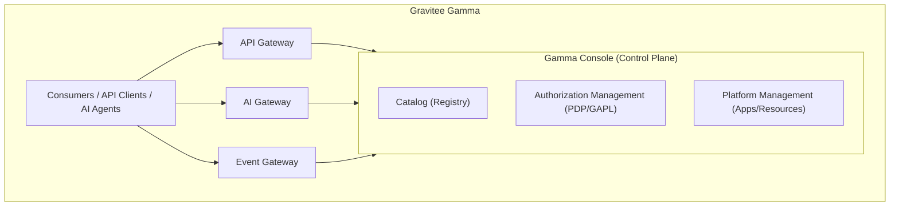

# Overview

Gravitee Gamma lets you govern, secure, and observe enterprise traffic—APIs, event streams, and AI agent interactions—from a single platform. It provides a shared catalog, authorization engine, and enforcement architecture.

***

## Why Gamma Exists

Modern enterprises run three distinct traffic types in isolation: REST, GraphQL, and gRPC APIs; Kafka event streams; and AI agent traffic—LLM calls, MCP tool invocations, and agent-to-agent delegations. Separate management of these traffic types results in fragmented visibility, duplicated policy configuration, and unaudited AI usage across your organization.

Gamma addresses the following core challenges:

* **Unmanaged AI traffic.** Engineering teams use Claude Code, Cursor, and ChatGPT Enterprise with no central visibility into cost, model usage, or data exposure. Agents call MCP tools on upstream servers using shared API keys or unaudited credentials.
* **Fragmented authorization.** Policies written for API gateways don't extend to AI agents or event streams, leaving different traffic types governed by different tools with no common enforcement point.
* **Disjointed infrastructure.** REST APIs, Kafka topics, MCP servers, AI models, and agents exist in separate registries with no shared catalog. This makes it impossible to build cross-protocol policies or expose existing infrastructure to AI agents without redevelopment.

***

## How Gamma Works

Gamma unifies four product lines—API Management, Event Stream Management, Agent Management, and Authorization Management—under a shared platform. All four share a common Catalog of assets and a common authorization engine that defines fine-grained policies against those cataloged assets. They also share common enforcement points—the AI Gateway, API Gateway, and Event Gateway—that evaluate the same policies at the wire level.

### Platform Components

Gamma includes the following components:

* **API Gateway.** Enforces runtime policy on every API request: authentication, rate limiting, content transformation, and routing between consumers and backend services.
* **AI Gateway.** The unified runtime for LLM, MCP, and A2A traffic. It consists of three proxies—LLM Proxy, MCP Proxy, and A2A Proxy—that share an authentication chain, policy chain, observability chain, and Authorization Management integration.
* **Event Gateway.** Enforces runtime policy on every Kafka event interaction: authentication, authorization, rate limiting, and protocol mediation.
* **Gamma Console.** The Control Plane where all product lines are configured, observed, and managed across API Management, Event Stream Management, Agent Management, Authorization Management, and Platform Management.
* **Catalog.** The authoritative registry of every asset an agent or consumer can use: AI models, MCP servers, tools—MCP, API, and Kafka API tools—prompts, resources, skills, and agents. Policy is authored against cataloged entities.
* **Policy Decision Point (PDP).** Evaluates all applicable Gravitee Authorization Policy Language (GAPL) policies at microsecond latency with no network hop, running inside every gateway.
* **Edge Daemon.** A lightweight process installed on employee devices using MDM that observes outgoing AI traffic, enforces local pre-egress policies, and forwards requests to the AI Gateway.

***

## Key Functionality

### API Management

API Management governs REST, GraphQL, and gRPC traffic through API proxies—the core artifact that mediates between consumers and backend services. The API Gateway enforces runtime policy on every request while the Gamma console provides the Control Plane to design, secure, publish, and observe APIs. Creation wizards offer both a from-scratch four-step flow—API Details, Configure Proxy, Secure, and Review & Deploy—and quick-start templates for common patterns.

See [API Management overview](../api-management/get-started/api-management-overview.md).

### Security & Authentication

Every API proxy accepts one or more security plans that define how consumers authenticate. Supported plan types include Keyless, API Key, JWT, OAuth2, and mTLS. Plans move through a defined lifecycle—Staging, Published, Deprecated, and Closed—and support rate limiting, quotas, and resource filtering at the plan level. For AI traffic, the AI Gateway supports OAuth authorization discovery and credential mediation for MCP servers, and token-based rate limiting for LLM Proxies.

See [Secure your API proxy](../api-management/build/secure-your-api-proxy.md).

### Event Stream Management

Event Stream Management governs Kafka clusters, event-driven data flows, and streaming infrastructure. Key capabilities include Kafka cluster registration, Kafka Service creation—the event-stream equivalent of an API proxy—and Virtual Clusters for multi-tenant isolation on shared infrastructure. An integrated Explorer lets you create topics, inspect messages, and manage connections. Kafka APIs contributed to the Catalog can be exposed as Kafka API Tools in Agent Management, bridging event streams to the AI agent layer without redevelopment.

See [Event Stream Management overview](../event-stream-management/get-started/event-stream-management-overview.md).

### Agent Management & AI Governance

Agent Management governs every protocol in the agentic stack. The **LLM Proxy** handles traffic to LLM providers—Anthropic, OpenAI, AWS Bedrock, Vertex AI, and Azure—with routing strategies (`COST`, `LATENCY`, `RANDOM`), guardrails, PII filtering, and token-based rate limiting. The **MCP Proxy** governs tool invocations in two modes: Proxy mode for transparent governance of upstream MCP servers, and Studio mode for composing Composite MCP Servers. The **A2A Proxy** governs agent-to-agent delegations with skill discovery, per-skill authorization, and agent identity verification. Every interaction emits an OpenTelemetry span with agent identity, tool name, inputs, outputs, latency, policy decision, cost, and timestamp.

See [Agent Management overview](../agent-management/get-started/ai-management-overview.md).

### Authorization Management

Authorization Management provides fine-grained, catalog-aware access control across all Gamma traffic types through policies written in Gravitee Authorization Policy Language (GAPL), a subset of the Cedar policy language. Policies declare an effect (`permit` or `forbid`), a principal, an action, a resource, and optional conditions for time-of-day restrictions, IP range checks, token budgets, and custom attribute matching. Policy categories cover MCP Policies, AI Model Policies, API Policies, and Custom Policies. Principals can be synchronized from identity providers using SCIM or from Gravitee Access Management.

See [Authorization Management overview](../authorization-management/get-started/authorization-management-overview.md).

### Edge Management

Edge Management provides visibility and control over AI traffic on employee devices. The Edge Daemon, distributed using MDM solutions—Kandji, Jamf, and Intune—supports two routing modes. Interception mode is the default and provides transparent DNS-level redirect of AI provider traffic. Proxy mode requires explicit per-tool base URL configuration. The daemon detects shadow AI usage regardless of whether traffic is routed through it. It enforces local pre-egress policies and forwards requests to the AI Gateway for enterprise-wide policy enforcement. The Edge Management dashboard surfaces fleet status, metrics filterable by device and model, and shadow AI usage reports.

See [Edge Management overview](../edge-management/get-started/edge-management-overview.md).

***

## Supported Protocols & Standards

Gamma supports the following protocols and standards:

| Protocol                                                | Support | Notes                                                                |
| ------------------------------------------------------- | ------- | -------------------------------------------------------------------- |
| REST / HTTP                                             | Full    | API proxies with context path or virtual host routing                |
| GraphQL                                                 | Full    | Governed through API Management                                      |
| gRPC                                                    | Full    | Governed through API Management                                      |
| Kafka (native)                                          | Full    | Through the Event Gateway—Kafka Services and Virtual Clusters        |
| MCP (JSON-RPC 2.0)                                      | Full    | Through the MCP Proxy in Proxy mode or Studio mode                   |
| A2A                                                     | Full    | Through the A2A Proxy with `/.well-known/agent.json` skill discovery |
| LLM APIs (OpenAI, Anthropic, Bedrock, Vertex AI, Azure) | Full    | Through the LLM Proxy with provider-specific routing                 |

***

## Next steps

If you are new to Gravitee Gamma, complete the following steps:

1. [**Create your first API**](../api-management/get-started/create-your-first-api.md) — Create an API proxy and enforce a security plan in under five minutes.
2. [**Create your first MCP server**](../agent-management/get-started/create-your-first-mcp-server.md) — Set up an MCP proxy in front of an upstream MCP server and verify tool invocations.
3. [**Create your first Kafka service**](../event-stream-management/get-started/create-your-first-kafka-service.md) — Register a Kafka cluster and create a governed Kafka service.

If you are evaluating Gravitee Gamma for your organization, consult the following resources:

* [**Authorization Management overview**](../authorization-management/get-started/authorization-management-overview.md)**.** Understand GAPL policies and how the shared policy engine governs all traffic types.
* [**Agent Management overview**](../agent-management/get-started/ai-management-overview.md)**.** Understand how the AI Gateway, Catalog, and Agent Identity work together to govern AI agent traffic.
* [**Event Stream Management overview**](../event-stream-management/get-started/event-stream-management-overview.md)**.** Understand how Kafka infrastructure is governed and exposed to agents through the Catalog.
