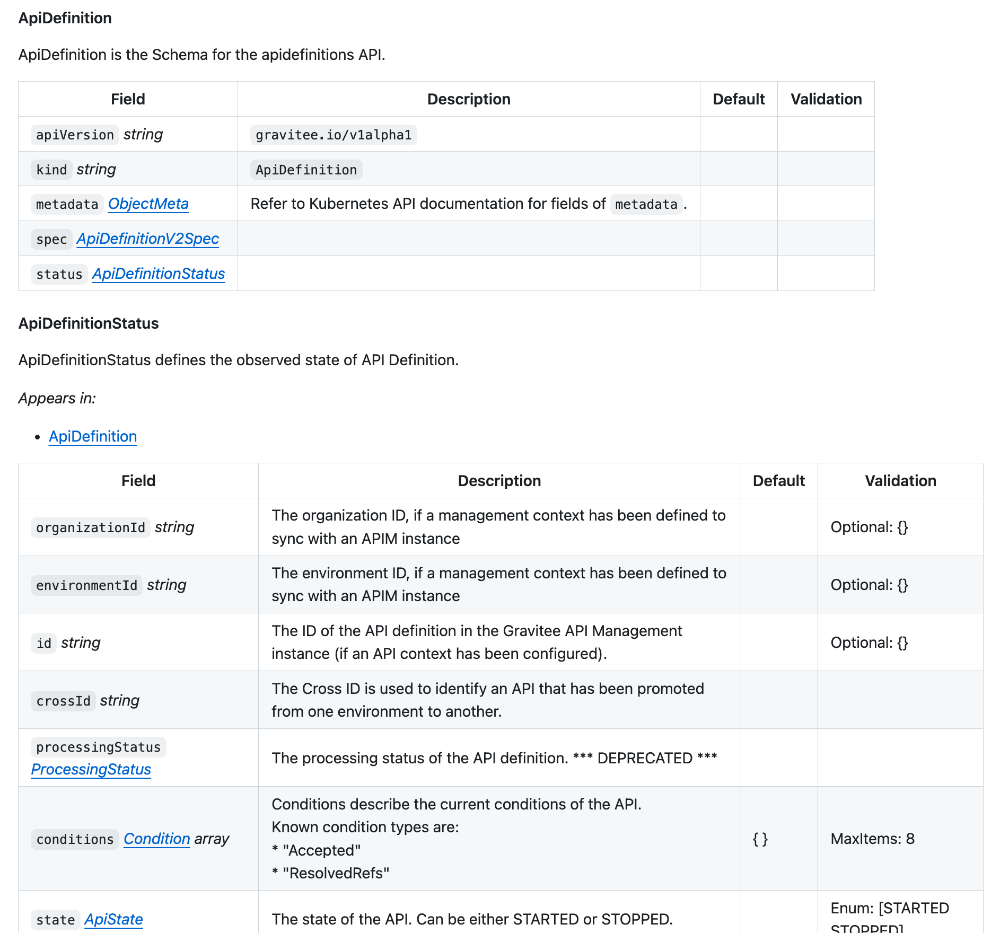

# API Reference

The Gravitee Kubernetes Operator (GKO) API reference documentation can be found [in the GKO Github repository](https://github.com/gravitee-io/gravitee-kubernetes-operator/blob/4.10.x/docs/api/reference.md).

The GKO CRDs can be found [on GitHub](https://github.com/gravitee-io/gravitee-kubernetes-operator/tree/4.10.x/helm/gko/crds).

<figure><figcaption>
The Gravitee Kubernetes Operator (GKO) API reference documentation can be found <a href="https://github.com/gravitee-io/gravitee-kubernetes-operator/blob/4.10.x/docs/api/reference.md">in the GKO Github repository</a>.
</figcaption></figure>

Here is a screenshot of the v4 `api_definition`  examples.&#x20;

<figure><figcaption>
The GKO CRDs can be found <a href="https://github.com/gravitee-io/gravitee-kubernetes-operator/tree/4.10.x/helm/gko/crds">on GitHub</a>.
</figcaption></figure>
