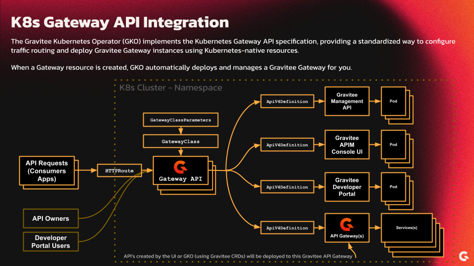
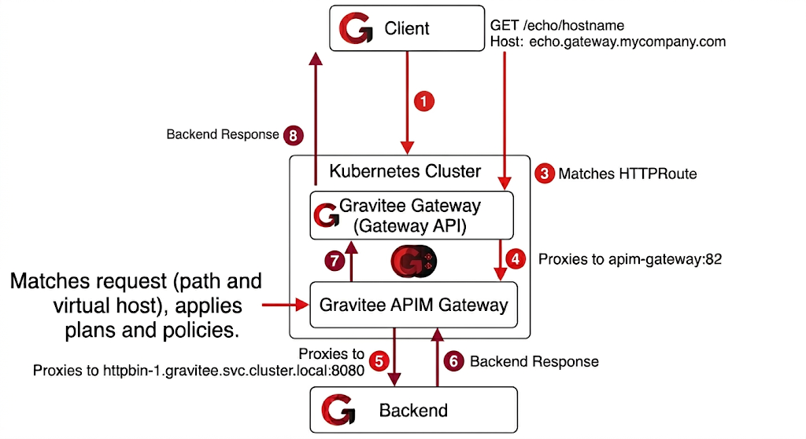

# Configure a self-hosted Gravitee APIM with Kubernetes Gateway API

## Overview

This guide describes how to use a fully self-hosted Gravitee APIM with the Kubernetes Gateway API for ingress traffic routing while delegating API management concerns (policies, plans, subscriptions, analytics, etc.) to a dedicated Gravitee APIM gateway.

In this architecture, two gateways work together:

* A **Gateway API gateway** deployed by the Gravitee Kubernetes Operator (GKO) handles incoming traffic and routes it based on standard `HTTPRoute` resources.
* A **dedicated APIM gateway** deployed via Helm handles the heavy lifting: policy enforcement, plan-based access control, rate limiting, subscriptions, and observability & analytics reporting.

A Gateway API deployment in GKO follows this resource hierarchy:

```
GatewayClassParameters (Gravitee-specific configuration)
  └── GatewayClass (references GatewayClassParameters)
        └── Gateway (references GatewayClass, defines listeners)
              └── HTTPRoute (references Gateway, defines routing rules)
```

The HTTPRoute defines the ingress path and hostname, then forwards traffic to the APIM gateway service. An `ApiV4Definition` with the same name defines the actual API behavior (listeners, endpoints, plans, flows) on the APIM gateway.

<figure><figcaption></figcaption></figure>

## Prerequisites

* A Kubernetes cluster with the Gravitee Kubernetes Operator (GKO) installed
* An APIM Gateway deployed via the Gravitee Helm chart
* A `ManagementContext` resource configured to connect GKO to the APIM Management API

## Configuration Steps

Complete the following steps to get started:&#x20;

### Step 1: Enable `skipAPIDefinition` in GKO Helm values

By default, the HTTPRoute reconciler creates an intermediate `ApiV4Definition` custom resource (CR) with the same name as the route. This conflicts with user-managed API definitions that share that name. Setting `skipAPIDefinition` to `true` makes the reconciler write a ConfigMap instead, leaving the CR name available for your own `ApiV4Definition`.

For OpenShift specific deployments, OpenShift already includes pre-installed GatewayAPI CRDs which you may want to keep.  Use `applyCRDs` to control whether GKO should install its own CRDs.


```yaml
gatewayAPI:
  # @@param applyCRDs - (OpenShift-specific) - if true, the manager will apply Gateway API CRDs on startup.
  # applyCRDs: true
  controller:
    enabled: true
    skipAPIDefinition: true
```



GKO Helm Chart reference: [https://github.com/gravitee-io/gravitee-kubernetes-operator/blob/master/helm/gko/values.yaml#L238](https://github.com/gravitee-io/gravitee-kubernetes-operator/blob/master/helm/gko/values.yaml#L238)


### Step 2: Prevent the APIM Gateway from loading Gateway API definitions

The ConfigMap created by the HTTPRoute reconciler contains an API definition tagged with the Gateway resource name (e.g. `gravitee/gravitee-gateway`). If the APIM Gateway has Kubernetes Sync enabled and no sharding tag filtering, it will deploy this definition. Because the API's backend points back to the APIM Gateway service itself (from the HTTPRoute `backendRef`), this creates a self-referencing loop that results in a 504 timeout.

Therefore, you have two options that need to be configured in your APIM `values.yaml` file:

#### **Option A: Disable Kubernetes sync (recommended)**

If the APIM Gateway only needs to sync API definitions from the Management API (which is the typical setup), disable Kubernetes Sync entirely:


```yaml
gateway:
  services:
    sync:
      kubernetes:
        enabled: false
```


This is the simplest and safest default for a dedicated APIM Gateway that receives its API definitions through a `ManagementContext`.


APIM Helm Chart reference: [https://github.com/gravitee-io/gravitee-api-management/blob/master/helm/values.yaml#L1073](https://github.com/gravitee-io/gravitee-api-management/blob/master/helm/values.yaml#L1073)


#### **Option B: Use Sharding Tags**

If the APIM Gateway needs Kubernetes Sync enabled for other purposes (e.g. other ConfigMap-based API definitions), use Sharding Tags to exclude Gateway API definitions:


```yaml
gateway:
  sharding_tags: "!gravitee/gravitee-gateway"
  services:
    sync:
      kubernetes:
        enabled: true
```


The `!` prefix tells the gateway to exclude APIs tagged with `gravitee/gravitee-gateway`, while still allowing other ConfigMap-based definitions through.


APIM Helm Chart reference: [https://github.com/gravitee-io/gravitee-api-management/blob/master/helm/values.yaml#L1522](https://github.com/gravitee-io/gravitee-api-management/blob/master/helm/values.yaml#L1522)


### Step 3: Prepare Resources

The following three resources set up the Gravitee Gateway with the Kubernetes Gateway API.

The last resource sets up the `HTTPRoute` to direct all traffic to the Gravitee services, including routing traffic to the Gravitee Gateway:

#### GatewayClassParameters

The `GatewayClassParameters` custom resource is the Gravitee extension point for configuring Gateway API deployments.


```yaml
apiVersion: gravitee.io/v1alpha1
kind: GatewayClassParameters
metadata:
  name: gravitee-gateway
spec:
  kubernetes:
    service:
      annotations:
        gravitee.io/gateway-class: gravitee-gateway
    deployment:
      replicas: 3
```


#### GatewayClass

The `GatewayClass` resource registers Gravitee as a Gateway API controller.


```yaml
apiVersion: gateway.networking.k8s.io/v1
kind: GatewayClass
metadata:
  name: gravitee-gateway
spec:
  controllerName: apim.gravitee.io/gateway
  parametersRef:
    kind: GatewayClassParameters
    group: gravitee.io
    name: gravitee-gateway
    namespace: gravitee
```


#### Gateway

The `Gateway` resource defines listeners that accept traffic.  You will need modify the below example resource accordingly, such as specifying the desired hostname and relevant TLS certificate reference.&#x20;


```yaml
apiVersion: gateway.networking.k8s.io/v1
kind: Gateway
metadata:
  name: gravitee-gateway
  # annotations:
  #   cert-manager.io/cluster-issuer: letsencrypt-prod-gateway
spec:
  gatewayClassName: gravitee-gateway
  listeners:
    # - name: http
    #   port: 80
    #   protocol: HTTP
    - name: https
      port: 443
      protocol: HTTPS
      hostname: '*.changeme.company.com'
      tls:
        certificateRefs:
          - group: ""
            kind: Secret
            name: "gravitee-gateway-api-tls"
```


#### HTTPRoute(s)

The `HTTPRoute` resource defines rules for routing HTTP traffic from a Gateway listener to backend Kubernetes Services, such as the relevant Gravitee APIM services described below.

Now that the `Gateway` definition is prepared for deployment, we can start preparing the required `HTTPRoute` definitions for Gravitee APIM, including:

* the **Management API** services (e.g.: `hostname` + `/automation` , `/management` and `/portal`)
* the **APIM Console** web service (e.g.: `hostname:8002`)
* the **Developer Portal** web service (e.g.: `hostname:8003`)
* and all traffic to the Gravitee **Gateway** (e.g.: `hostname:82`)


```yaml
apiVersion: gateway.networking.k8s.io/v1
kind: HTTPRoute
metadata:
  name: gko-apim-gravitee-api
  namespace: gravitee
  labels:
    app.kubernetes.io/component: api
    app.kubernetes.io/instance: gko-apim-gravitee
    app.kubernetes.io/name: apim
spec:
  parentRefs:
    - name: gravitee-gateway
      namespace: gravitee
  hostnames:
    - apim-gravitee-api.changeme.company.com
  rules:
    - matches:
        - path:
            type: PathPrefix
            value: /automation
      backendRefs:
        - name: gko-apim-gravitee-api
          port: 83
    - matches:
        - path:
            type: PathPrefix
            value: /management
      backendRefs:
        - name: gko-apim-gravitee-api
          port: 83
    - matches:
        - path:
            type: PathPrefix
            value: /portal
      backendRefs:
        - name: gko-apim-gravitee-api
          port: 83
---
apiVersion: gateway.networking.k8s.io/v1
kind: HTTPRoute
metadata:
  name: gko-apim-gravitee-ui
  namespace: gravitee
  labels:
    app.kubernetes.io/component: ui
    app.kubernetes.io/instance: gko-apim-gravitee
    app.kubernetes.io/name: apim
spec:
  parentRefs:
    - name: gravitee-gateway
      namespace: gravitee
  hostnames:
    - apim-gravitee-console.changeme.company.com
  rules:
    - matches:
        - path:
            type: PathPrefix
            value: /
      filters:
        - type: URLRewrite
          urlRewrite:
            path:
              type: ReplacePrefixMatch
              replacePrefixMatch: /
      backendRefs:
        - name: gko-apim-gravitee-ui
          port: 8002
---
apiVersion: gateway.networking.k8s.io/v1
kind: HTTPRoute
metadata:
  name: gko-apim-gravitee-portal
  namespace: gravitee
  labels:
    app.kubernetes.io/component: portal
    app.kubernetes.io/instance: gko-apim-gravitee
    app.kubernetes.io/name: apim
spec:
  parentRefs:
    - name: gravitee-gateway
      namespace: gravitee
  hostnames:
    - apim-gravitee-portal.changeme.company.com
  rules:
    - matches:
        - path:
            type: PathPrefix
            value: /
      filters:
        - type: URLRewrite
          urlRewrite:
            path:
              type: ReplacePrefixMatch
              replacePrefixMatch: /
      backendRefs:
        - name: gko-apim-gravitee-portal
          port: 8003
---
apiVersion: gateway.networking.k8s.io/v1
kind: HTTPRoute
metadata:
  name: gko-apim-gravitee-gateway
  namespace: gravitee
  labels:
    app.kubernetes.io/component: gateway
    app.kubernetes.io/instance: gko-apim-gravitee
    app.kubernetes.io/name: apim
spec:
  parentRefs:
    - name: gravitee-gateway
      namespace: gravitee
  hostnames:
    - apim-gravitee-gateway.changeme.company.com
  rules:
    - matches:
        - path:
            type: PathPrefix
            value: /
      filters:
      - type: RequestHeaderModifier
        requestHeaderModifier:
          set:
          - name: Host
            value: "gko-apim-gravitee-gateway.gko-gravitee.svc.cluster.local"
      backendRefs:
        - name: gko-apim-gravitee-gateway
          port: 82
```


### Apply Resources

You can now apply all of your prepared resources to your Kubernetes cluster using `kubectl` - which will perform the following:

1. Apply the `GatewayClassParameters` resource
2. Apply the `GatewayClass` resource
3. Apply the `Gateway` resource, and **deploy** a new _lightweight_ Gravitee Gateway (with k8s Gateway API)
4. Apply multiple `HTTPRoute`'s for access to the various Gravitee APIM services and a generic catch-all `HTTPRoute` for routing all gateway-specific traffic to the Gravitee Gateway.

```shellscript
kubectl apply -f gateway-class-parameters.yaml
kubectl apply -f gateway-class.yaml
kubectl apply -f gateway.yaml

kubectl apply -f http-route-gravitee-services.yaml
```

### Step 5: Test & Confirm

You can now use a browser to access the various Gravitee APIM services.

### Testing end-to-end API request flow

1. Create a new API using the APIM Console UI
2. Deploy the API to the Gateway
3. The API is deployed to the API Gateway (as shown in the lower-right corner of the screen).

Traffic Flow:  **API Request {on entryPoint} > Gateway (k8s Gateway API) > HTTP Route > Gateway (Gravitee) > {entryPoint}**


## **Next Step:  Deploying a new API (HTTPRoute and ApiV4Definition)**

The infrastructure is in place, so you can now define an actual API on top of it. Each API needs two paired resources: an `HTTPRoute` that routes ingress traffic to the APIM gateway, and an `ApiV4Definition` that tells the APIM gateway how to handle the request once it arrives.

### How it works:

* The **HTTPRoute** `backendRef` targets the Gravitee APIM Gateway service (`apim-gateway:82`). The Gateway API gateway will forward matching requests there.
* The **ApiV4Definition** uses a `contextRef` to sync the API through the APIM Management Plane. The APIM Gateway picks it up through its regular sync mechanism and handles policy enforcement, plan validation, and backend proxying.
* The listener `host` in the `ApiV4Definition` must match the HTTPRoute `hostname` so the APIM gateway can match incoming requests by virtual host.

### Request flow

The example below traces a single request end-to-end, showing how it moves through both Gateways before reaching the backend:

1. A client sends `GET /echo/hostname` with `Host: echo.gateway.mycompany.com`
2. The **Gateway API gateway** matches the request via the HTTPRoute and proxies it to `apim-gateway:82`
3. The **Gravitee APIM Gateway** matches the request against the `echo` API (by path and virtual host), applies plans and policies, then proxies to the backend (`httpbin-1.gravitee.svc.cluster.local:8080`).
4. The backend responds, and the response flows back through both gateways to the client.

<figure><figcaption></figcaption></figure>

### **Step 1: Confirm ManagementContext**

As listed in the [pre-requisites](full-example-of-configuring-self-hosted-gravitee-apim-with-k8s-gateway-api.md#prerequisites), obtain the `metadata: name:` value from your `ManagementContext` resource (that is used to connect GKO to your APIM Management API). &#x20;

This values is specified in `spec: contextRef: name: "..."` of your `ApiV4Definition` (as shown below).

### **Step 2: Prepare the custom resource**

Both resources share the same `metadata.name`. The `HTTPRoute` handles ingress routing to the APIM gateway, and the `ApiV4Definition` configures the API behavior on it.


```yaml
apiVersion: gateway.networking.k8s.io/v1
kind: HTTPRoute
metadata:
  name: echo
spec:
  parentRefs:
    - name: gravitee-gateway
      kind: Gateway
      group: gateway.networking.k8s.io
      namespace: gravitee
  hostnames:
    - echo.gateway.mycompany.com
  rules:
    - matches:
        - path:
            type: PathPrefix
            value: /echo
      backendRefs:
        - kind: Service
          group: ""
          name: apim-gateway
          port: 82
---
apiVersion: gravitee.io/v1alpha1
kind: ApiV4Definition
metadata:
  name: echo
spec:
  contextRef:
    name: "your-management-contextRef-name"
  name: "echo"
  description: "Echo API managed by Gravitee Kubernetes Operator"
  version: "1.0"
  type: PROXY
  state: STARTED
  listeners:
    - type: HTTP
      paths:
        - path: "/echo/"
          host: echo.gateway.mycompany.com
      entrypoints:
        - type: http-proxy
          qos: AUTO
  endpointGroups:
    - name: Default HTTP proxy group
      type: http-proxy
      endpoints:
        - name: Default HTTP proxy
          type: http-proxy
          inheritConfiguration: false
          configuration:
            target: http://httpbin-1.gravitee.svc.cluster.local:8080
          secondary: false
          sharedConfigurationOverride:
            http:
              propagateClientHost: false
  flowExecution:
    mode: DEFAULT
    matchRequired: false
  plans:
    KeyLess:
      name: "Free plan"
      description: "This plan does not require any authentication"
      security:
        type: "KEY_LESS"
  notifyMembers: false
```


### Step 3: Apply Resources

You can now apply your prepared HTTPRoute and ApiV4Definition resource to your Kubernetes cluster using `kubectl` - which will perform the following:

```shellscript
kubectl apply -f some-api-demo.yaml --namespace==gravitee
```

<details>

<summary>Example Output</summary>

The following output shows a successful implementation of the custom resource:

```shellscript
// Coming soon...
```

</details>

### Step 4: Test & Confirm

You can now use a browser to access the various Gravitee APIM services.

### Testing end-to-end API request flow

1. Create a new API using the APIM Console UI
2. Deploy the API to the Gateway
3. The API is deployed to the API Gateway (as shown in the lower-right corner of the screen).

Traffic Flow:  **API Request {on entryPoint} > Gateway (k8s Gateway API) > HTTP Route > Gateway (Gravitee) > {entryPoint}**
