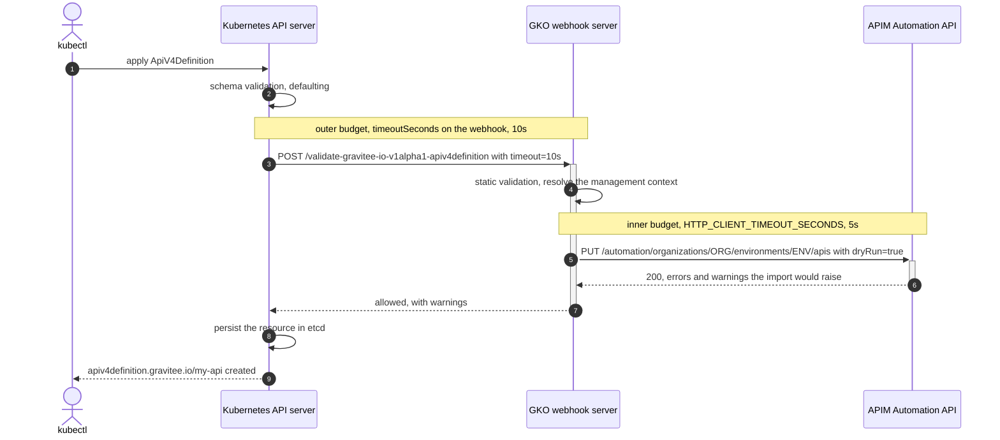
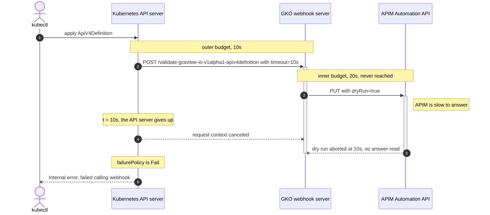

# Admission validation

## Overview

The Gravitee Kubernetes Operator (GKO) registers two webhooks with the Kubernetes API server: a validating admission webhook named `gko-validating-webhook-configurations` and a mutating admission webhook named `gko-mutating-webhook-configurations`. When you create or update a Gravitee custom resource, the API server calls GKO before the resource is written to the cluster. If validation fails, `kubectl apply` returns the error immediately and nothing is stored.

Validation runs in the following two stages:

1. **Local validation.** GKO checks the resource on its own, without contacting APIM. This covers structural and semantic rules. Examples include flow and endpoint group definitions, broker port ranges on Native Kafka API plans, references to other custom resources, and API context path conflicts in the namespace or cluster.
2. **Dry-run validation against APIM.** If the resource references a `ManagementContext`, GKO asks APIM to validate the resource as well, before it enters the cluster.

## Dry-run validation against the Automation API

Local validation alone cannot tell you whether APIM accepts a resource. A resource can be well-formed and still be rejected by APIM, because only APIM knows the state and configuration of the target environment.

To close that gap, the validating webhook issues an HTTP call to the APIM **Automation API** with the `dryRun` query parameter set to `true`:

```http
PUT {baseUrl}/automation/organizations/{orgId}/environments/{envId}/apis?dryRun=true
```

The request body is the same specification GKO sends on a real apply. GKO authenticates the call with the credentials from the `ManagementContext` that the resource references. Because `dryRun` is set to `true`, APIM runs its full validation and returns the result **without persisting anything**. APIM creates or modifies nothing during this call.

GKO applies the following rules to map the response onto the admission decision:

* **Severe errors** cause the webhook to reject the request. The resource is not stored in the cluster, and the messages returned by APIM are surfaced in the `kubectl` output.
* **Warnings** do not block admission. The resource is stored and the warnings are surfaced alongside it.


The `dryRun` query parameter is part of the Automation API contract, not something specific to GKO. The [Automation API OpenAPI specification](https://github.com/gravitee-io/gravitee-api-management/blob/master/gravitee-apim-rest-api/gravitee-apim-rest-api-automation/gravitee-apim-rest-api-automation-rest/src/main/resources/open-api.yaml) documents it. It describes the parameter as a way to "test the result of an endpoint without actually persisting the state of the underlying spec".


### Endpoints called for each custom resource

GKO calls each of the following endpoints with `PUT` and `?dryRun=true`, relative to the Automation API base path described in the following section:

| Custom resource     | Endpoint                                                                                                                |
| ------------------- | ----------------------------------------------------------------------------------------------------------------------- |
| `ApiV4Definition`   | `/organizations/{orgId}/environments/{envId}/apis`                                                                        |
| `Application`       | `/organizations/{orgId}/environments/{envId}/applications`                                                                |
| `Dictionary`        | `/organizations/{orgId}/environments/{envId}/dictionaries`                                                                |
| `Group`             | `/organizations/{orgId}/environments/{envId}/groups`                                                                      |
| `SharedPolicyGroup` | `/organizations/{orgId}/environments/{envId}/shared-policy-groups`                                                        |
| `Portal`            | `/organizations/{orgId}/environments/{envId}/portals`                                                                     |
| `PortalListing`     | `/organizations/{orgId}/environments/{envId}/portals/{portalHrid}/listings`                                               |
| `Documentation`     | `/organizations/{orgId}/environments/{envId}/apis/{apiHrid}/documentations` or `.../portals/{portalHrid}/documentations`   |


`ApiDefinition`, the v2 API resource, is the exception. It is validated against the Management API rather than the Automation API, using the same `dryRun` parameter:

```http
PUT {baseUrl}/management/organizations/{orgId}/environments/{envId}/apis/import-crd?dryRun=true
```


### Automation API base path

The base path GKO uses depends on how the `ManagementContext` is configured:

| Target                              | Base path                |
| ----------------------------------- | ------------------------ |
| Self-hosted APIM                    | `/automation`            |
| Gravitee Cloud, where `spec.cloud` is set | `/apim/automation`  |
| Any target where `spec.path` is set | The value of `spec.path` |

Set `spec.path` when you reverse proxy APIM behind a URL rewrite. See [managementcontext.md](custom-resource-definitions/managementcontext.md "mention").

## The round trip

The following sequence applies an `ApiV4Definition` that carries a context reference. It uses the defaults, so the Kubernetes API server grants 10 seconds to the webhook, and GKO grants 5 seconds to the dry run:



Once the resource is persisted, the controller picks it up and replays the same call without `dryRun`, this time outside any admission budget.


The same round trip applies to every kind covered by the validating webhook. Kinds that also have a mutating webhook registered go through the mutation phase first, under its own instance of the outer budget. The following kinds carry a mutating webhook: `managementcontexts`, `subscriptions`, `groups`, `dictionaries`, `portals`, `portallistings`, and `documentations`.


## Admission timeouts

A single `kubectl apply` opens two nested timeout budgets, described in the following table:

| Budget                  | Where you set it                                                                  | What it covers                                                                                                     | Default |
| ----------------------- | --------------------------------------------------------------------------------- | ------------------------------------------------------------------------------------------------------------------ | ------- |
| Outer, the webhook call | `timeoutSeconds`, on every webhook of the validating and mutating configurations   | The whole admission call, from the moment the API server dials the webhook to the moment it reads the response       | 10s     |
| Inner, the APIM call    | `HTTP_CLIENT_TIMEOUT_SECONDS`, from `manager.httpClient.timeoutSeconds`            | One call issued by GKO to APIM, the dry run included                                                                 | 5s      |

The inner budget must expire **before** the outer one. GKO builds its APIM requests from the admission request context, so the two are not independent. When the API server gives up, the context is canceled and the dry run in flight dies with it.

### When the outer budget is too small

If you raise `manager.httpClient.timeoutSeconds` above the webhook timeout, in front of a slow APIM, the following happens:



`kubectl` reports the webhook, not APIM:


```text
Error from server (InternalError): error when creating "api.yml": Internal error occurred: failed calling webhook "v1alpha1.gravitee.io.apiv4definition": failed to call webhook: Post "https://gko-webhook.gravitee.svc:443/validate-gravitee-io-v1alpha1-apiv4definition?timeout=10s": context deadline exceeded
```


You lose the following two things:

* **The configured timeout never applies.** The dry run is cut at the outer budget, whatever value `manager.httpClient.timeoutSeconds` holds. A higher value has no visible effect.
* **The real cause is hidden.** Given the time to hit its own timeout, GKO denies the request with the underlying error, which names the endpoint that did not answer:


```text
Error from server (Forbidden): error when creating "api.yml": admission webhook "v1alpha1.gravitee.io.apiv4definition" denied the request: unable to perform request [PUT] https://apim.example.com/automation/organizations/DEFAULT/environments/DEFAULT/apis?dryRun=true: (Put "https://apim.example.com/automation/organizations/DEFAULT/environments/DEFAULT/apis?dryRun=true": context deadline exceeded (Client.Timeout exceeded while awaiting headers))
```


### How the chart keeps the budgets aligned

The chart derives the webhook timeout from the HTTP client timeout. It keeps 5 seconds of headroom for the rest of the admission work, such as decoding the review, resolving the management context, and reading its secret:

```text
webhook timeoutSeconds = min(manager.httpClient.timeoutSeconds + 5, 30)
```

The following table shows the values that derivation produces:

| `manager.httpClient.timeoutSeconds` | Webhook `timeoutSeconds` |
| ----------------------------------- | ------------------------ |
| 5, the default                      | 10                       |
| 10                                  | 15                       |
| 20                                  | 25                       |
| 40                                  | 30, capped               |


Kubernetes refuses a webhook `timeoutSeconds` above 30. Past 25 seconds of HTTP client timeout the headroom shrinks, and at 30 seconds and beyond GKO cannot honor the client timeout during admission. If APIM needs more than that to answer a dry run, treat the latency itself as the problem rather than raising the timeout.


### Tune and verify the budgets

1.  On a high latency network, give APIM more time with the following command:

    ```sh
    helm upgrade --install gko graviteeio/gko \
      -n gravitee --create-namespace \
      --set manager.httpClient.timeoutSeconds=20
    ```
2.  Confirm that the webhooks followed with the following command:

    ```sh
    kubectl get validatingwebhookconfiguration gko-validating-webhook-configurations \
      -o jsonpath='{.webhooks[*].timeoutSeconds}'
    ```

    The output reports the derived webhook timeout for every webhook in the configuration:

    ```text
    25 25 25 25 25 25 25 25 25 25 25 25
    ```


Only the dry run is bound to these budgets. A resource that carries no context reference is still admitted through the webhook, but validation stays local, so GKO makes no APIM call and the inner budget never opens.


## When the dry-run call is skipped

The dry-run call only happens when the resource references a `ManagementContext`. Resources that are not synced to an APIM Control Plane are validated locally only. Examples include a v4 API with no `contextRef`, and a v2 API with `local: true`. This includes [db-less-mode.md](../guides/db-less-mode.md "mention") deployments, where there is no Control Plane to call.

## What this means in practice

* **APIM must be reachable when you apply a resource, not just when GKO reconciles it.** Both webhooks are registered with `failurePolicy: Fail`, and a failed dry-run call is treated as a severe error. If APIM is down, unreachable, or the `ManagementContext` credentials are invalid, `kubectl apply` on a context-bound resource is rejected rather than queued.
* **The credentials in the `ManagementContext` need write permissions.** Nothing is written, but the dry run calls the same create and update endpoint as a real apply. See [define-an-apim-service-account-for-gko.md](../guides/define-an-apim-service-account-for-gko.md "mention").
* **Each resource you apply costs a round trip to APIM.** On bulk applies, this is one call per context-bound resource.
* **The calls appear in APIM's logs.** They look like ordinary Automation API requests, and the `dryRun=true` query parameter is what distinguishes them from a real apply.

## Disable the webhooks

The webhooks are enabled by default. You can disable them in your Helm values:


```yaml
manager:
  webhook:
    enabled: false
```



If you disable the webhooks, no validation happens at apply time, and that includes the dry-run call. Invalid resources are then accepted into the cluster and only fail later, during reconciliation. The error surfaces in the resource status and the operator logs instead of in your `kubectl` output.


To keep the webhooks but widen the API context path conflict check from the resource's namespace to the whole cluster, set `manager.webhook.admission.checkApiContextPathConflictInCluster` to `true`.

For the RBAC the webhooks require, see [rbac-customization.md](../getting-started/installation/rbac-customization.md "mention").
