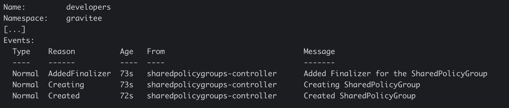

# SharedPolicyGroup

The SharedPolicyGroup custom resource definition allows you to create a Shared Policy Group in a given APIM environment. Shared policy groups created with this Custom Resource Definition (CRD) can be later on referenced inside ApiV4Definition CRDs using the SharedPolicyGroup metadata name and an optional namespace.

## Create a `SharedPolicyGroup`

SharedPolicyGroups are only relevant for a given APIM environment, and so a `SharedPolicyGroup`resource must reference an existing management context object.\
The following example shows a simple SharedPolicyGroup custom resource definition:

```yaml
apiVersion: gravitee.io/v1alpha1
kind: SharedPolicyGroup
metadata:
  name: simple-shared-policy-groups
spec:
  contextRef:
    name: "dev-ctx"
  name: "simple-shared-policy-groups"
  description: "Simple shared policy groups"
  apiType: "PROXY"
  phase: "REQUEST"
  steps:
    - name: Rate Limit
      description: k8s rate limit
      enabled: true
      policy: rate-limit
      configuration:
        async: false
        addHeaders: true
        rate:
          useKeyOnly: false
          periodTime: 1
          limit: 10
          periodTimeUnit: MINUTES
          key: ""
```

## Validation and Defaults

* SharedPolicyGroup Phase is immutable
* SharedPolicyGroup ApiType is immutable
* You can't delete a SharedPolicyGroup CRD when it is already referenced inside another resource
* You can't reference a Non-exiting SharedPolicyGroup CRD inside your other resources such as ApiV4Definition CRDs

## Referencing a SharedPolicyGroup from an ApiV4Definition

After successfully applying your SharedPolicyGroup CRD, you can reference it inside your ApiV4Definition by its name (and an optional namespace if SharedPolicyGroup CRD is in another namespace different from your ApiV4Definition).

Here is an example of a `SharedPolicyGroup` reference inside a APIV4Definition:

```yaml
apiVersion: gravitee.io/v1alpha1
kind: ApiV4Definition
metadata:
  name: api-v4-with-context
spec:
  ...
  flows:
    - name: "default"
      request:
        - sharedPolicyGroupRef:
            name: "simple-shared-policy-groups"
```

In that case, if the SharedPolicyGroup reference cannot be resolved, you cannot apply your ApiV4Definition CRD.

## The SharedPolicyGroup lifecycle

The following workflow is applied when a new SharedPolicyGroup resource is added to the cluster:

1. The GKO listens for SharedPolicyGroup resources.
2. The GKO resolves any references to external sources such as ConfigMaps or Secrets.
3. The GKO performs required changes, such as adding default settings.
4. The GKO converts the data to JSON format.
5. The GKO compares the definition to the existing definition. If something has changed, the GKO pushes the definition to the Management API.

Events are added to the resource as part of each action performed by the operator. To view these events, ensure that the CRD creation steps described above are completed, then run the following command:

```
kubectl describe -n gravitee sharedpolicygroups.gravitee.io developers
```

Here is an example output for the command:

<figure><figcaption></figcaption></figure>

For more information about the `SharedPolicyGroup` CRD, go to [Gravitee's GitHub repository.](https://github.com/gravitee-io/gravitee-kubernetes-operator/blob/master/api/v1alpha1/sharedpolicygroups_types.go)
