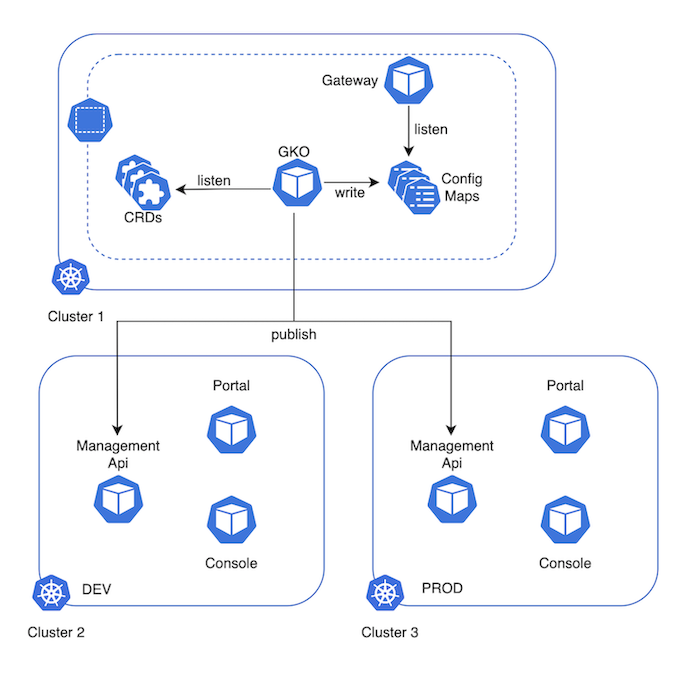

# Multi-environment deployment architecture

In a multi-environment deployment, a single GKO can be deployed and can publish APIs to different environments (logical or physical).

The following diagram illustrates the multi-environment deployment architectural approach:

<figure><figcaption>
Multi-environment deployment architecture
</figcaption></figure>
