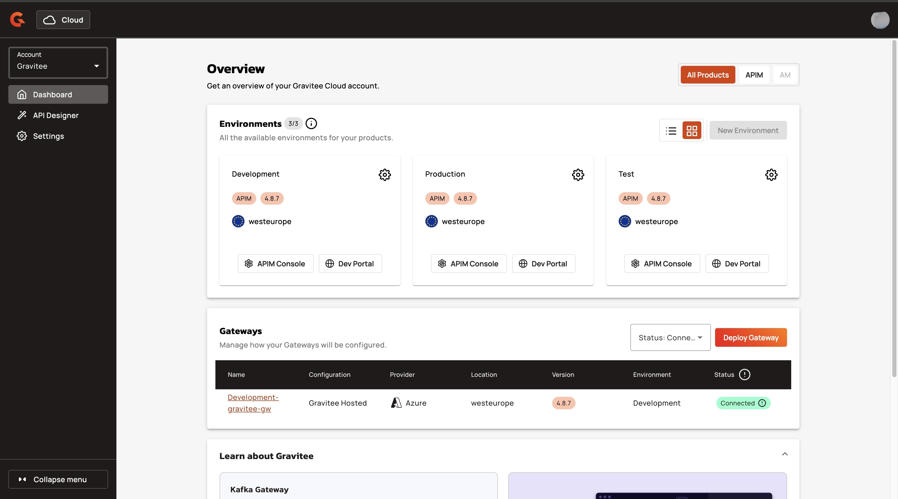

# Gravitee Cloud

## Introduction

Formerly known as Cockpit, Gravitee Cloud is a simple and secure method of running the Gravitee API Management (APIM). With the Control Plane hosted by Gravitee, you can count on consistent availability, cutting-edge features, and innovations from the Gravitee team.

<figure><figcaption></figcaption></figure>

When you subscribe to to Gravitee Cloud, Gravitee generates a pre-configured and best-practice setup for your APIM, which is ready to help you unlock new potential for your APIs. Whether you choose to run your API Gateways with Gravitee-hosted, hybrid, or federated third-party gateways, we provide a unified platform that adapts to your IT landscape.

<table data-card-size="large" data-view="cards"><thead><tr><th></th><th></th><th></th><th data-hidden data-card-target data-type="content-ref"></th></tr></thead><tbody><tr><td></td><td>Log in to your Gravitee Cloud account  <a href="https://cockpit.gravitee.io">Gravitee Cloud Login</a></td><td></td><td><a href="https://cockpit.gravitee.io/">https://cockpit.gravitee.io/</a></td></tr><tr><td></td><td>Start a Free Gravitee Cloud Trial!  <a href="https://cockpit.gravitee.io/?createUser=true">Embark on an enhanced API Platform journey!</a></td><td></td><td><a href="https://cockpit.gravitee.io/?createUser=true">https://cockpit.gravitee.io/?createUser=true</a></td></tr></tbody></table>
