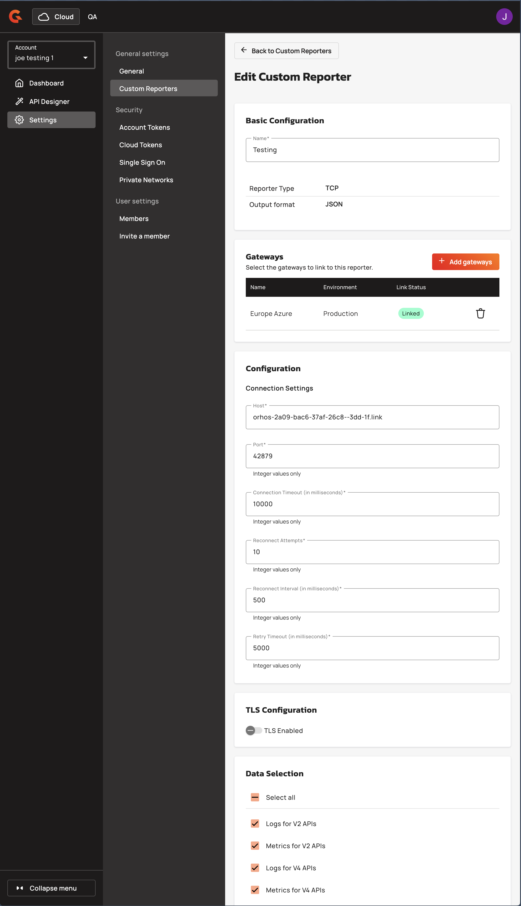

# Creating and Managing Custom Reporters

## Creating a Custom Reporter

Navigate to **Settings → Custom Reporters** and click **Create Custom Reporter**. Enter a unique name (2-128 characters, alphanumeric with spaces, hyphens, underscores, and periods). Specify the target **Host** (max 255 characters, no protocol prefix or path) and **Port** (1-65535). Configure connection parameters: **Connection Timeout**, **Reconnect Attempts**, **Reconnect Interval**, and **Retry Timeout** (all in milliseconds). Select at least one data type from the **Data Selection** checkboxes. If TLS is required, toggle **TLS Enabled**, choose **Keystore Type** (JKS or PKCS12), upload the keystore file (max 2 MB), and enter the **Keystore Password**. Optionally configure a truststore using the same process. Enable **Verify Client** for mutual TLS. Optionally link the reporter to specific gateways by providing gateway IDs. Click **Save** to create the reporter and initiate asynchronous gateway linking.

<figure><figcaption></figcaption></figure>

## Managing Custom Reporters

To update a reporter, retrieve it via the API or UI, modify the desired fields (name, host, port, connection parameters, data selection, TLS settings, or gateway links), and submit the updated configuration. The system computes the difference in gateway links and synchronizes changes (adding, removing, or updating links). To delete a reporter, send a DELETE request to `/cloud/accounts/{accountId}/custom-reporters/{customReporterId}`. The system unlinks all associated gateways before removing the reporter. Existing passwords are masked as `********` in API responses; re-enter passwords to update encrypted values.

<figure><figcaption></figcaption></figure>

<figure><figcaption></figcaption></figure>

## End-User Configuration

