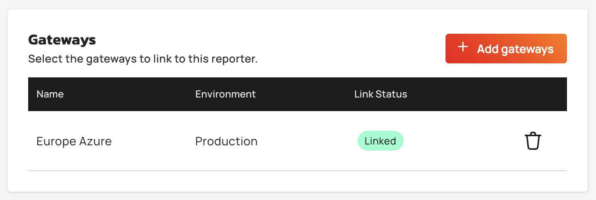
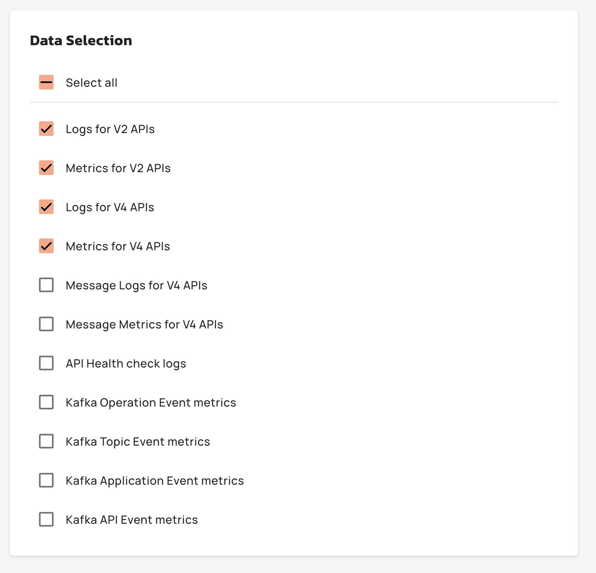
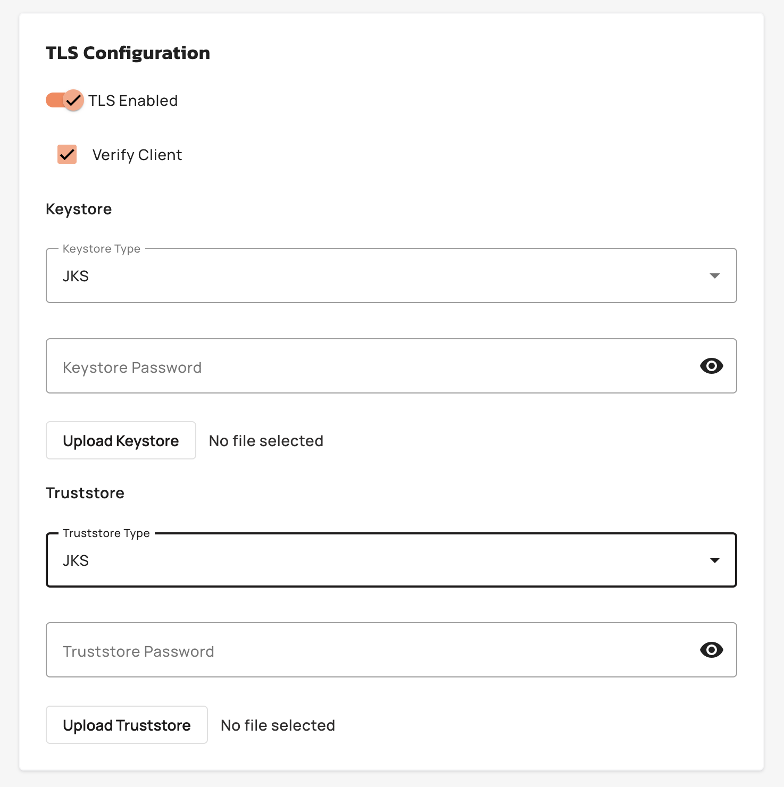

# Custom Reporters Overview

## Overview

Custom Reporters enable API platform administrators to send gateway telemetry to external systems via TCP. This feature extends TCP reporter configuration to Gravitee-hosted gateways, which was previously available only for hybrid gateways. Administrators configure reporter endpoints, select data types (V2/V4 logs and metrics, message logs, health checks, Kafka event metrics), and link reporters to specific gateways. Sensitive TLS credentials are encrypted using RSA-OAEP/SHA-256.

For more information about TCP reporters, see [TCP Reporter](https://documentation.gravitee.io/apim/analyze-and-monitor-apis/reporters/tcp-reporter).

## Key Concepts

### TCP Reporter

A TCP Reporter streams JSON-formatted gateway telemetry to a remote TCP endpoint. Administrators configure the target host, port, connection parameters (timeout, reconnect attempts, retry intervals), and optional TLS settings. Each reporter can be linked to one or more gateways, and data selection determines which telemetry types are forwarded.

### Data Selection

Administrators choose which telemetry types to forward from the following options:

<figure><figcaption></figcaption></figure>

| Data Type | Description |
|:----------|:------------|
| V2 Logs | Logs from v2 API executions |
| V2 Metrics | Metrics from v2 API executions |
| V4 Logs | Logs from v4 API executions |
| V4 Metrics | Metrics from v4 API executions |
| V4 Message Logs | Message-level logs from v4 APIs |
| V4 Message Metrics | Message-level metrics from v4 APIs |
| API Health Check Logs | Health check execution logs |
| Kafka Operation Event Metrics | Kafka operation event metrics |
| Kafka Topic Event Metrics | Kafka topic event metrics |
| Kafka Application Event Metrics | Kafka application event metrics |
| Kafka API Event Metrics | Kafka API event metrics |

Gateway Monitoring Metrics are always excluded, even if selected.

For more information about data selection, see [Configuring Reporters and Selecting Fields](https://documentation.gravitee.io/apim/analyze-and-monitor-apis/reporters#configuring-reporters-and-selecting-fields).

### TLS Configuration

When TLS is enabled, administrators upload keystore and truststore files (JKS or PKCS12 format, max 2 MB each) and provide passwords. Passwords are encrypted using the platform's RSA public key before storage. The **Verify Client** option enforces mutual TLS authentication. If TLS is disabled, all TLS-related fields are cleared.

<figure><figcaption></figcaption></figure>

### Gateway Linking

Reporters are linked to gateways during creation or update. When a reporter is created with gateway IDs, the system asynchronously links those gateways (errors are logged but do not block creation). On update, the system computes the difference between existing and new gateway lists, adding, removing, or updating links as needed. Gateways with status `PENDING` or `DELETING` are skipped. Deleting a reporter unlinks all associated gateways. A gateway can only have one reporter of each type linked.

<figure><figcaption></figcaption></figure>
