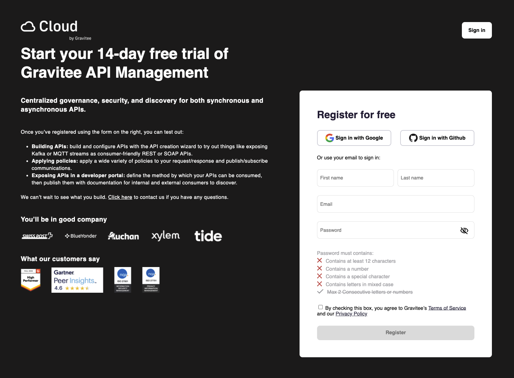
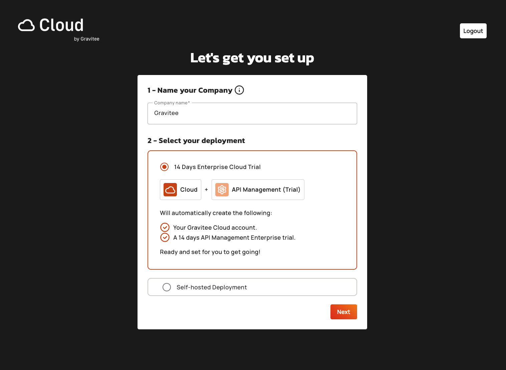
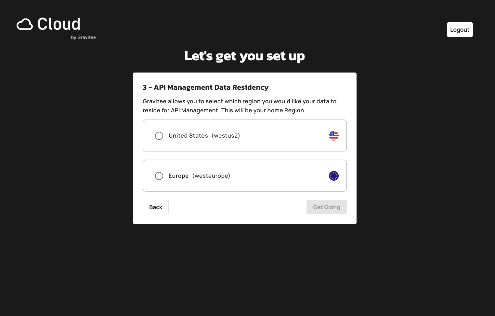
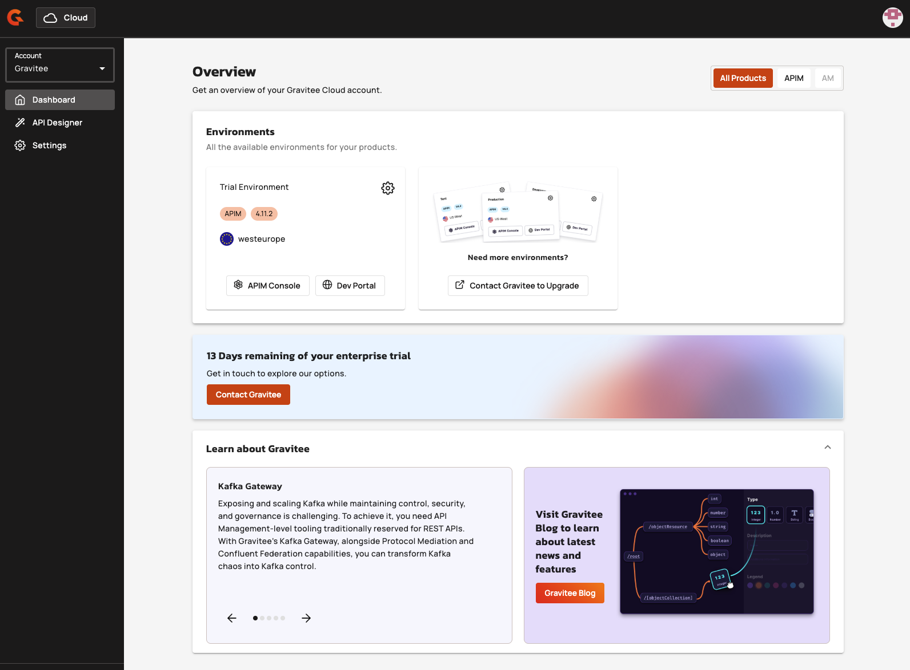

# Getting started with Gravitee Cloud

To get started with Gravitee Cloud, complete the following steps

**Step 1** - Navigate to [Gravitee Cloud](https://cockpit.gravitee.io/?createUser=true), and then sign up with a new user or sign up using your Google or GitHub account.

<figure><figcaption></figcaption></figure>

**Step 2** - Check your inbox for the verification email sent by Gravitee Cloud, then click the link in the email to confirm your email address. Registration can't continue until your email address is verified.


If the email doesn't arrive within a few minutes, check your spam folder.


**Step 3** - Name your cloud account

**Step 4** - Choose _14 days Enterprise trial_ as the deployment option. The trial is your first stepping stone into Gravitee Cloud. 

<figure><figcaption></figcaption></figure>

**Step 5** - Select the data residency you want. Gravitee allows you to select the region where you would like your data to reside for API Management.&#x20;

<figure><figcaption></figcaption></figure>

**Step 6** - Click on _"Get Going"_

You are then directed to the Gravitee Cloud Dashboard, where you can discover your options in Gravitee Cloud UI or go straight into API Management Control Plane by accessing APIM Console or Dev Portal.

<figure><figcaption></figcaption></figure>
