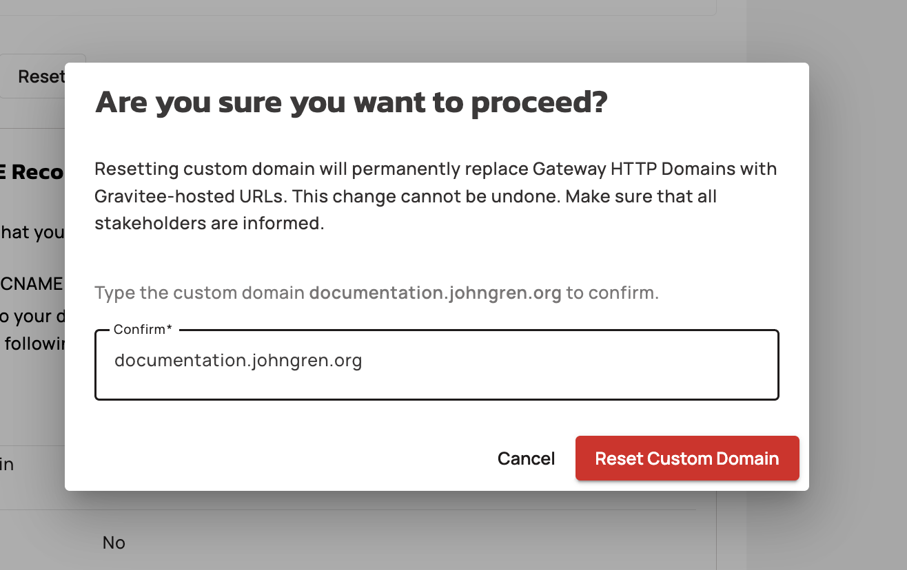

# Account Token

## Introduction

Account Token lets you generate secure, long living tokens that can be used to interact with your Cockpit Account using the Management API.

Use cases for this can be to automate the creation of Organizations, Environments and link them to your installations.

## How it works

Account tokens management is available through Account Settings, only available to Account Administrators.

You can have a total of 10 account tokens active at the same time. \
\
It is important to know that account tokens permissions are directly derived from the user who created the token. So if an an ACCOUNT\_PRIMARY\_OWNER creates an account token, the token will inherit the same permissions on the account as this used has.

## How to create a token

Follow the steps below to create and manage Account Tokens, such as deletion.

1. Go to Settings > Account tokens.

<figure><figcaption></figcaption></figure>

2. Click on **Generate token**, give your Account Token a meaningful name, and then click on **Generate**.

<figure><figcaption></figcaption></figure>

3. In the next dialogue box you will see your Account token complemented with a CURL example of how to use it. Make sure you copy your Account token as it will not be possible to copy it once you close the the dialogue box. Click on **Close** once you feel ready.

<figure><figcaption></figcaption></figure>

4. You can now see your Account Token listed in the table. If you want to delete a token, click on the **bin icon** next to the Account Token you wish to delete.

<figure><figcaption></figcaption></figure>

5. Enter the name in the Confirm input field, make sure you have no dependencies of this token, and finally click on **I understand the consequences, revoke this token**.

<figure><figcaption></figcaption></figure>
