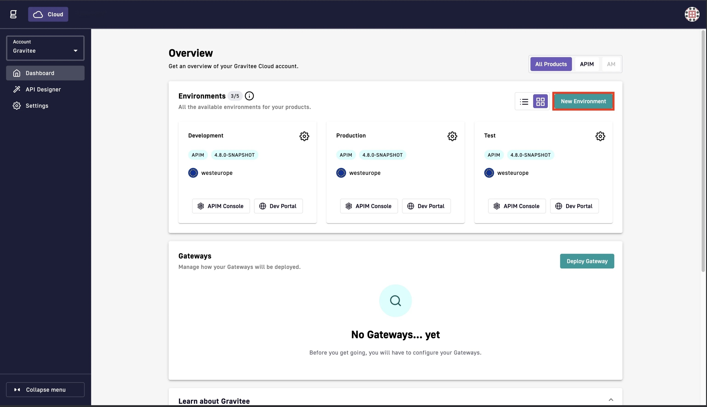
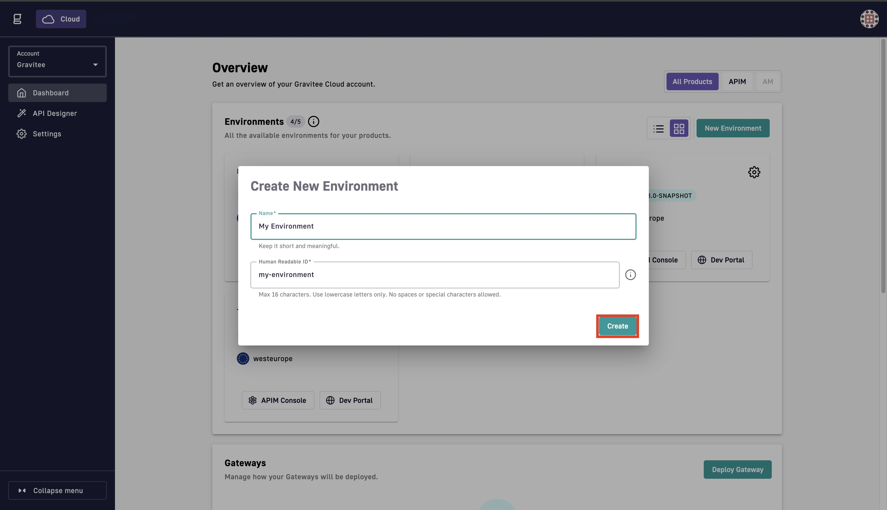
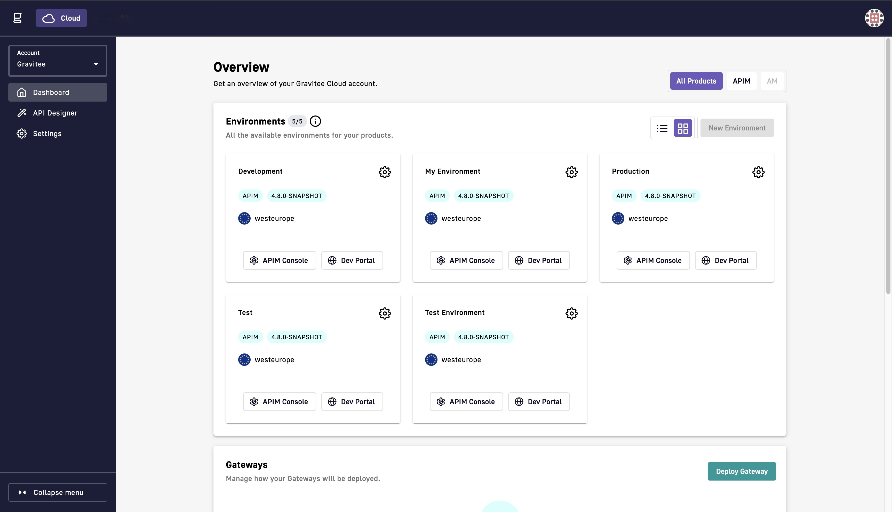
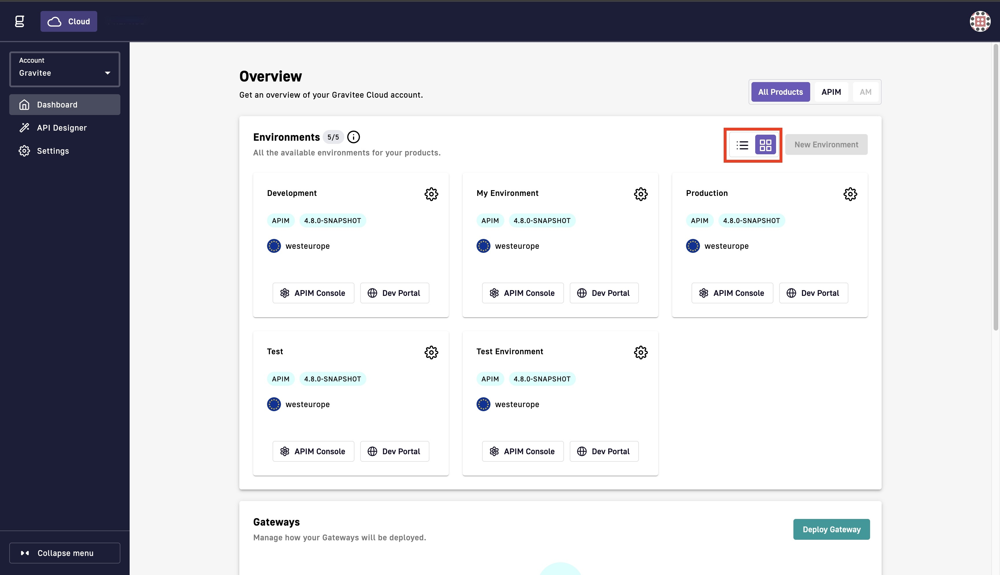
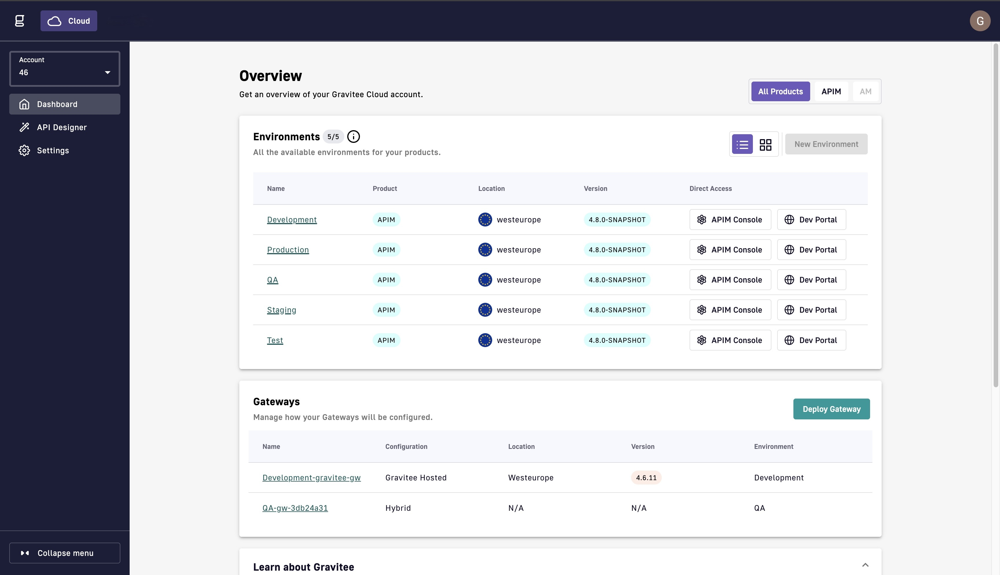

# Add Environments


Once you add an environment, you cannot delete the environment.


## Prerequisites

* You must link additional environments to your account. To link additional environments, contact your Technical Account Manager or use [Gravitee's contact form](https://www.gravitee.io/contact-us).

## Add an Environment

1.  From the **Dashboard**, navigate to the **Environments** section, and then click **New Environment**.

    <figure><figcaption></figcaption></figure>
2.  In the **Create New Environment** pop-up window, enter the name of your environment. The Human Readable ID (HRID) is automatically generated.

    \{% hint style="warning" %\} Once you create the environment, you cannot change the name of the environment. \{% endhint %\}

    <figure><figcaption></figcaption></figure>
3.  (Optional) Edit the Human Readable ID. The HRID must meet the following criteria:

    * Be a maximum of 16 characters.
    * Contain only lowercase letters.
    * Not contain spaces or special characters.

    \{% hint style="warning" %\} The Human Readable ID is used to build public API URLs for services hosted by Gravitee, and it is part of the end-user facing URLs. \{% endhint %\}4. Click **Create**.

    <figure><figcaption></figcaption></figure>

    Your environment appears in the **Environments** section of the **Dashboard**.

    <figure><figcaption></figcaption></figure>

## Change the Environment section layout

*   To change the Environment section from the tile view to a list view, click the **list button**. \\

    <figure><figcaption></figcaption></figure>

    <figure><figcaption></figcaption></figure>
