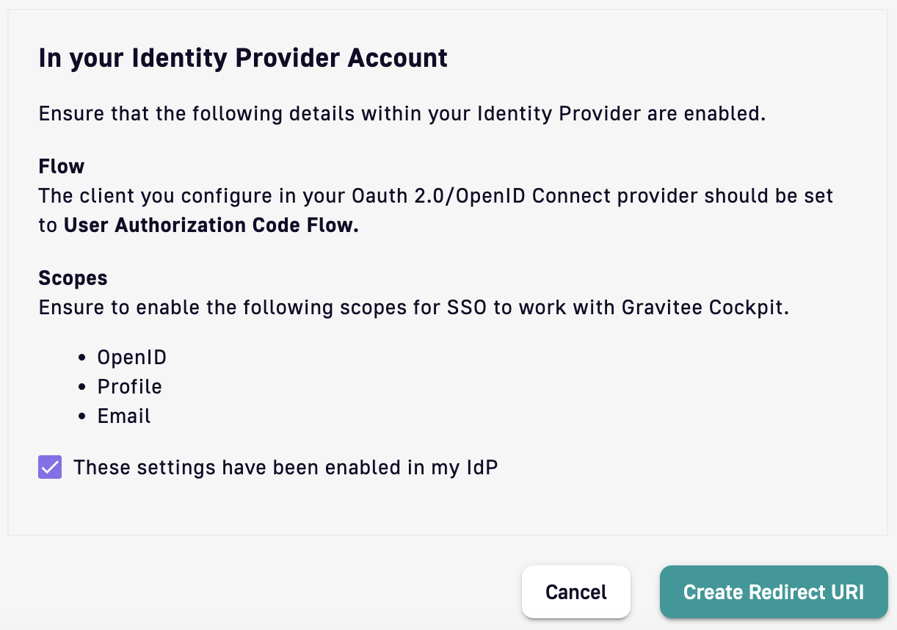

# Configure Single Sign On

## Introduction

Single Sign On (SSO) allows you to configure your own authentication method for signing in to Cockpit. Benefits include:

* Your users can sign in with an already familiar account and credentials
* You can use an authentication method that meets your information security assessments
* You can centrally remove user accounts and prevent them from signing in to Cockpit


Single Sign On is an enterprise feature. Want to know more about the full Gravitee Enterprise offering? [Reach out to our commercial team](https://www.gravitee.io/contact-us-cockpit).


## How it works

Single Sign On allows you to set up an identity trust federation with your organization's identity provider using the standard OAuth 2.0 and OpenID Connect. You can then connect directly to your Gravitee Access Management, Okta, Ping, Azure AD, Keycloak, or any identity provider that supports OAuth 2.0 and OpenID Connect.

Once the end user chooses to sign in to Cockpit with SSO, they will be asked to provide their organization email. This email is used to redirect the user to your chosen authentication method to either sign in or bypass sign in via SSO if the user is already authenticated.

<figure><figcaption>
Single Sign On users should select "Sign in with your company SSO"
</figcaption></figure>

<figure><figcaption>
User email redirects to your organization's IdP
</figcaption></figure>

## How to configure


It is recommended that the Account Primary Owner be a non-SSO user so that the Cockpit Account can always be recovered. Only the Account Primary Owner can configure Single Sign On.


1.  Select **Settings** from the left sidebar, choose **Single Sign On**, and click **Configure**&#x20;

    <figure><figcaption>
Go to Settings to find Single Sign On
</figcaption></figure>
2.  Enter an email domain in **Set domain realm** to specify how users should be authenticated when they sign in with an email address&#x20;

    <figure><figcaption>
Set the email domain that correctly redirects users
</figcaption></figure>
3. Create an Oauth client in your IdP that supports the Authorization Code Flow. If you are using Gravitee Access Management, you can follow [this guide](https://documentation.gravitee.io/am/guides/applications) to configure an OAuth client application.
4.  Enter the details of your Oauth client in **Set up Oauth/ OpenID Connect configuration**&#x20;

    <figure><figcaption>
Add the details of the OAuth client configured in your IdP
</figcaption></figure>
5. Ensure the **OpenID**, **Profile**, and **Email** scopes are enabled in your OAuth client so that Cockpit will receive all user attributes (claims) necessary to create the user profile\
   \
   In order to fully build the user profile in Cockpit, the claims `email`, `family_name` and `given_name` must be present in the token. This should be the case if your IdP conforms to OpenID Connect standard scope `email` and `profile`. But please verify as each IdP may behave differently\

6.  Click **Create Redirect URI**&#x20;

    <figure><figcaption>
Consent to enabling OpenID, Profile and Email scopes in your OAuth client
</figcaption></figure>
7.  The next screen presents the generated redirect URI. This is the endpoint that your IdP will send users back from once they have successfully authenticated. Copy this value and update the redirect URI on the OAuth client in your IdP.&#x20;

    <figure><figcaption>
Generated redirect URI to update your IdP OAuth client
</figcaption></figure>


Your users can now sign in to Cockpit with SSO!


The Single Sign On screen will display an Identity Provider that has been created and enabled

<figure><figcaption>
Single Sign On with an identity provider successfully created
</figcaption></figure>
