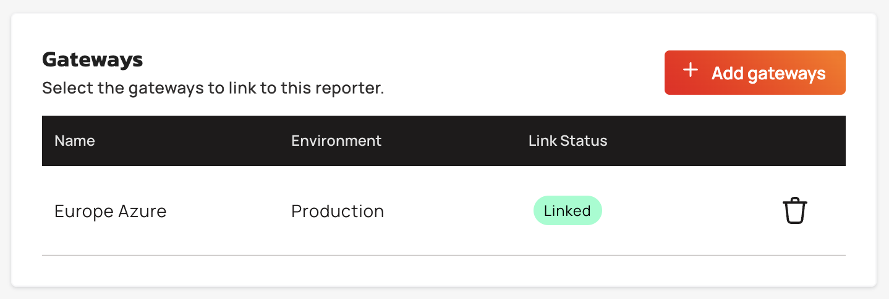
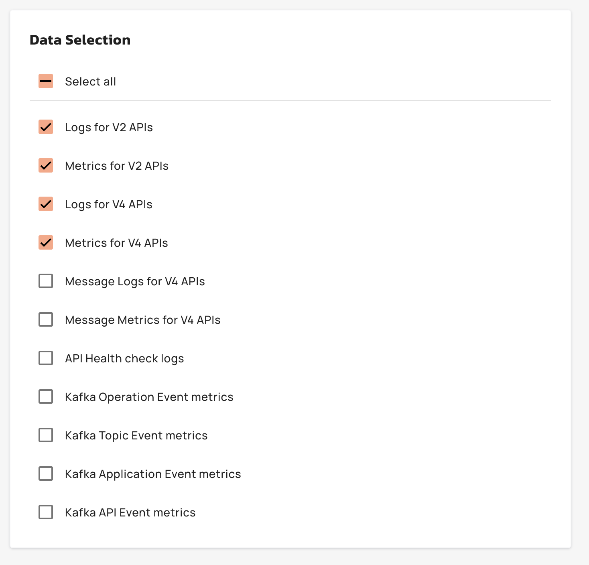
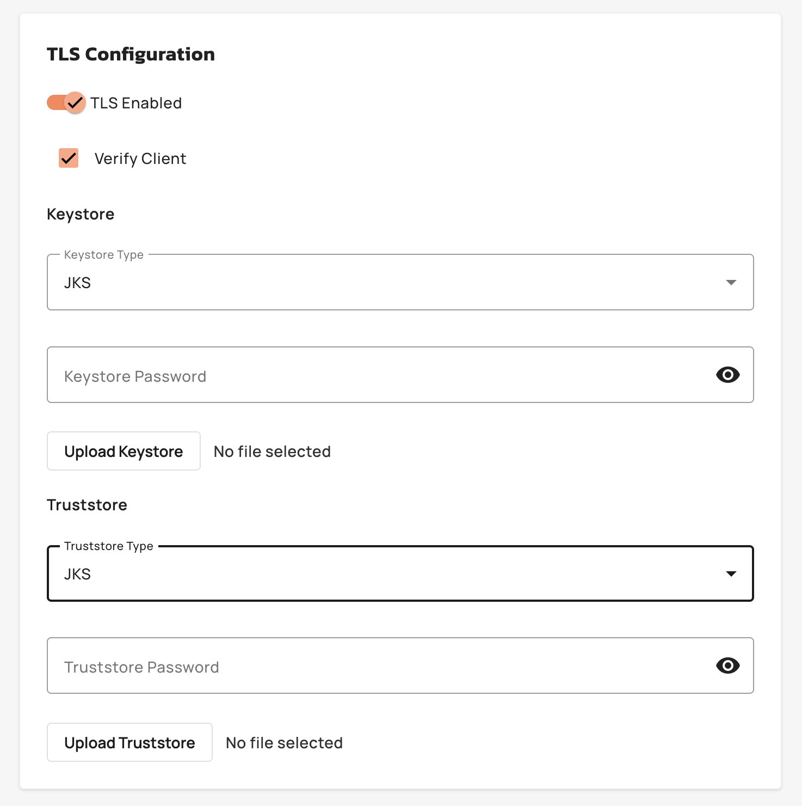

# Configure custom reporters

## Overview

Custom Reporters enable API platform administrators to configure log and metrics exporters that stream analytics data from Gravitee Hosted Gateways to external monitoring systems. Two reporter types are available: a TCP reporter, which streams the data to a TCP endpoint, and a Datadog reporter, which sends the data to your Datadog site. TCP reporters support TLS encryption and configurable reconnection and retry settings, and both types support selective data type filtering. This feature is available to enterprise customers with Galaxy or Universe tier licenses.

For more information about TCP reporter configuration, see [TCP Reporter](https://documentation.gravitee.io/apim/analyze-and-monitor-apis/reporters/tcp-reporter).

For more information about the Datadog reporter plugin, see [Datadog Reporter](https://documentation.gravitee.io/apim/analyze-and-monitor-apis/reporters/datadog-reporter).

### Compatibility matrix

| Reporter  | APIM version     |
| --------- | ---------------- |
| TCP TLS   | 4.11.x and above |
| TCP Plain | Any version      |

## Key Concepts

### Reporter Configuration

A custom reporter defines the connection parameters, security settings, and data selection rules for exporting gateway telemetry. A TCP reporter specifies a TCP endpoint, connection timeouts, reconnection behavior, and optional TLS certificates. A Datadog reporter specifies the Datadog site, an API key, batching settings, optional custom tags, and an optional proxy. Administrators select which data types to export like V2 Logs, V4 Metrics, Kafka event metrics, and then link the reporter to one or more gateways.

<figure><figcaption></figcaption></figure>

### Gateway Linking

Reporters are deployed to Gateways through a linking mechanism. A single reporter can be linked to multiple gateways, and each gateway can host multiple reporters. When a reporter is updated, all linked gateways with `DEPLOYED` status automatically receive the new configuration. Unlinking a reporter from a gateway triggers an asynchronous deletion job, transitioning the reporter status to `DELETING` until the job completes.

<figure><figcaption></figcaption></figure>

### Data Type Selection

Administrators choose which telemetry streams to export from a predefined set of data types. The available types include V2 Logs, V2 Metrics, V4 Logs, V4 Metrics, V4 Message Logs, V4 Message Metrics, API Health Check Logs, and Kafka event metrics, which include operation, topic, application, and API. A Datadog reporter doesn't send the Kafka event metrics, so they aren't offered when you create one.

For more information about data selection, see [Configuring Reporters and Selecting Fields](https://documentation.gravitee.io/apim/analyze-and-monitor-apis/reporters#configuring-reporters-and-selecting-fields).

<figure><figcaption></figcaption></figure>

### TLS Security

Reporters support mutual TLS authentication using JKS or PFX keystores and truststores. When TLS is enabled, administrators upload certificate files, with a maximum 2 MB each, and provide encrypted passwords. The TLS Verify Client option controls whether the reporter validates the remote server's certificate. Before stor age, all sensitive fields like keystore passwords, truststore passwords are encrypted with RSA-OAEP with SHA-256 .

<figure><figcaption></figcaption></figure>

## Prerequisites

* Enterprise license with Galaxy or Universe tier
* Account-level permissions to manage custom reporters
* For a TCP reporter, a TCP endpoint accessible from the gateway network
* For a Datadog reporter, an API key for your Datadog site
* (Optional) For a TCP reporter, JKS or PFX certificate files for TLS connections

To learn more about how to configure custom reporters, see the following articles:

<table data-view="cards"><thead><tr><th></th><th data-hidden data-card-target data-type="content-ref"></th></tr></thead><tbody><tr><td>Create a TCP reporter</td><td><a href="create-and-configure-custom-reporters.md">create-and-configure-custom-reporters.md</a></td></tr><tr><td>Create a Datadog reporter</td><td><a href="create-a-datadog-reporter.md">create-a-datadog-reporter.md</a></td></tr><tr><td>Custom Reporters Reference</td><td><a href="custom-reporters-reference.md">custom-reporters-reference.md</a></td></tr><tr><td>Managing Custom Reporter Deployments</td><td><a href="manage-custom-reporter-deployments.md">manage-custom-reporter-deployments.md</a></td></tr></tbody></table>
