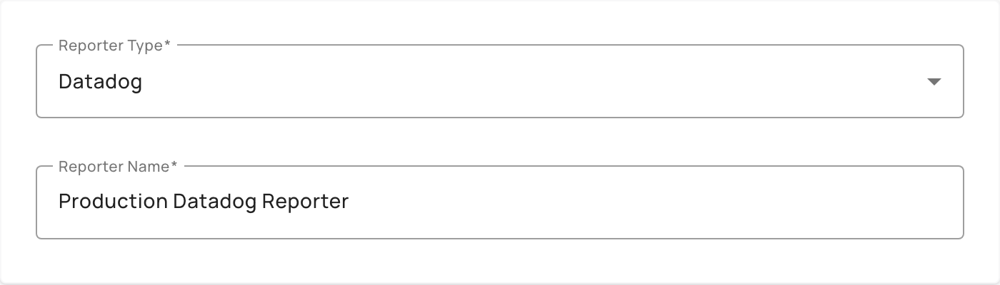
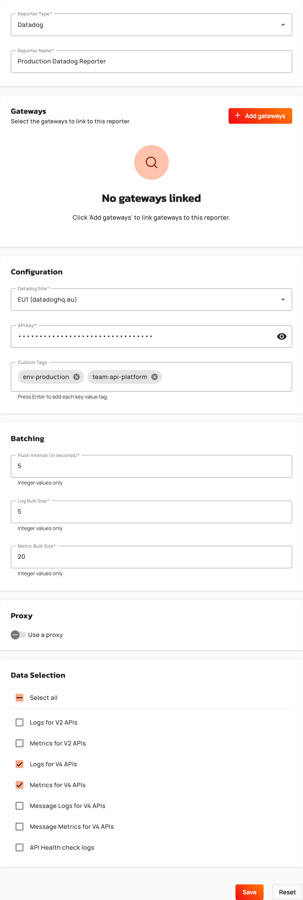
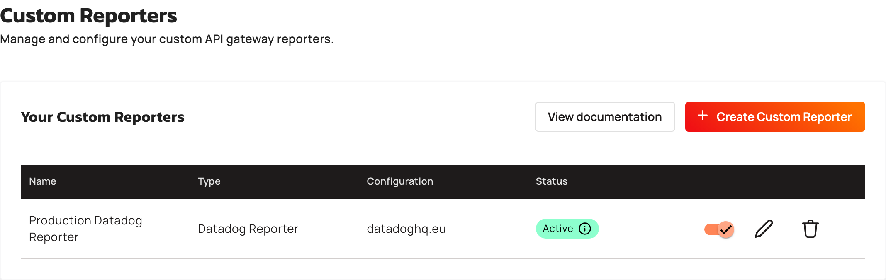

# Create a Datadog reporter

A Datadog reporter sends the logs and metrics of your Gravitee Hosted Gateways to your Datadog site. You configure the reporter once for your account, then link it to one or more Gateways, and Gravitee Cloud deploys the configuration to the linked Gateways. For more information about the data that the reporter sends to Datadog, see [Datadog Reporter](https://documentation.gravitee.io/apim/analyze-and-monitor-apis/reporters/datadog-reporter).

## Prerequisites

Before creating a Datadog reporter, ensure you meet the following requirements:

* Enterprise license with the Galaxy or Universe tier
* An API key for your Datadog site
* To link Gateways when you create the reporter, at least one deployed Gravitee Hosted Gateway that isn't linked to another Datadog reporter
* Optional: A proxy that the Gateways reach, if the traffic to Datadog goes through a proxy

## Create the reporter

1. From the **Dashboard**, click **Settings**.
2. Click **Custom Reporters**.
3. Click **Create Custom Reporter**.
4. From the **Reporter Type** list, select **Datadog**.

    <figure><figcaption></figcaption></figure>

5. In the **Reporter Name** field, enter a name for the reporter. The name accepts between 2 and 128 characters, and only letters, numbers, spaces, hyphens, underscores, and periods.
6. Optional: To link the reporter to Gateways now, complete the following sub-steps. To link Gateways later instead, use the **Reporters** page of a Gateway. For more information, see [Manage custom reporter deployments](manage-custom-reporter-deployments.md).
   1. In the **Gateways** section, click **Add gateways**.
   2. In the **Select gateways to link** window, select the Gateways to link. The window lists only Gateways that are deployed, Gravitee-hosted, and not already linked to a Datadog reporter.
   3. Click **Add**. The button label includes the number of Gateways you selected, for example, **Add 2 gateways**.
7. In the **Configuration** section, configure the connection to Datadog:
   1. From the **Datadog Site** list, select the site that hosts your Datadog organization: **US1 (datadoghq.com)**, **US3 (us3.datadoghq.com)**, **US5 (us5.datadoghq.com)**, **EU1 (datadoghq.eu)**, or **US1-FED (ddog-gov.com)**.
   2. In the **API Key** field, enter your Datadog API key.
   3. Optional: In the **Custom Tags** field, enter a tag in the `key:value` format, and then press Enter. Repeat for each tag. The Gateways add these tags to the logs and metrics that they send to Datadog. A tag starts with a letter, accepts only letters, digits, and the characters `_`, `-`, `:`, `.`, and `/`, and is at most 200 characters.
8. In the **Batching** section, configure how the Gateways group the data before sending it to Datadog:
   1. In the **Flush Interval (in seconds)** field, enter how often the Gateways send the data that they have buffered. The default is 5. Enter a whole number of at least 1.
   2. In the **Log Bulk Size** field, enter the number of log entries that the Gateways group into one request. The default is 5. Enter a whole number between 1 and 1000.
   3. In the **Metric Bulk Size** field, enter the number of metrics that the Gateways group into one request. The default is 20. Enter a whole number of at least 1.
9. Optional: In the **Proxy** section, send the traffic to Datadog through a proxy:
   1. Turn on **Use a proxy**.
   2. From the **Proxy Type** list, select **HTTP**, **SOCKS4**, or **SOCKS5**.
   3. In the **Proxy Host** field, enter the proxy host without a scheme or a path. The host is at most 255 characters and contains no whitespace or control characters.
   4. In the **Proxy Port** field, enter the proxy port, between 1 and 65535. The default is 3128.
   5. Optional: In the **Username** and **Password** fields, enter the credentials of the proxy.
10. In the **Data Selection** section, select at least one data type to send to Datadog. A Datadog reporter sends the following data types:
    * **Logs for V2 APIs**
    * **Metrics for V2 APIs**
    * **Logs for V4 APIs**
    * **Metrics for V4 APIs**
    * **Message Logs for V4 APIs**
    * **Message Metrics for V4 APIs**
    * **API Health check logs**

    The Kafka event metrics aren't available for a Datadog reporter.
11. Click **Save**. If you linked Gateways, a **Save reporter configuration** dialog warns you that the affected Gateways are rolling-restarted to apply the change. Click **Save** to confirm.

    <figure><figcaption></figcaption></figure>


After you save the reporter, the API key and the proxy password are stored encrypted and displayed as `********`. When you edit the reporter, leave the masked value unchanged to keep the stored value, or enter a new value to replace it.


## Verification

To verify the Datadog reporter is working as expected, follow these steps:

1. From the **Dashboard**, click **Settings**.
2. Click **Custom Reporters**. The reporter appears in the **Your Custom Reporters** table with the type **Datadog Reporter** and the Datadog site in the **Configuration** column.
3. Check the **Status** column. If you linked Gateways, the status is **Updating** until every Gateway has applied the configuration, and then **Active**. If you didn't link any Gateway, the status is **Not linked**. For more information about the statuses, see [Manage custom reporter deployments](manage-custom-reporter-deployments.md).

    <figure><figcaption></figcaption></figure>
