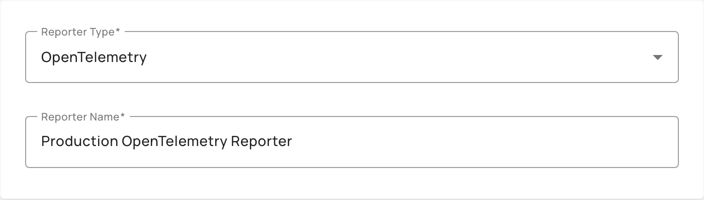
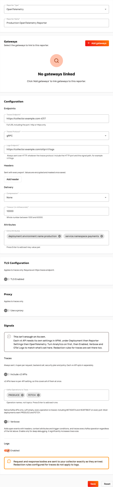

# Create an OpenTelemetry reporter

An OpenTelemetry reporter sends traces, and optionally logs, from your Gravitee Hosted Gateways to an OpenTelemetry collector that you run. You configure the reporter once for your account, link it to one or more Gateways, and Gravitee Cloud deploys the configuration to the linked Gateways.

The reporter sends two signals:

* **Traces:** a span for each request, and one for the backend call, the security plan, and each policy. Traces are always sent.
* **Logs:** request and response bodies, and message payloads for event-driven APIs, sent as OpenTelemetry log records. Logs are optional.

The reporter doesn't send metrics. To export metrics, use a [TCP reporter](create-and-configure-custom-reporters.md) or a [Datadog reporter](create-a-datadog-reporter.md).


The reporter alone doesn't produce data. Each v4 API needs OpenTelemetry turned on in its own reporter settings in APIM. For more information, see [OpenTelemetry](https://documentation.gravitee.io/apim/analyze-and-monitor-apis/opentelemetry) and [Enable and use OpenTelemetry logs for APIs](https://documentation.gravitee.io/apim/analyze-and-monitor-apis/enable-and-use-opentelemetry-logs-for-apis).


## Prerequisites

Before creating an OpenTelemetry reporter, ensure you meet the following requirements:

* Enterprise license with the Galaxy or Universe tier
* An OpenTelemetry collector that the Gateways reach, with an endpoint for traces and, to send logs, an HTTP endpoint for logs
* To link Gateways when you create the reporter, at least one deployed Gravitee Hosted Gateway that isn't linked to another OpenTelemetry reporter
* Optional: A JKS or PFX keystore, truststore, or both, if the collector requires TLS or mutual TLS for traces
* Optional: A proxy that the Gateways reach, if the trace traffic goes through a proxy

## Create the reporter

1. From the **Dashboard**, click **Settings**.
2. Click **Custom Reporters**.
3. Click **Create Custom Reporter**.
4. From the **Reporter Type** list, select **OpenTelemetry**.

    <figure><figcaption></figcaption></figure>

5. In the **Reporter Name** field, enter a name for the reporter. The name accepts between 2 and 128 characters, and only letters, numbers, spaces, hyphens, underscores, and periods.
6. Optional: To link the reporter to Gateways now, complete the following sub-steps. To link Gateways later instead, use the **Reporters** page of a Gateway. For more information, see [Manage custom reporter deployments](manage-custom-reporter-deployments.md).
   1. In the **Gateways** section, click **Add gateways**.
   2. In the **Select gateways to link** window, select the Gateways to link.
   3. Click **Add**. The button label includes the number of Gateways you selected, for example, **Add 2 gateways**.
7. In the **Configuration** section, under **Endpoints**, configure where the Gateways send the data:
   1. In the **Traces Endpoint** field, enter the full URL of the collector, including the port, for example `https://collector.example.com:4317`. Use `http` or `https`, and don't add a signal path such as `/v1/traces`, because the Gateway appends it. Don't include credentials in the URL.
   2. From the **Traces Protocol** list, select `gRPC` or `HTTP / protobuf`. The default is `HTTP / protobuf`.
   3. Optional: In the **Logs Endpoint** field, enter the full URL of the logs endpoint, including the HTTP port and the signal path, for example `https://collector.example.com/otlp/v1/logs`. Logs are always sent over HTTP, whatever the traces protocol. This field is required when you turn on logs in step 12.
8. Optional: Under **Headers**, add the headers that the Gateways send with every export, for example an authentication token for the collector:
   1. Click **Add header**.
   2. In the **Name** field, enter the header name. The name is at most 128 characters, contains no spaces, colons, or non-ASCII characters, and is unique, compared without case.
   3. In the **Value** field, enter the header value. The value is at most 446 printable ASCII characters.

   A reporter carries at most 20 headers.
9. Under **Delivery**, configure how the Gateways send the data:
   1. From the **Compression** list, select `None` or `gzip`. The default is `None`.
   2. In the **Timeout (in milliseconds)** field, enter a whole number between 1000 and 60000. The default is 10000.
10. Optional: Under **Attributes**, in the **Extra Attributes** field, enter an attribute in the `key:value` format, and then press Enter. Repeat for each attribute. The key starts with a letter and accepts only letters, digits, and the characters `_`, `-`, `.`, and `/`. The value is printable ASCII. Neither part contains a comma, and each part is at most 200 characters.
11. Optional: Configure TLS and a proxy for the traces. Both settings apply to traces only.
    * To use TLS, in the **TLS Configuration** section, turn on **TLS Enabled**. The **Traces Endpoint** must then use `https`.
      * **Verify Host** checks that the collector's certificate matches its hostname. It's on by default.
      * **Trust All** skips the certificate checks, including the hostname. Use it only for testing.
      * To present a client certificate, select a **Keystore Type**, **JKS** or **PFX**, enter the **Keystore Password**, and click **Upload Keystore**.
      * To trust a certificate authority that the Gateways don't trust by default, select a **Truststore Type**, enter the **Truststore Password**, and click **Upload Truststore**.

      Each file is at most 2 MB.
    * To use a proxy, in the **Proxy** section, turn on **Use a proxy**, and then enter the **Proxy Host**, without a scheme or a path, and the **Proxy Port**, between 1 and 65535. The default port is 3128. Optionally, enter a **Username** and a **Password**.
12. In the **Signals** section, configure what the Gateways send:
    1. Optional: Turn on **Include v2 APIs** to trace every v2 API. v2 APIs have no per-API setting, so this switch covers every v2 API at once.
    2. Optional: In the **Kafka Operations to Trace** field, enter the Kafka operation names to trace for native Kafka APIs, for example `PRODUCE` and `FETCH`, and press Enter after each one. Left empty, every operation is traced, including `METADATA` and `HEARTBEAT` on every poll.
    3. Optional: Turn on **Verbose** to add span events with headers, context attributes, and trigger conditions. Verbose mode also traces every Kafka operation, whatever the list in the previous sub-step. It significantly increases trace size, so use it only for deep debugging.
    4. Optional: Under **Logs**, turn on **Enabled** to send logs to the **Logs Endpoint**.

    
    Logs carry request and response bodies to your collector exactly as they arrived. Redaction rules configured for traces don't apply to logs.
    

13. Click **Save**. If you linked Gateways, a **Save reporter configuration** dialog warns you that the affected Gateways are rolling-restarted to apply the change. Click **Save** to confirm.

    <figure><figcaption></figcaption></figure>


After you save the reporter, the header values, the keystore and truststore passwords, and the proxy password are stored encrypted and displayed as `********`. When you edit the reporter, leave a masked value unchanged to keep the stored value, or enter a new value to replace it. If you rename a header, re-enter its value.


## Turn on OpenTelemetry for your APIs

The reporter sends traces only for the v4 APIs that opt in, and for all v2 APIs when **Include v2 APIs** is on. For each v4 API to trace, open the API in the APIM Console and turn on OpenTelemetry in its reporter settings. To send the logs of an API, also turn on **OTel Logs** for that API. For the settings, see [OpenTelemetry](https://documentation.gravitee.io/apim/analyze-and-monitor-apis/opentelemetry) and [Enable and use OpenTelemetry logs for APIs](https://documentation.gravitee.io/apim/analyze-and-monitor-apis/enable-and-use-opentelemetry-logs-for-apis).

## Verification

To verify the OpenTelemetry reporter is working as expected, follow these steps:

1. From the **Dashboard**, click **Settings**.
2. Click **Custom Reporters**. The reporter appears in the **Your Custom Reporters** table with the type **OpenTelemetry Reporter**.
3. Check the **Status** column. If you linked Gateways, the status is **Updating** until every Gateway has applied the configuration, and then **Active**. If you didn't link any Gateway, the status is **Not linked**. For more information about the statuses, see [Manage custom reporter deployments](manage-custom-reporter-deployments.md).
4. Call a v4 API that has OpenTelemetry turned on, and confirm that its spans arrive at your collector.
