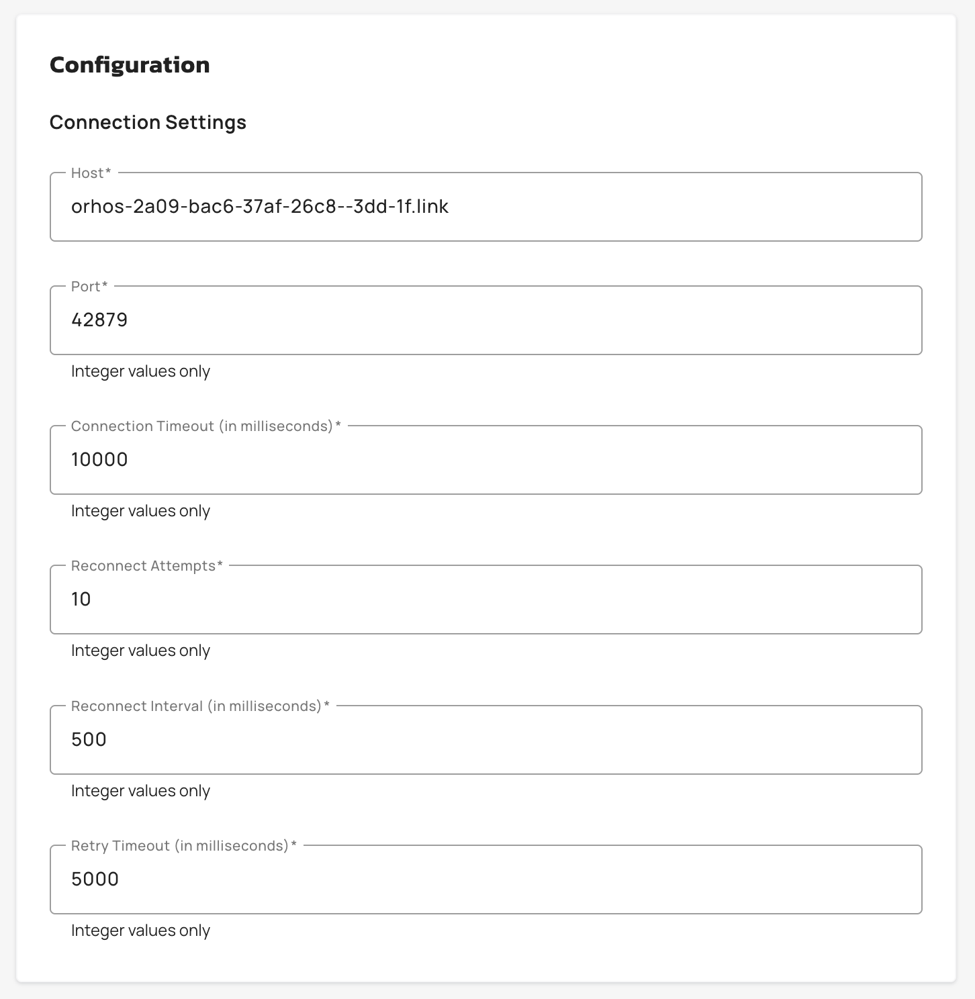

# Create and Configure Custom Reporters

## Prerequisites

Before creating a custom reporter, ensure you meet the following requirements:

* Enterprise license with Galaxy or Universe tier
* Account-level permissions to manage custom reporters
* TCP endpoint accessible from gateway network
* (Optional) JKS or PFX certificate files for TLS connections

## Creating a Custom Reporter

1. From the **Dashboard**, click **Settings**.
2. From the **Settings** menu, click **Custom Reporters**.
3. Click **Create Custom Reporter**.
4. In the **Name** field, enter a unique name for the reporter. The name must meet the following requirements:
 * Must be 2-128 characters.
 * Allowed characters: alphanumeric, spaces, hyphens, underscores, and periods.
5. Configure the following connection settings:
 1. Enter the destination **Host** (maximum 255 characters, no protocol prefix or path).
 2. Enter the **Port** (1-65535).
 3. Set the **Connection Timeout** in milliseconds.
 4. Set the **Reconnect Attempts**.
 5. Set the **Reconnect Interval** in milliseconds.
 6. Set the **Retry Timeout** in milliseconds.

 <figure><figcaption></figcaption></figure>

6.  Link the reporter to one or more gateways. To link the reporter to a Gateway, complete the following sub-steps:
 1. Click **Add Gateways**.
 2. In the **Select Gateways to link** pop-up window, select the Gateways that you want to link to the reporter.
 3. Click **Add Gateway**.
7. (Optional) Enable TLS:
 1. Toggle **TLS Enabled**.
 2. (Optional) Enable **TLS Verify Client** to validate the remote server's certificate.
 3. Select the **Keystore Type** (JKS or PFX).
 4. Upload the keystore file (maximum 2 MB).
 5. Provide the encrypted keystore password.
 6. Select the **Truststore Type** (JKS or PFX).
 7. Upload the truststore file (maximum 2 MB).
 8. Provide the encrypted truststore password.
8. From the **Data Selection** menu, select at least one data type to export from the available options.
9. Click **Save**.

<figure><figcaption></figcaption></figure>

## Verification 

Your Custom Reporter appears in the Custom Reporters screen.