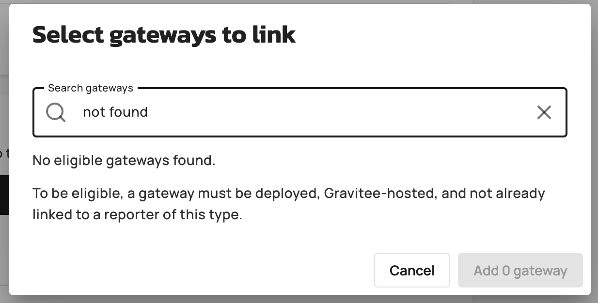

# Custom Reporters Reference

## Restrictions

- Only TCP reporter type is supported
- Only JSON output format is supported
- Gateway Monitoring Metrics data type is always excluded from export
- Reporter names must match the pattern `^[a-zA-Z0-9\s\-_.]+$`
- Host field cannot contain protocol prefixes like`http://`, `https://`, `tcp://`, or paths
- Host field cannot contain whitespace or control characters
- TLS certificate files must be JKS or PFX format
- TLS certificate files must be 2 MB or smaller
- When TLS is enabled, all three fields, type, password, content, must be provided for each store (keystore and truststore)
- Password fields display a masked placeholder (`********`) for existing values; actual passwords cannot be retrieved after initial entry
- Updating a reporter re-deploys only to gateways with `DEPLOYED` status and not `PENDING` or `DELETING`.
- Configuration keys changed from seconds to milliseconds in recent versions; existing reporters must migrate values. For example, `connectionTimeoutSeconds: "30"` becomes `connectTimeout: "1000"`)

<figure><figcaption></figcaption></figure>
