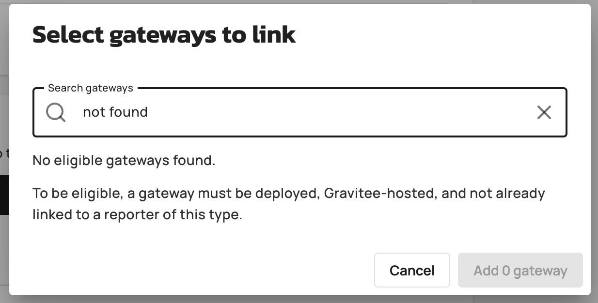

# Custom Reporters Reference

## Restrictions

- Two reporter types are available: TCP and Datadog. The type of an existing reporter is read-only. To switch types, delete the reporter and create a new one
- A Datadog reporter doesn't send the Kafka event metrics
- A Datadog reporter targets only the following Datadog sites: `datadoghq.com`, `us3.datadoghq.com`, `us5.datadoghq.com`, `datadoghq.eu`, and `ddog-gov.com`
- The Datadog log bulk size is between 1 and 1000
- Datadog custom tags start with a letter, accept only letters, digits, and the characters `_`, `-`, `:`, `.`, and `/`, and are at most 200 characters
- A Datadog proxy host contains no scheme (`http://`, `https://`, or a SOCKS4 or SOCKS5 scheme), no path, no whitespace, and no control characters
- A Gateway is linked to one reporter of each type at a time. Linking another reporter of the same type from the **Reporters** page of the Gateway replaces the current one
- Only JSON output format is supported
- Gateway Monitoring Metrics data type is always excluded from export
- Reporter names must match the pattern `^[a-zA-Z0-9\s\-_.]+$`
- Host field cannot contain protocol prefixes like`http://`, `https://`, `tcp://`, or paths
- Host field cannot contain whitespace or control characters
- TLS certificate files must be JKS or PFX format
- TLS certificate files must be 2 MB or smaller
- When TLS is enabled, all three fields, type, password, content, must be provided for each store (keystore and truststore)
- Password fields display a masked placeholder (`********`) for existing values; actual passwords cannot be retrieved after initial entry
- Updating a reporter re-deploys only to gateways with `DEPLOYED` status and not `PENDING` or `DELETING`.
- Configuration keys changed from seconds to milliseconds in recent versions; existing reporters must migrate values. For example, `connectionTimeoutSeconds: "30"` becomes `connectTimeout: "1000"`)

<figure><figcaption></figcaption></figure>
