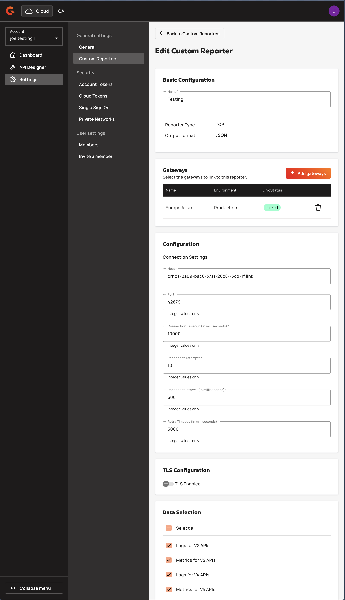
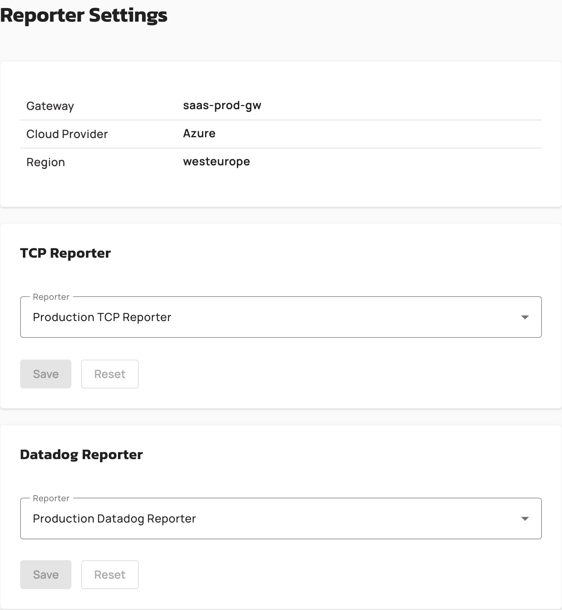
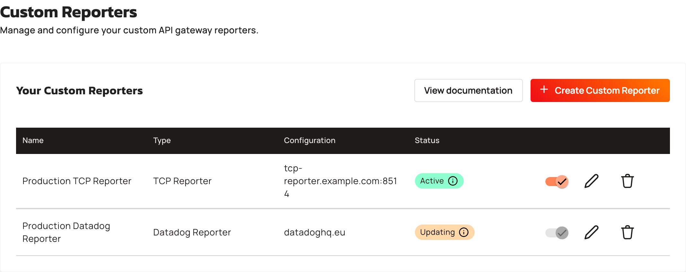

# Manage Custom Reporter Deployments

## Managing Reporter Deployments

After creating a reporter, monitor its deployment status on linked gateways. Reporters transition through `PENDING`, `DEPLOYED`, and `DELETING` states as deployment jobs execute. To update a reporter, modify its configuration or data selection. Then, the platform automatically deploys the reporter again to all Gateways with `DEPLOYED` status and Gateways in `PENDING` or `DELETING` states are skipped. To remove a reporter from a Gateway, unlink it. This action triggers an asynchronous deletion job that transitions the reporter to `DELETING` status until the job completes. Deployment failures are logged but do not block reporter creation or updates.

<figure><figcaption></figcaption></figure>

## Link a reporter from a Gateway

You link a TCP reporter and a Datadog reporter to a Gravitee Hosted Gateway from the Gateway itself, without editing the reporter. A Gateway uses one reporter of each type at a time.

1. From the **Dashboard**, in the **Gateways** section, click the name of the Gateway.
2. Click **Reporters**.
3. In the **Datadog Reporter** card or the **TCP Reporter** card, select a reporter from the **Reporter** list. To unlink the current reporter, select **None**. A deactivated reporter is listed with the **(Disabled)** suffix.
4. Click **Save**.

    <figure><figcaption></figcaption></figure>

The Gateway applies the change, and both cards are locked until the deployment completes. If no reporter of that type exists yet, the card shows a **Configure reporters** link to the **Custom Reporters** settings instead of the list. If the deployment fails, the card shows a warning banner that asks you to contact Gravitee.

## Edit a reporter

1. From the **Dashboard**, click **Settings**.
2. Click **Custom Reporters**.
3. In the row of the reporter, click the **Edit reporter** icon.
4. Change the settings, the linked Gateways, or the data selection, and then click **Save**. If the reporter is linked to Gateways, confirm the **Save reporter configuration** dialog.

The type of an existing reporter is read-only. To switch types, delete the reporter and create a new one. The form is locked while a deployment is pending on a linked Gateway. Changing only the name doesn't redeploy the reporter to the linked Gateways.

## Activate or deactivate a reporter

Deactivating a reporter turns it off on every linked Gateway without deleting anything. The reporter keeps its settings and its linked Gateways, so you activate it again later without retyping anything.

1. From the **Dashboard**, click **Settings**.
2. Click **Custom Reporters**.
3. In the row of the reporter, click the toggle. Its tooltip reads **Deactivate reporter** for an active reporter and **Activate reporter** for a deactivated one.
4. Click **Deactivate** or **Activate** to confirm.

Gravitee Cloud pushes the change to every linked Gateway, and the reporter shows the **Updating** status until every Gateway has applied it. The toggle is unavailable while an update is pending on a linked Gateway. A deactivated reporter shows a **Disabled** badge when you open it.

## Delete a reporter

Deleting a reporter removes it from every linked Gateway and from the list. A reporter that is being deployed to a Gateway can't be deleted until the deployment completes.

1. From the **Dashboard**, click **Settings**.
2. Click **Custom Reporters**.
3. In the row of the reporter, click the **Delete reporter** icon.
4. In the confirmation dialog, enter the name of the reporter, and then click **Yes, delete it**.

## Verification

To verify that a reporter is deployed as expected, follow these steps:

1. From the **Dashboard**, click **Settings**.
2. Click **Custom Reporters**.
3. Check the **Status** column of the **Your Custom Reporters** table. The table refreshes automatically while an update is in progress.

    <figure><figcaption></figcaption></figure>

The **Status** column shows one of the following values:

| Status | Meaning |
| --- | --- |
| **Not linked** | The reporter isn't linked to any Gateway. |
| **Active** | The reporter is active on all linked Gateways. |
| **Inactive** | The reporter is deactivated on all linked Gateways. |
| **Updating** | An update is pending on one or more linked Gateways. |
| **Update failed** | An update failed on one or more linked Gateways. |

To see the state of each Gateway, click the **Edit reporter** icon of the reporter. The **Link Status** column of the **Gateways** section shows **Linked**, **Pending**, **Deleting**, or **Error** for each linked Gateway.
