# Configure a Custom Domain for a Gateway

## Overview

With Custom domains, you route API traffic through your own domain, for example, `dev.gravitee.io` instead of the default Gravitee gateway URL. You can configure multiple custom domains for each Gateway, within the limits of your subscription plan.

The default Gravitee-provided gateway URL remains functional as a fallback.

## Prerequisites

* Access to Gravitee Cloud. To access Gravitee Cloud, [contact Gravitee](https://eu-auth.cloud.gravitee.io/cloud/register?response_type=code\&client_id=fd45d898-e621-4b12-85d8-98e621ab1237\&state=X24yazlSTUstY0llbUlFWVBiVFFsZm9kTGlrV3BRLm5TWVJkcExpY0tKOXRK\&redirect_uri=https%3A%2F%2Feu.cloud.gravitee.io\&scope=openid+profile+email+offline_access\&code_challenge=yb3oiZ6oKvJhNTPXFV9tIr94FvR7CVmgcfv3Z2iMljo\&code_challenge_method=S256\&nonce=X24yazlSTUstY0llbUlFWVBiVFFsZm9kTGlrV3BRLm5TWVJkcExpY0tKOXRK\&createUser=true\&hubspotutk=feb0e3649a4e3e5dff322ca54bcd54a7).
* You must a Cloud Account Owner permissions.
* Deploy a Gravitee Hosted Gateway for at least one environment. For more information about deploying a Gravitee Hosted Gateway, see [gravitee-hosted-gateways](gravitee-hosted-gateways/ "mention").
* Access to your domain registrar to manage DNS records (CNAME).

## Add a custom domain


The number of custom domains for each Gateway is limited by your subscription plan. The quota usage is displayed on the custom domains page. To increase your limit, contact Gravitee.


1.  From the **Dashboard**, navigate to **Gateways**, and then click the Gateway that you want to configure the Custom Domain for.  

    <figure>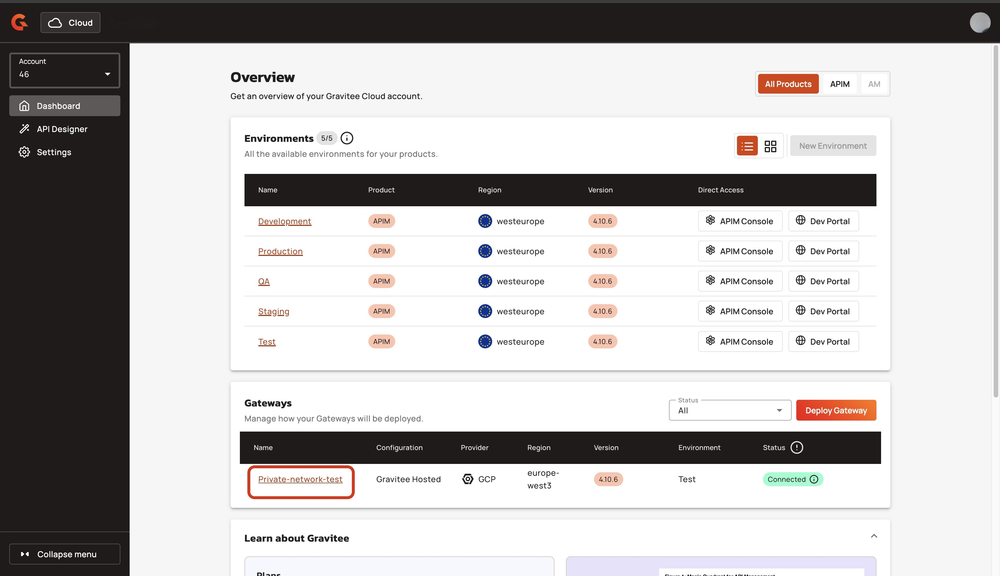<figcaption></figcaption></figure>
2.  In the Gateway details' menu, click **Custom Domains**. 

    <figure>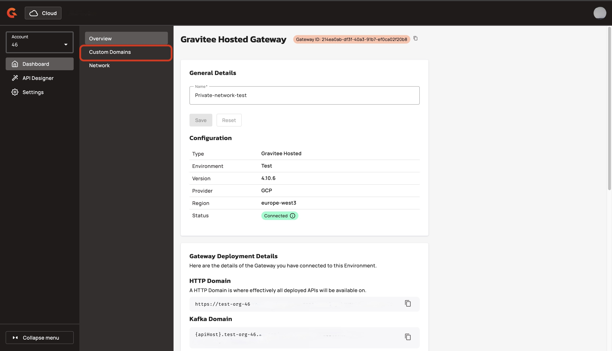<figcaption></figcaption></figure>

<figure>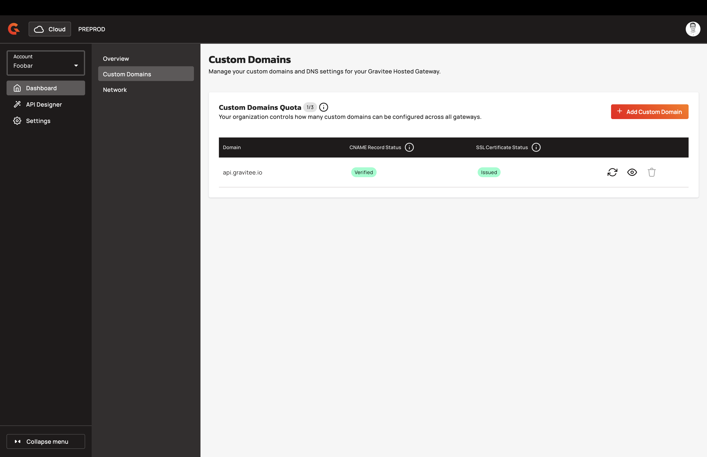<figcaption></figcaption></figure>

3.  Click **+ Add Custom Domain**.  

    <figure>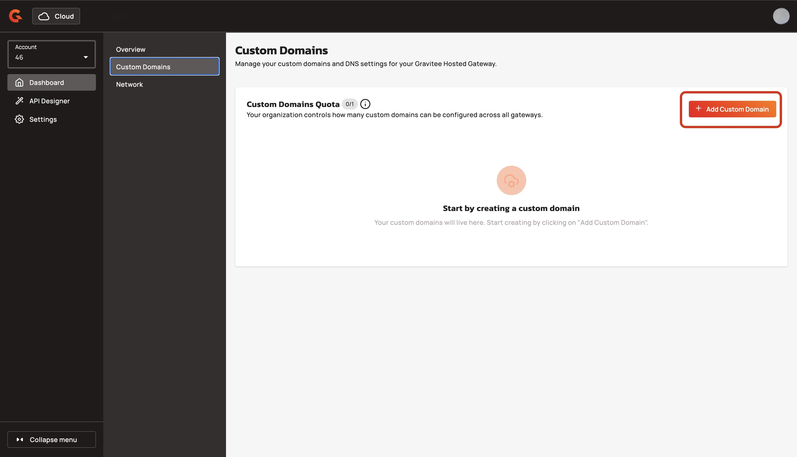<figcaption></figcaption></figure>
4. In the Gateway name field, enter the name of your Custom Domain. For example, `dev.gravitee.io`. The name of the Gateway must follow the following rules:
   1. The domain must be a valid domain name. The domain name can contain only lowercase letters, numbers, hyphens, and dots.
   2. The maximum length is 253 characters.
   3. The domain must be unique across all gateways and accounts.
5.  Click **Save**. 

    <figure>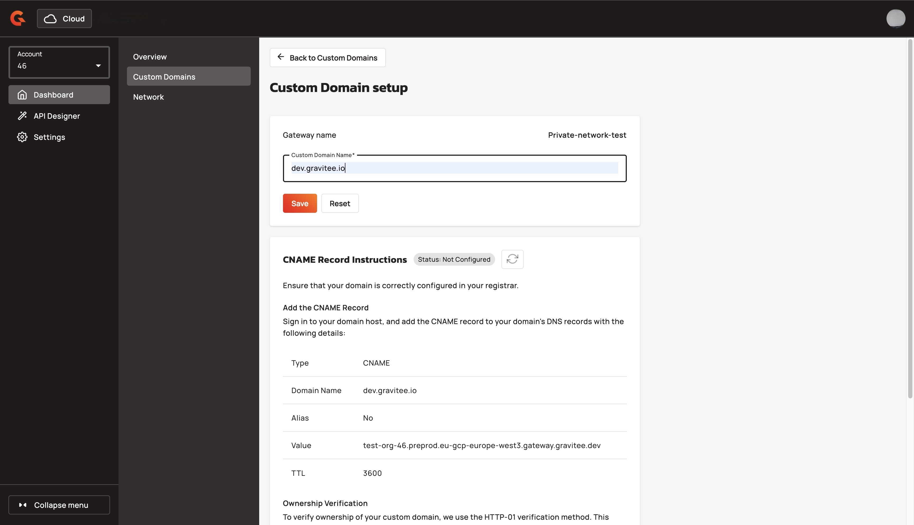<figcaption></figcaption></figure>

The domain is created and a DNS deployment job is triggered in the background. The domain appears in the list and the status is `not verified` status.

## Configure the DNS


Forward only the DNS record to Gravitee. Do not create an A record or modify any other DNS settings for this domain.


Create a **CNAME record** at your domain registrar. To find the correct values to create the CNAME record, complete the following steps:

1. Enter the `<Name_of_your_Custom_Domain>` with the name of the custom domain you created in [#add-a-custom-domain](custom-domains.md#add-a-custom-domain "mention").
2. Enter the `<Gateway_URL>`. To find the custom domain setup page, complete the following sub-steps:
   1.  From the **Custom Domains** page, click the **eye icon**.  

       <figure>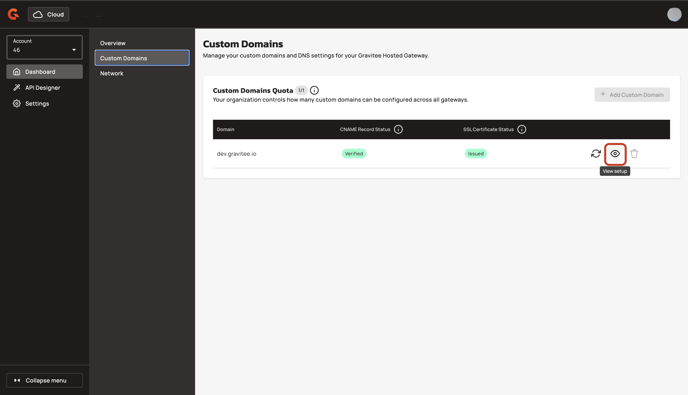<figcaption></figcaption></figure>
   2.  Navigate to the **CNAME Record Instructions** section. The **Value** field shows the Gateway URL. 

       <figure>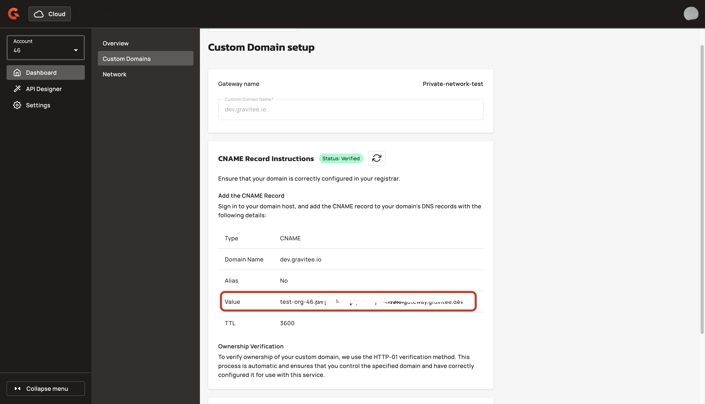<figcaption></figcaption></figure>

<table><thead><tr><th>Type</th><th width="266.3785400390625">Name</th><th>Value</th></tr></thead><tbody><tr><td>CNAME</td><td><code>&#x3C;Name_of_your_Custom_Domain></code></td><td><code>&#x3C;Gateway_URL></code></td></tr></tbody></table>

### SSL certificate issuance

Once the CNAME record is detected, Gravitee automatically performs an **HTTP-01 challenge** with Google CA to generate an SSL certificate. This process is fully automated and takes between 5 minutes and 24 hours, depending on on DNS propagation and CA availability. Gravitee continuously maintained the CNAME record.

## Verification&#x20;

On the custom domains page, each domain shows the following status indicators:

| Status                    | CNAME                                | SSL Certificate                 |
| ------------------------- | ------------------------------------ | ------------------------------- |
| **Verified** / **Issued** | CNAME record is correctly configured | SSL certificate has been issued |
| **Not verified**          | CNAME record not yet detected        | Certificate pending issuance    |
| **Error**                 | DNS configuration issue              | Certificate issuance failed     |

<figure>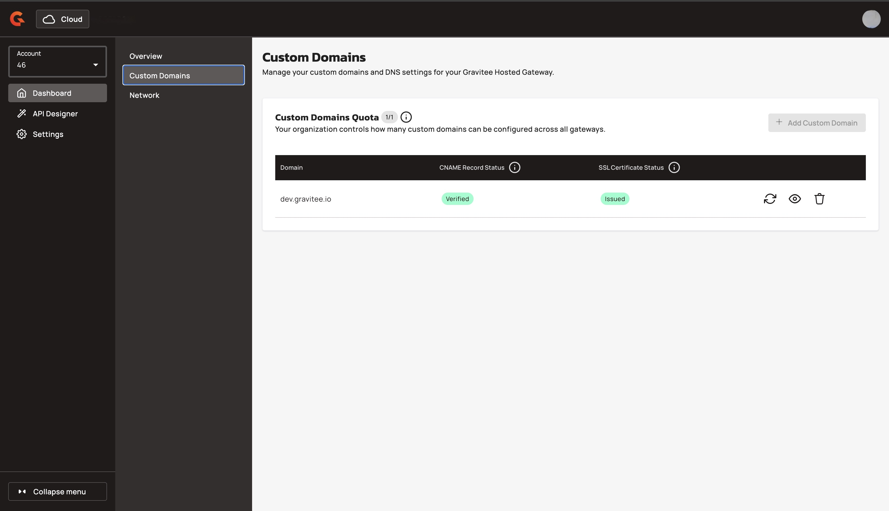<figcaption></figcaption></figure>

### Check the current status

*   On the **Custom Domain setup** page, navigate to the **CNAME Record Instructions** or **SSL Certificate Issuance**, and then click **Refresh.** 

    <figure>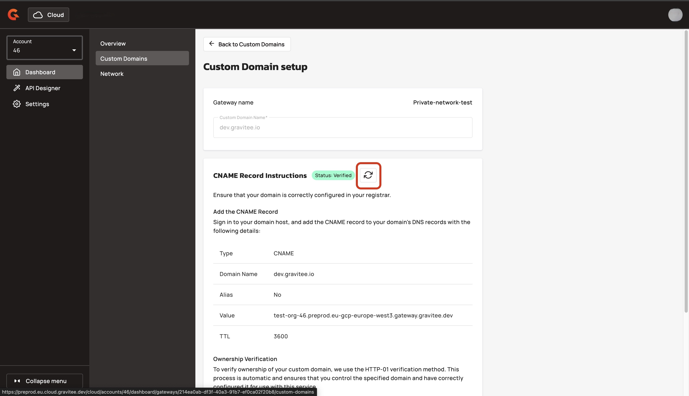<figcaption></figcaption></figure>

## Delete a custom domain


Deleting a custom domain is permanent. API traffic routed through this domain stops working immediately.


1.  From the **Dashboard**, navigate to **Gateways**, and then click the Gateway that you want to delete the custom domain for. 

    <figure><figcaption></figcaption></figure>
2.  In the Gateway details' menu, click **Custom Domains**. 

    <figure><figcaption></figcaption></figure>
3.  Navigate to the custom domain that you want to delete, and then click the **bin** icon.  

    <figure>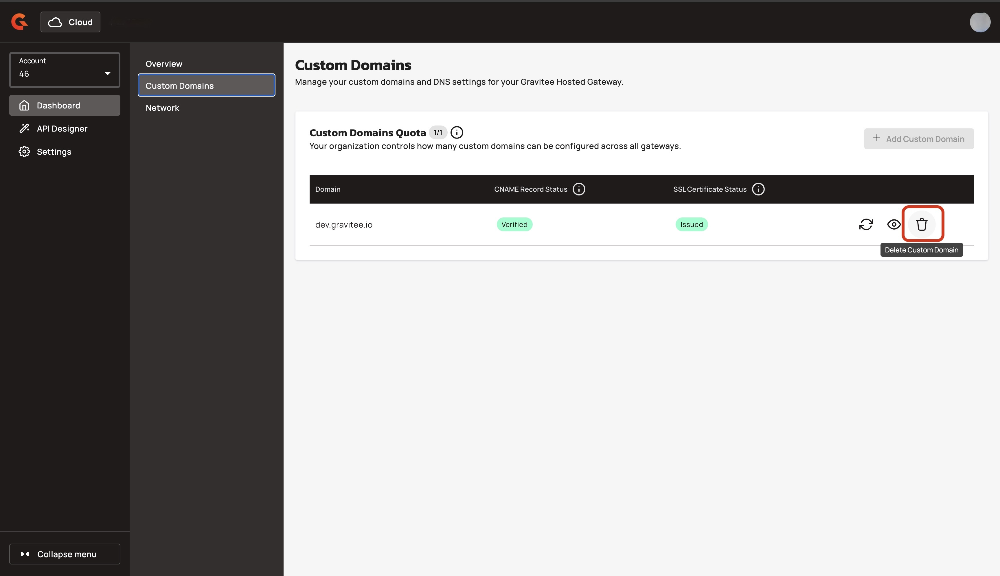<figcaption></figcaption></figure>
4.  In the **Delete Custom Domain** pop-up dialog box, type the name of the custom domain, and then click **Yes, delete it**.  

    <figure>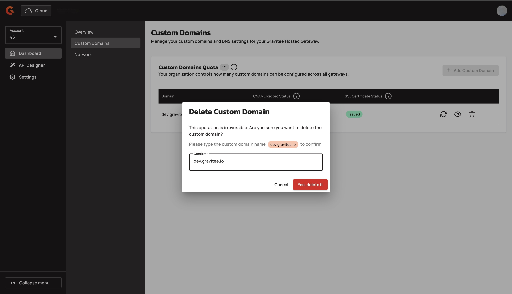<figcaption></figcaption></figure>

This removes the DNS configuration on Gravitee's side. You should also delete the CNAME record from your domain registrar.

## Verification

The custom domain is removed from the **Custom Domains** screen. 

<figure>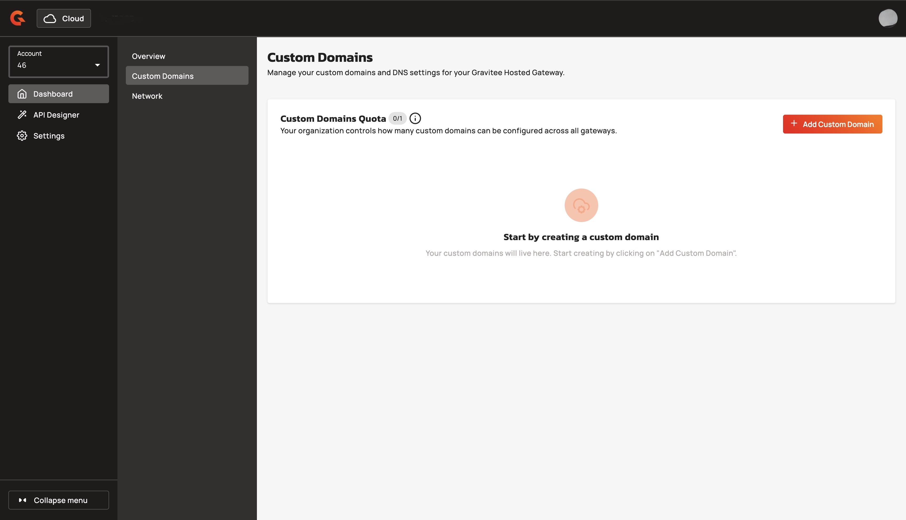<figcaption></figcaption></figure>
