# Configure a Custom Domain for a Gateway

## Overview

With Custom domains, you route API traffic through your own domain, for example, `api.example.com` instead of the default Gravitee gateway URL. You can configure multiple custom domains for each Gateway, within the limits of your subscription plan.

The default Gravitee-provided gateway URL remains functional as a fallback.

A Gravitee Hosted Gateway supports two types of custom domain, selected in the **Custom Domain Type** list when you add one:

* **HTTP** carries the Gateway's HTTP traffic.
* **Kafka** carries the Gateway's native Kafka API traffic.

Both types are managed on the same **Custom Domains** page and both count toward the same custom domain quota.

Gravitee saves a custom domain only after its CNAME record resolves to the Gateway. Create the CNAME record at your domain registrar before you click **Save**. The **Custom Domain setup** page shows the record to create as soon as you enter a valid domain name.

Custom domains apply to Gravitee Hosted Gateways only. The **Custom Domains** menu item doesn't appear for hybrid Gateways.

## Prerequisites

* Access to Gravitee Cloud. To log in or create an account, go to [Gravitee Cloud](https://cloud.gravitee.io).
* Cloud Account Owner permissions.
* Deploy a Gravitee Hosted Gateway for at least one environment. For more information about deploying a Gravitee Hosted Gateway, see [gravitee-hosted-gateways](gravitee-hosted-gateways/ "mention").
* Access to your domain registrar to manage DNS records (CNAME).

## Add an HTTP custom domain


The number of custom domains for each Gateway is limited by your subscription plan. The quota usage is displayed on the custom domains page. To increase your limit, contact Gravitee.


1.  From the **Dashboard**, navigate to **Gateways**, and then click the Gateway that you want to configure the Custom Domain for.  

    <figure><figcaption></figcaption></figure>
2.  In the Gateway details' menu, click **Custom Domains**. 

    <figure>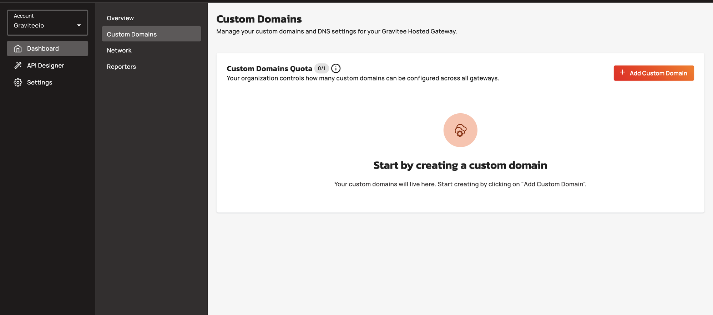<figcaption></figcaption></figure>

3.  Click **+ Add Custom Domain**. The **Custom Domain setup** page opens. It reminds you that the CNAME record must be configured at your registrar before the custom domain works.  

    <figure>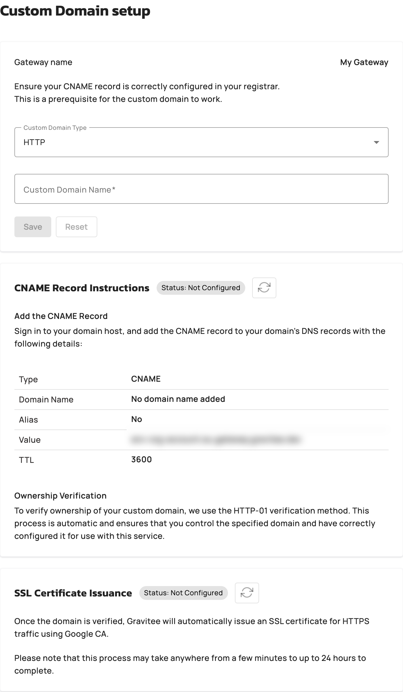<figcaption></figcaption></figure>
4.  In the **Custom Domain Type** list, select **HTTP**. 

    <figure>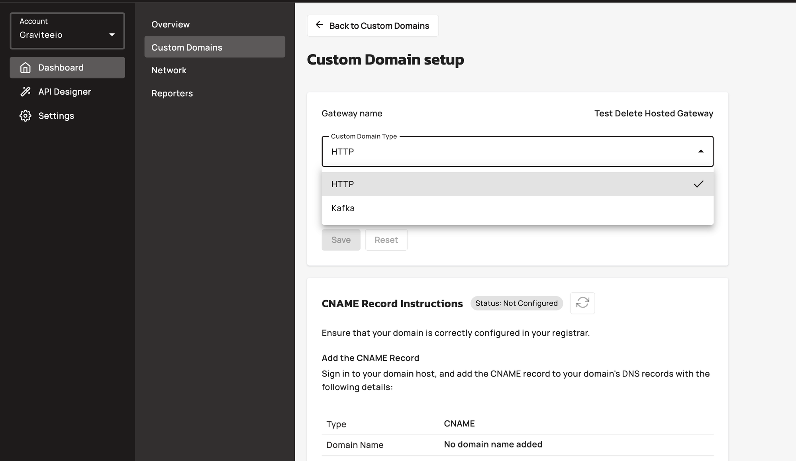<figcaption></figcaption></figure>
5. In the **Custom Domain Name** field, enter the name of your custom domain. For example, `api.example.com`. The custom domain name must follow these rules:
   1. The domain must be a valid domain name. The domain name can contain only lowercase letters, numbers, hyphens, and dots.
   2. The maximum length is 253 characters.
   3. The domain must be unique across all gateways and accounts.
6.  Scroll to the **CNAME Record Instructions** section. The **Domain Name** row shows the custom domain that you entered, and the **Value** row shows the Gateway host that your CNAME record must point to. 

    <figure>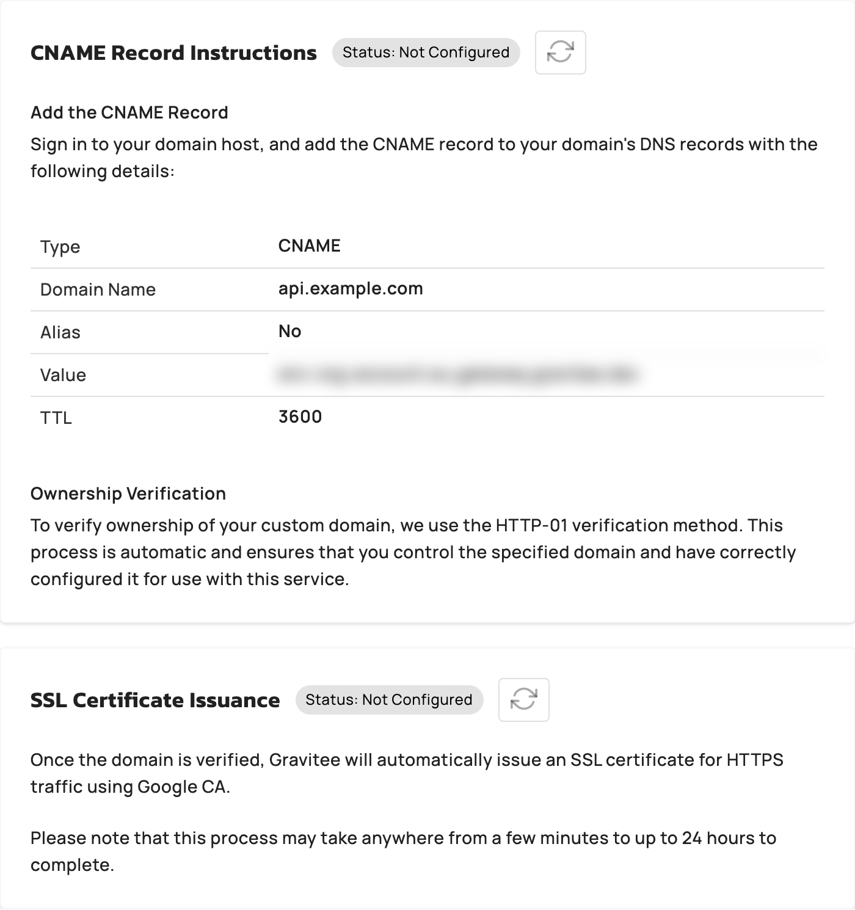<figcaption></figcaption></figure>
7.  Sign in to your domain registrar and create a CNAME record with these values.

    
    Forward only the DNS record to Gravitee. Don't create an A record or modify any other DNS settings for this domain.
    

    <table><thead><tr><th>Type</th><th width="266.3785400390625">Name</th><th>Value</th></tr></thead><tbody><tr><td>CNAME</td><td><code>&#x3C;Name_of_your_Custom_Domain></code></td><td><code>&#x3C;Gateway_URL></code></td></tr></tbody></table>
8. Click **Save**. Gravitee looks up the CNAME record of your custom domain and compares its target with the Gateway host:
   * If the record resolves to the Gateway host, the custom domain is saved, the message **Custom Domain successfully added** appears, and the **Custom Domains** page opens. Gravitee then deploys the DNS configuration for the domain in the background.
   *   If no CNAME record exists for the domain, if the record points to a different host, or if the record can't be looked up, the warning **This custom domain can't be saved until its CNAME record is in place and resolves to the gateway** appears below the buttons. The domain isn't saved and nothing is deployed. Wait for your DNS change to propagate, and then click **Save** again. 

       <figure>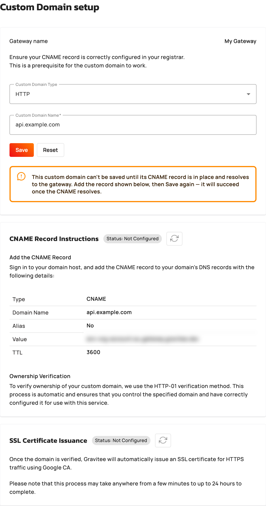<figcaption></figcaption></figure>
   * Other errors appear in an error banner at the top of the form.

To add a Kafka custom domain instead, see [#add-a-kafka-custom-domain](custom-domains.md#add-a-kafka-custom-domain "mention").

### SSL certificate issuance

Once the CNAME record is detected, Gravitee automatically performs an **HTTP-01 challenge** with Google CA to generate an SSL certificate. This process is fully automated and takes between 5 minutes and 24 hours, depending on DNS propagation and CA availability. Gravitee continuously maintained the CNAME record.

## Add a Kafka custom domain

A Kafka custom domain exposes the Gateway's native Kafka APIs on a host you own. Every API and every broker gets its own hostname under that host, so the value you enter is a base domain rather than a single bootstrap address.

A Kafka custom domain needs two CNAME records at your registrar:

* An ACME delegation record. Gravitee verifies ownership and issues the wildcard TLS certificate through an ACME DNS-01 challenge, and the delegation record lets Gravitee answer that challenge. This is the record that Gravitee verifies, both when you save the domain and when you check its status later.
* A wildcard record that routes Kafka client traffic. Each API and each broker gets its own single-label hostname under the custom domain, so one wildcard record covers the bootstrap address and every broker address. Gravitee doesn't verify this record.

1. From the **Dashboard**, navigate to **Gateways**, and then click the Gateway that you want to configure the Kafka custom domain for.
2. In the Gateway details' menu, click **Custom Domains**.
3. Click **+ Add Custom Domain**.
4. In the **Custom Domain Type** list, select **Kafka**.
5.  In the **Custom Domain Name** field, enter the domain. The field carries a fixed `{apiHost}.` prefix, so enter only the part that follows it. For example, enter `kafka.example.com` to create the domain `{apiHost}.kafka.example.com`. 

    <figure>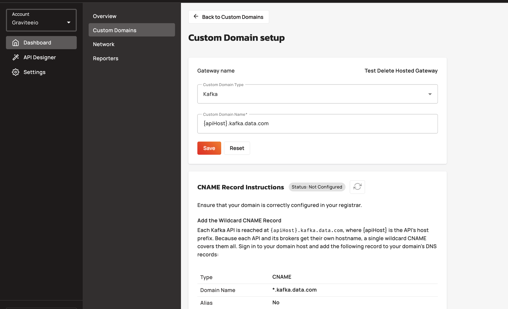<figcaption></figcaption></figure>
6.  Scroll to the **CNAME Record Instructions** section. The **Add the ACME Delegation CNAME Record** section comes first, with the status badge and the refresh icon next to its title. The **Add the Wildcard CNAME Record** section follows. 

    <figure>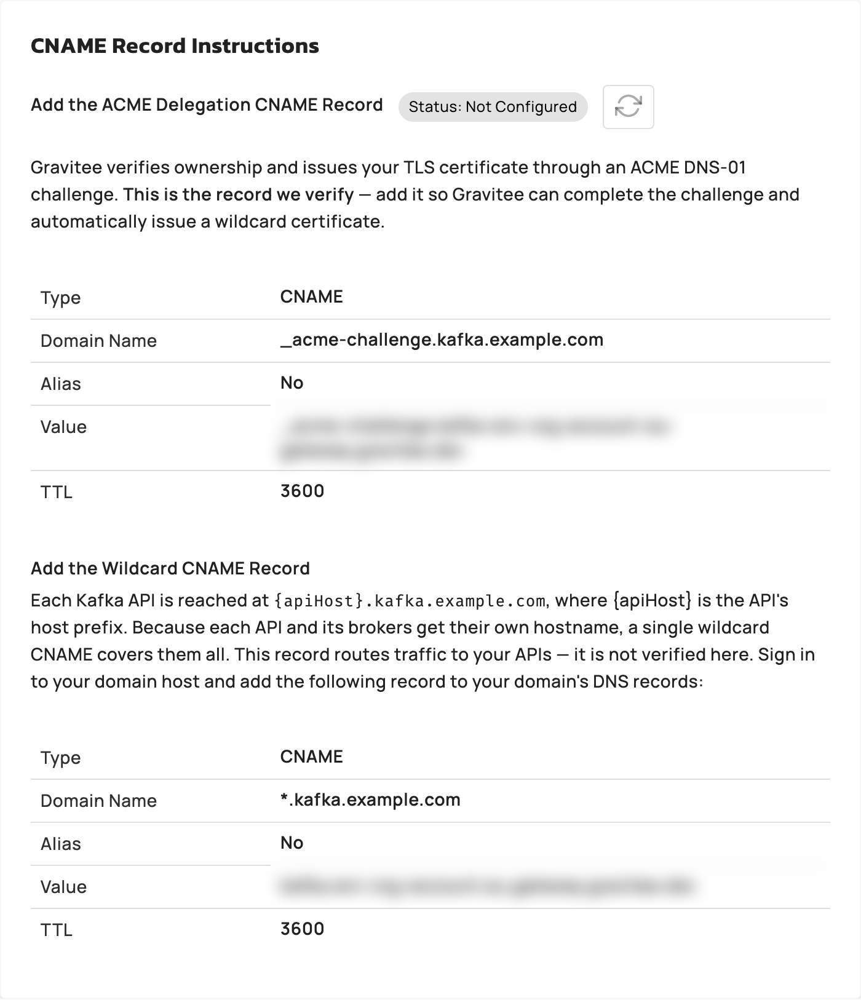<figcaption></figcaption></figure>
7. Sign in to your domain registrar and create both records with the **Domain Name** and **Value** shown in each section.
8. Click **Save**. Gravitee looks up the ACME delegation record and compares its target with the **Value** shown in the **Add the ACME Delegation CNAME Record** section:
   * If the record resolves to that target, the custom domain is saved, the message **Custom Domain successfully added** appears, and the **Custom Domains** page opens. Gravitee then provisions the DNS entry for the domain in the background.
   * If no delegation record exists at that name, if the record points to a different target, or if the record can't be looked up, the warning **This custom domain can't be saved until its CNAME record is in place and resolves to the gateway** appears below the buttons. The domain isn't saved and nothing is deployed. Wait for your DNS change to propagate, and then click **Save** again.
   * Other errors appear in an error banner at the top of the form.

A Kafka custom domain name follows these rules:

* The part you enter contains only lowercase letters, numbers, hyphens, and dots, and it ends in a top-level domain of at least two letters. A protocol prefix, a path, and uppercase letters are rejected.
* A port isn't accepted. A Kafka custom domain never changes the port, so clients keep connecting on the same port as the default Kafka domain.
* The maximum length of the part you enter is 243 characters, because Gravitee adds the 10-character `{apiHost}.` prefix and the whole domain is limited to 253 characters.
* The domain is unique across all Gateways. A host that's already a custom or default Kafka domain on any Gateway is rejected.

## Connect Kafka clients to a Kafka custom domain

When you add a Kafka custom domain, Gravitee propagates it to the environment linked to the Gateway, and the Gateway starts accepting Kafka connections on it. The default Kafka domain keeps working alongside it. Kafka clients connect over TLS, so point them at the custom domain once its status is `verified`.

The bootstrap address of an API is the API's host, followed by the custom domain. For the custom domain `{apiHost}.kafka.example.com` and an API whose host is `my-api`, the bootstrap address is `my-api.kafka.example.com`. The Gateway then advertises each broker as `broker-<brokerId>-<apiHost>` followed by the custom domain, for example `broker-1-my-api.kafka.example.com`.

Both the bootstrap host and the broker hosts are single labels under the custom domain, which is why one wildcard CNAME record and one wildcard certificate cover them.

## Verification&#x20;

On the custom domains page, each domain shows its protocol in the **Type** column, along with a **CNAME Record Status** column and a **Certificate** column. The values in those two columns depend on the type of custom domain.

### HTTP custom domain status

| CNAME Record Status | Certificate    | Meaning                                                       |
| ------------------- | -------------- | ------------------------------------------------------------- |
| `verified`          | `issued`       | The CNAME record resolves to the Gateway host, and the domain serves a trusted certificate that matches it |
| `verified`          | `not verified` | The CNAME record resolves to the Gateway host, but the domain doesn't serve a trusted certificate that matches it yet |
| `not verified`      | `not verified` | No CNAME record exists for the domain, or the record points to a different host |
| `error`             | `error`        | The CNAME record couldn't be looked up |
| `verifying`         | `verifying`    | Gravitee is checking the CNAME record and the certificate |

### Kafka custom domain status

For a Kafka custom domain, the **CNAME Record Status** reflects the ACME delegation record only. The wildcard record isn't part of this check.

| CNAME Record Status | Meaning                                                              |
| ------------------- | -------------------------------------------------------------------- |
| `verified`          | The delegation record resolves to the expected target                 |
| `not verified`      | No delegation record exists at that name, or the record resolves to a different target |
| `error`             | The delegation record couldn't be resolved                            |
| `verifying`         | Gravitee is checking the delegation record                            |

The **Certificate** column shows `managed` for every Kafka custom domain, because Gravitee issues and renews the wildcard certificate through the ACME delegation.

<figure>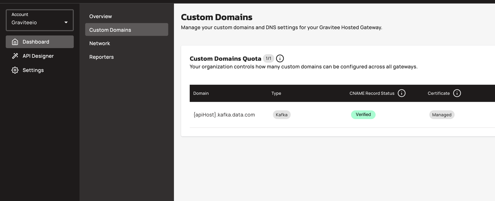<figcaption></figcaption></figure>

### Check the current status

To open the **Custom Domain setup** page of a saved custom domain, click the **eye** icon in its row on the **Custom Domains** page. The tooltip reads **View setup**. 

<figure>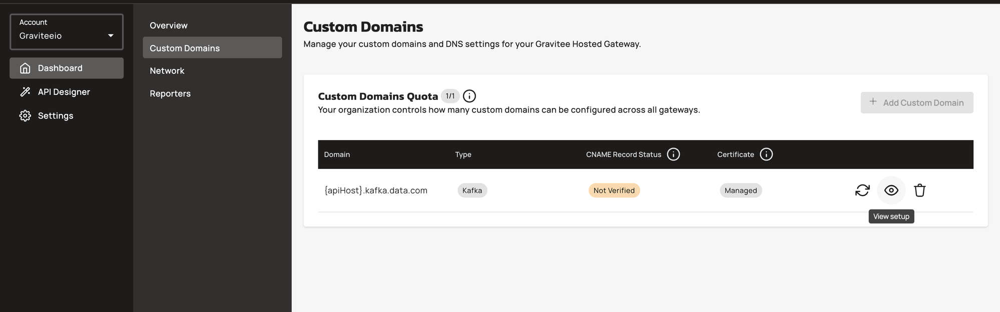<figcaption></figcaption></figure>

*   On the **Custom Domain setup** page of an HTTP custom domain, click the refresh icon next to the status badge in the **CNAME Record Instructions** section or in the **SSL Certificate Issuance** section. Either icon re-checks both the CNAME record and the certificate. 

    <figure>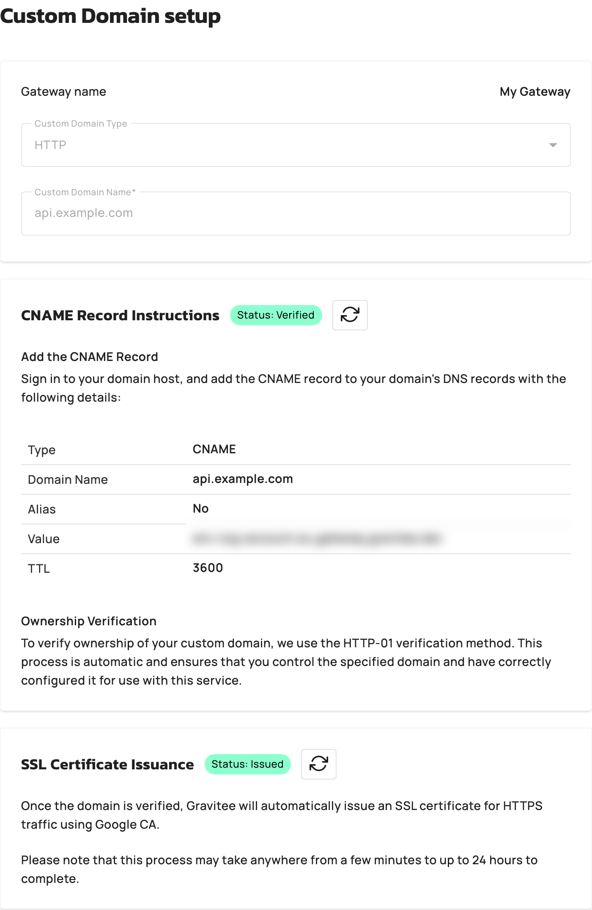<figcaption></figcaption></figure>
*   On the **Custom Domain setup** page of a Kafka custom domain, click the refresh icon next to the status badge in the **Add the ACME Delegation CNAME Record** section. 

    <figure>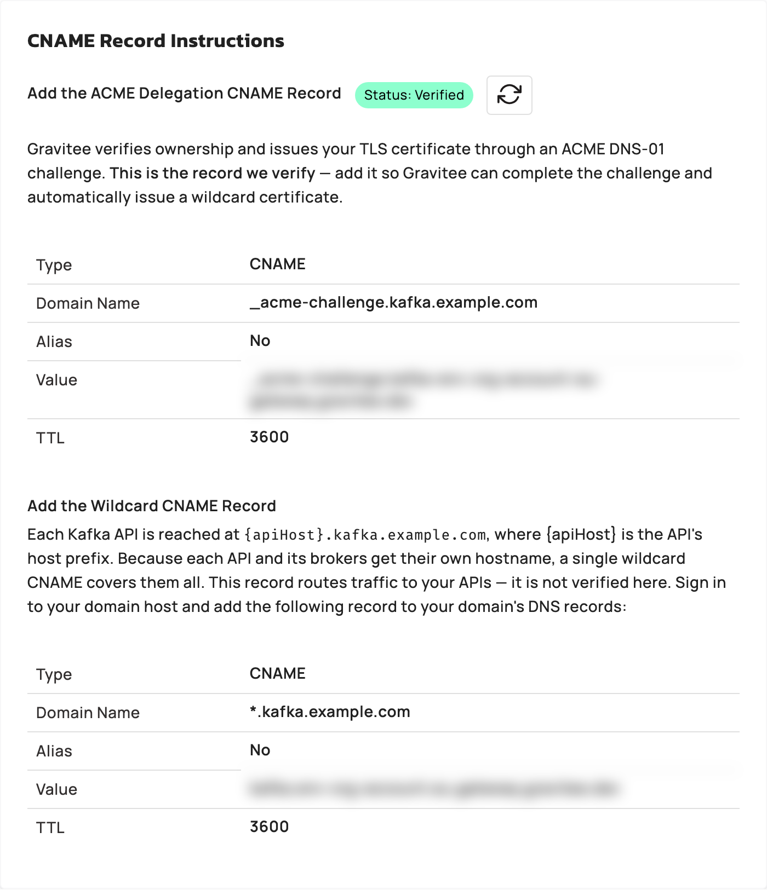<figcaption></figcaption></figure>
* On the **Custom Domains** page, click the refresh icon in the row of the custom domain. The tooltip reads **Refresh status**.

While you add a new custom domain, the refresh icons on the **Custom Domain setup** page are disabled. Clicking **Save** runs the CNAME check.

## Delete a custom domain


Deleting a custom domain is permanent. API traffic routed through this domain stops working immediately.


1.  From the **Dashboard**, navigate to **Gateways**, and then click the Gateway that you want to delete the custom domain for. 

    <figure>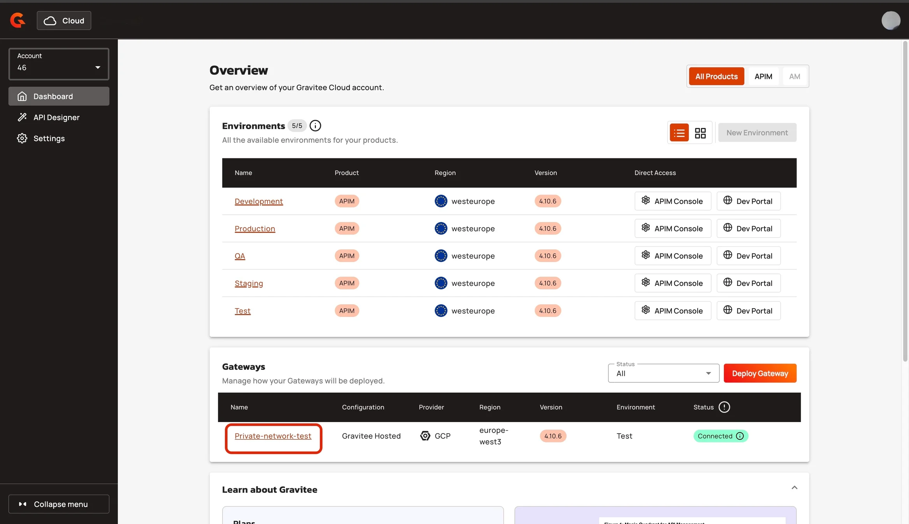<figcaption></figcaption></figure>
2.  In the Gateway details' menu, click **Custom Domains**. 

    <figure>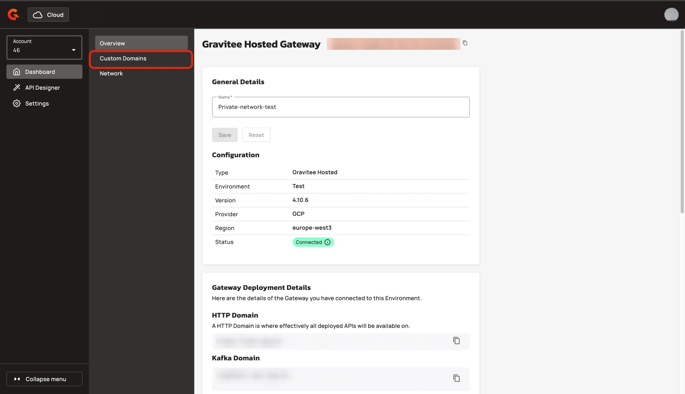<figcaption></figcaption></figure>
3.  Navigate to the custom domain that you want to delete, and then click the **bin** icon.  

    <figure>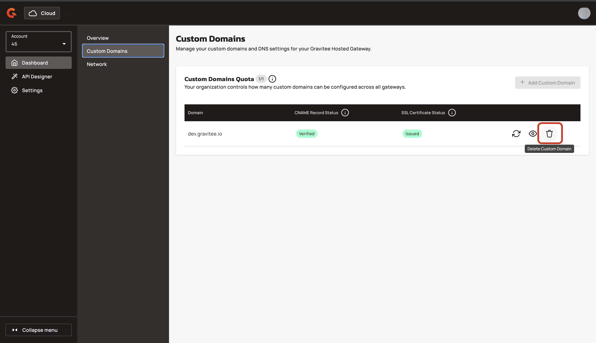<figcaption></figcaption></figure>
4.  In the **Delete Custom Domain** pop-up dialog box, type the name of the custom domain, and then click **Yes, delete it**.  

    <figure>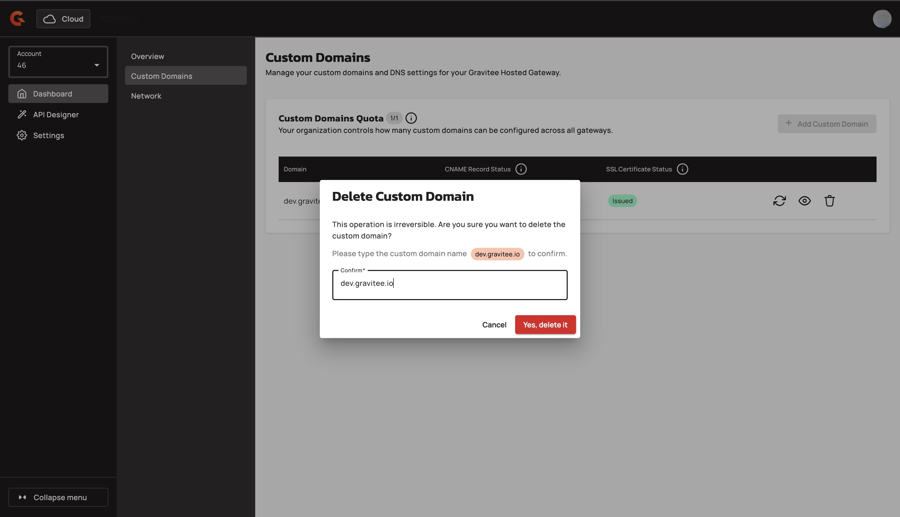<figcaption></figcaption></figure>

This removes the DNS configuration on Gravitee's side. Delete the matching records from your domain registrar too. For an HTTP custom domain, delete the CNAME record. For a Kafka custom domain, delete both the wildcard CNAME record and the ACME delegation CNAME record.

A custom domain whose DNS entry isn't provisioned yet can't be deleted. Its **bin** icon is disabled, and the tooltip reads **This custom domain can't be deleted**.

## Verification

The custom domain is removed from the **Custom Domains** screen. 

<figure>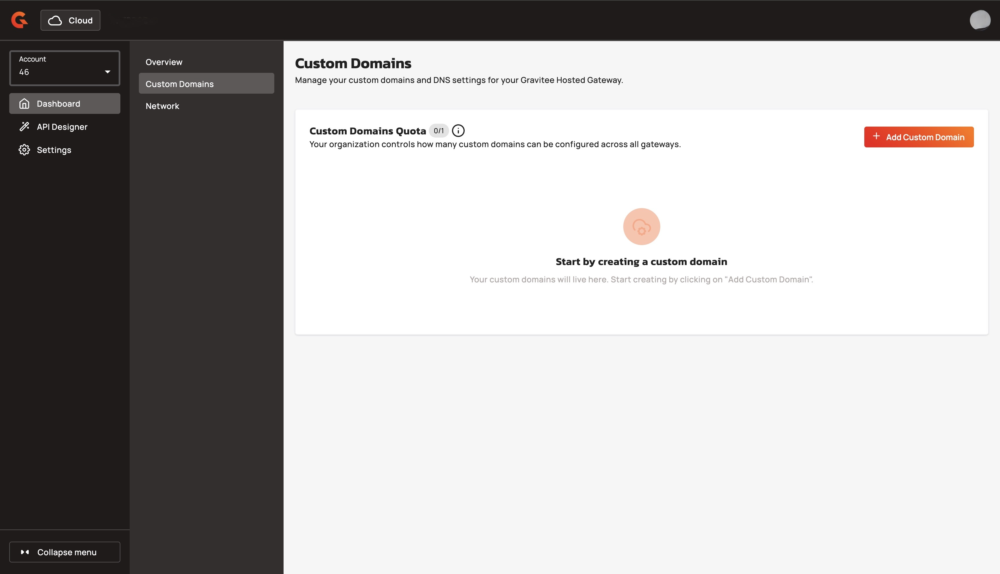<figcaption></figcaption></figure>
