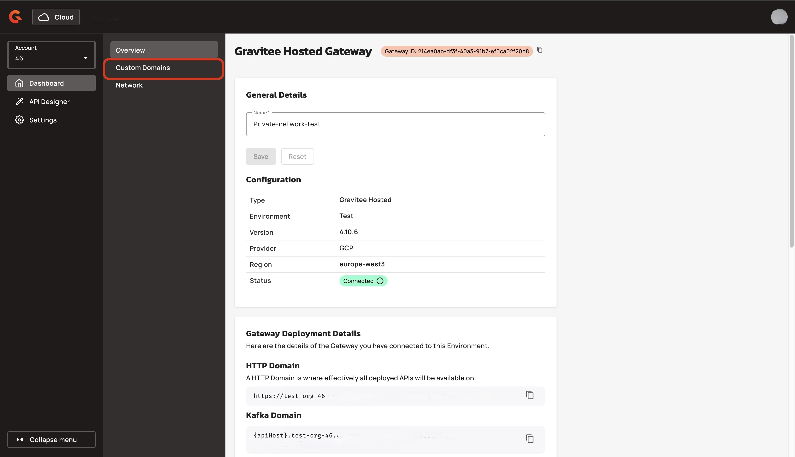
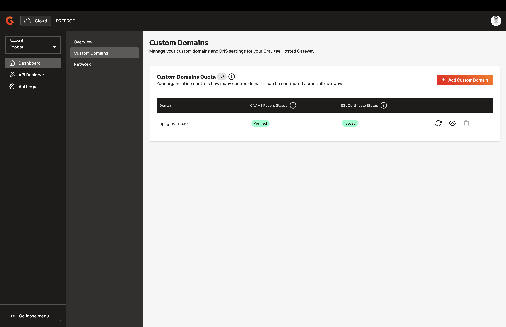
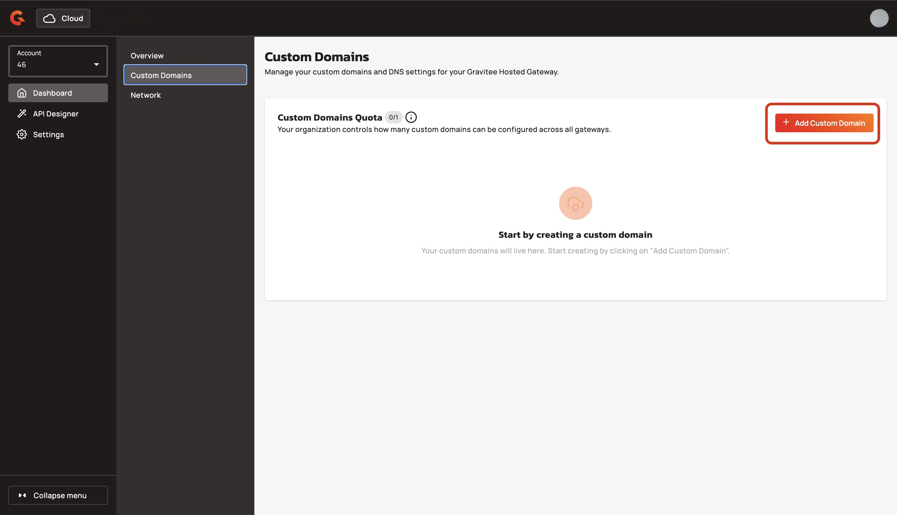
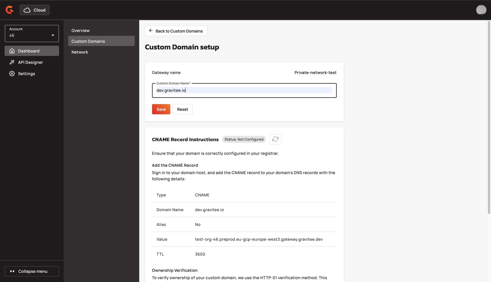
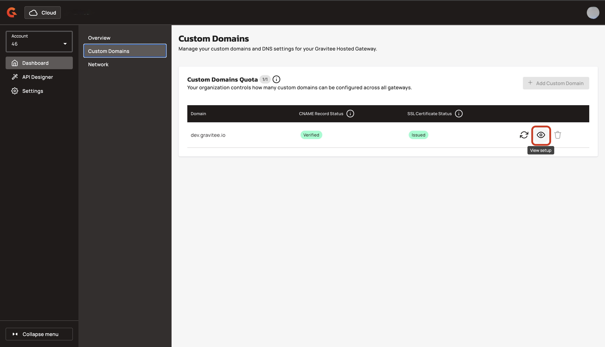
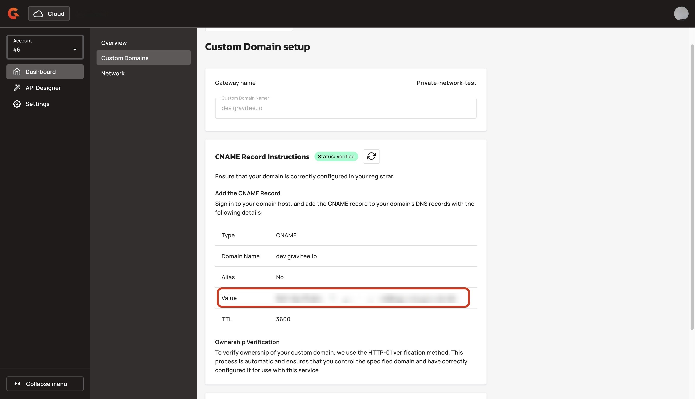
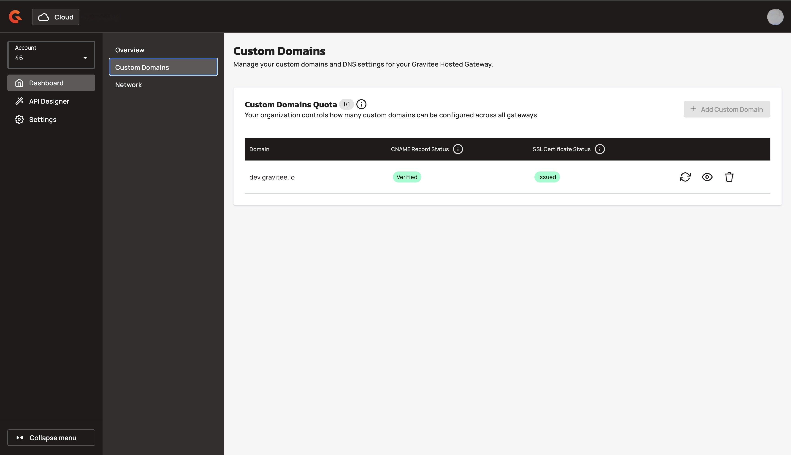
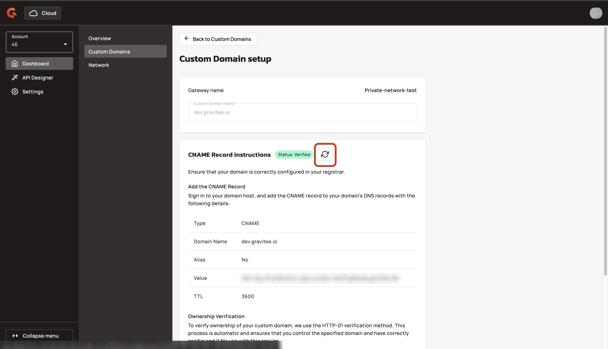

# Configure a Custom Domain for a Gateway

## Overview

With Custom domains, you route API traffic through your own domain, for example, `dev.gravitee.io` instead of the default Gravitee gateway URL. You can configure multiple custom domains for each Gateway, within the limits of your subscription plan.

The default Gravitee-provided gateway URL remains functional as a fallback.

A Gravitee Hosted Gateway supports two types of custom domain, selected in the **Custom Domain Type** list when you add one:

* **HTTP** carries the Gateway's HTTP traffic.
* **Kafka** carries the Gateway's native Kafka API traffic.

Both types are managed on the same **Custom Domains** page and both count toward the same custom domain quota.

## Kafka domain options

Native Kafka APIs address each API on its own hostname, so every Kafka domain carries an `{apiHost}` placeholder that Gravitee replaces with the API's host prefix. Three kinds of Kafka domain exist, and they differ in where you set them and what format they accept.

<table>
    <thead>
        <tr>
            <th width="200">Kafka domain</th>
            <th width="240">Where you set it</th>
            <th>Format</th>
        </tr>
    </thead>
    <tbody>
        <tr>
            <td>Default Kafka domain</td>
            <td>Created with the Gravitee Hosted Gateway. Shown on the Gateway <strong>Overview</strong> page under <strong>Kafka Domain</strong>.</td>
            <td>Gravitee-owned host. Read-only.</td>
        </tr>
        <tr>
            <td>Custom Kafka domain</td>
            <td>The <strong>Custom Domains</strong> page of a Gravitee Hosted Gateway.</td>
            <td>Your own host. Gravitee adds the <code>{apiHost}.</code> prefix for you. No port.</td>
        </tr>
        <tr>
            <td>Hybrid Kafka domain</td>
            <td>The <strong>Overview</strong> page of a hybrid Gateway, in the <strong>Kafka Domains</strong> field.</td>
            <td>Your own host. Include the <code>{apiHost}</code> placeholder yourself. A port is optional.</td>
        </tr>
    </tbody>
</table>

The rest of this page covers custom domains, which apply to Gravitee Hosted Gateways only. The **Custom Domains** menu item doesn't appear for hybrid Gateways.

## Prerequisites

* Access to Gravitee Cloud. To access Gravitee Cloud, [contact Gravitee](https://eu-auth.cloud.gravitee.io/cloud/register?response_type=code&client_id=fd45d898-e621-4b12-85d8-98e621ab1237&state=X24yazlSTUstY0llbUlFWVBiVFFsZm9kTGlrV3BRLm5TWVJkcExpY0tKOXRK&redirect_uri=https%3A%2F%2Feu.cloud.gravitee.io&scope=openid+profile+email+offline_access&code_challenge=yb3oiZ6oKvJhNTPXFV9tIr94FvR7CVmgcfv3Z2iMljo&code_challenge_method=S256&nonce=X24yazlSTUstY0llbUlFWVBiVFFsZm9kTGlrV3BRLm5TWVJkcExpY0tKOXRK&createUser=true&hubspotutk=feb0e3649a4e3e5dff322ca54bcd54a7).
* Cloud Account Owner permissions.
* Deploy a Gravitee Hosted Gateway for at least one environment. For more information about deploying a Gravitee Hosted Gateway, see [gravitee-hosted-gateways](gravitee-hosted-gateways/ "mention").
* Access to your domain registrar to manage DNS records (CNAME).

## Add a custom domain


The number of custom domains for each Gateway is limited by your subscription plan. The quota usage is displayed on the custom domains page. To increase your limit, contact Gravitee.


1.  From the **Dashboard**, navigate to **Gateways**, and then click the Gateway that you want to configure the Custom Domain for.  

    <figure><figcaption></figcaption></figure>
2.  In the Gateway details' menu, click **Custom Domains**. 

    <figure><figcaption></figcaption></figure>

<figure><figcaption></figcaption></figure>

3.  Click **+ Add Custom Domain**.  

    <figure><figcaption></figcaption></figure>
4. In the **Custom Domain Type** list, select **HTTP**.
5. In the Gateway name field, enter the name of your Custom Domain. For example, `dev.gravitee.io`. The name of the Gateway must follow the following rules:
   1. The domain must be a valid domain name. The domain name can contain only lowercase letters, numbers, hyphens, and dots.
   2. The maximum length is 253 characters.
   3. The domain must be unique across all gateways and accounts.
6.  Click **Save**. 

    <figure><figcaption></figcaption></figure>

The domain is created and a DNS deployment job is triggered in the background. The domain appears in the list and the status is `not verified` status.

To add a Kafka custom domain instead, see [#add-a-kafka-custom-domain](custom-domains.md#add-a-kafka-custom-domain "mention").

## Configure the DNS


Forward only the DNS record to Gravitee. Do not create an A record or modify any other DNS settings for this domain.


Create a **CNAME record** at your domain registrar. To find the correct values to create the CNAME record, complete the following steps:

1. Enter the `<Name_of_your_Custom_Domain>` with the name of the custom domain you created in [#add-a-custom-domain](custom-domains.md#add-a-custom-domain "mention").
2. Enter the `<Gateway_URL>`. To find the custom domain setup page, complete the following sub-steps:
   1.  From the **Custom Domains** page, click the **eye icon**.  

       <figure><figcaption></figcaption></figure>
   2.  Navigate to the **CNAME Record Instructions** section. The **Value** field shows the Gateway URL. 

       <figure><figcaption></figcaption></figure>

<table><thead><tr><th>Type</th><th width="266.3785400390625">Name</th><th>Value</th></tr></thead><tbody><tr><td>CNAME</td><td><code>&#x3C;Name_of_your_Custom_Domain></code></td><td><code>&#x3C;Gateway_URL></code></td></tr></tbody></table>

### SSL certificate issuance

Once the CNAME record is detected, Gravitee automatically performs an **HTTP-01 challenge** with Google CA to generate an SSL certificate. This process is fully automated and takes between 5 minutes and 24 hours, depending on DNS propagation and CA availability. Gravitee continuously maintained the CNAME record.

## Add a Kafka custom domain

A Kafka custom domain exposes the Gateway's native Kafka APIs on a host you own. Every API and every broker gets its own hostname under that host, so the value you enter is a base domain rather than a single bootstrap address.


**Kafka** appears in the **Custom Domain Type** list only when Kafka custom domains are enabled for your account. If the option is missing, contact Gravitee.


1. From the **Dashboard**, navigate to **Gateways**, and then click the Gateway that you want to configure the Kafka custom domain for.
2. In the Gateway details' menu, click **Custom Domains**.
3. Click **+ Add Custom Domain**.
4.  In the **Custom Domain Type** list, select **Kafka**.

    <!-- TODO: Screenshot of the Custom Domain Type list with Kafka selected -->

    <figure><figcaption>
Kafka selected in the Custom Domain Type list
</figcaption></figure>
5.  In the **Custom Domain Name** field, enter the domain. The field carries a fixed `{apiHost}.` prefix, so enter only the part that follows it. For example, enter `kafka.example.com` to create the domain `{apiHost}.kafka.example.com`.

    <!-- TODO: Screenshot of the Custom Domain Name field showing the fixed {apiHost}. prefix -->

    <figure><figcaption>
Custom Domain Name field with the fixed prefix
</figcaption></figure>
6. Click **Save**.

A Kafka custom domain name follows these rules:

* The part you enter contains only lowercase letters, numbers, hyphens, and dots, and it ends in a top-level domain of at least two letters. A protocol prefix, a path, and uppercase letters are rejected.
* A port isn't accepted. A Kafka custom domain never changes the port, so clients keep connecting on the same port as the default Kafka domain.
* The maximum length of the part you enter is 243 characters, because Gravitee adds the 10-character `{apiHost}.` prefix and the whole domain is limited to 253 characters.
* The domain is unique across all Gateways. A host that's already a custom or default Kafka domain on any Gateway is rejected.

Gravitee provisions the DNS entry for the domain. The domain appears in the **Custom Domains** list with the type `Kafka` and the **CNAME Record Status** `not verified`.

## Configure the DNS for a Kafka custom domain

A Kafka custom domain needs two CNAME records at your registrar:

* A wildcard record that routes Kafka client traffic. Each API and each broker gets its own single-label hostname under the custom domain, so one wildcard record covers the bootstrap address and every broker address.
* An ACME delegation record. Gravitee verifies ownership and issues the wildcard TLS certificate through an ACME DNS-01 challenge, and the delegation record lets Gravitee answer that challenge. Until this record resolves to the delegation target, the domain isn't verified.

To find the exact values for both records, complete the following steps:

1. On the **Custom Domains** page, click the **eye** icon for the Kafka custom domain.
2.  Scroll to the **CNAME Record Instructions** section.

    <!-- TODO: Screenshot of the CNAME Record Instructions section for a Kafka custom domain, showing both record tables -->

    <figure><figcaption>
CNAME Record Instructions for a Kafka custom domain
</figcaption></figure>

### Add the wildcard CNAME record

Create this record at your registrar with the values from the **Add the Wildcard CNAME Record** section of the card.

<table>
    <thead>
        <tr>
            <th width="180">Field</th>
            <th>Value</th>
        </tr>
    </thead>
    <tbody>
        <tr>
            <td>Type</td>
            <td><code>CNAME</code></td>
        </tr>
        <tr>
            <td>Domain Name</td>
            <td>The custom domain with the <code>{apiHost}</code> label replaced by <code>*</code>. For <code>{apiHost}.kafka.example.com</code>, the record name is <code>*.kafka.example.com</code>.</td>
        </tr>
        <tr>
            <td>Alias</td>
            <td><code>No</code></td>
        </tr>
        <tr>
            <td>Value</td>
            <td>The Gateway's default Kafka host, without its <code>{apiHost}</code> label and without the port.</td>
        </tr>
        <tr>
            <td>TTL</td>
            <td><code>3600</code></td>
        </tr>
    </tbody>
</table>

### Add the ACME delegation CNAME record

Create this record at your registrar with the values from the **Add the ACME Delegation CNAME Record** section of the card.

<table>
    <thead>
        <tr>
            <th width="180">Field</th>
            <th>Value</th>
        </tr>
    </thead>
    <tbody>
        <tr>
            <td>Type</td>
            <td><code>CNAME</code></td>
        </tr>
        <tr>
            <td>Domain Name</td>
            <td><code>_acme-challenge.</code> followed by the custom domain without its <code>{apiHost}</code> label. For <code>{apiHost}.kafka.example.com</code>, the record name is <code>_acme-challenge.kafka.example.com</code>.</td>
        </tr>
        <tr>
            <td>Alias</td>
            <td><code>No</code></td>
        </tr>
        <tr>
            <td>Value</td>
            <td>The delegation target shown on the card. It starts with <code>_acme-challenge.</code> and ends with the registrable domain of the Gateway's default Kafka host.</td>
        </tr>
        <tr>
            <td>TTL</td>
            <td><code>3600</code></td>
        </tr>
    </tbody>
</table>

## Connect Kafka clients to a Kafka custom domain

When you add a Kafka custom domain, Gravitee propagates it to the environment linked to the Gateway, and the Gateway starts accepting Kafka connections on it. The default Kafka domain keeps working alongside it. Kafka clients connect over TLS, so point them at the custom domain once its status is `verified`.

The bootstrap address of an API is the API's host, followed by the custom domain. For the custom domain `{apiHost}.kafka.example.com` and an API whose host is `my-api`, the bootstrap address is `my-api.kafka.example.com`. The Gateway then advertises each broker as `broker-<brokerId>-<apiHost>` followed by the custom domain, for example `broker-1-my-api.kafka.example.com`.

Both the bootstrap host and the broker hosts are single labels under the custom domain, which is why one wildcard CNAME record and one wildcard certificate cover them.

## Verification&#x20;

On the custom domains page, each domain shows its protocol in the **Type** column, along with a **CNAME Record Status** column and a **Certificate** column. The values in those two columns depend on the type of custom domain.

### HTTP custom domain status

| CNAME Record Status | Certificate    | Meaning                                                       |
| ------------------- | -------------- | ------------------------------------------------------------- |
| `verified`          | `issued`       | The CNAME record is correctly configured and the certificate is issued |
| `not verified`      | `not verified` | The CNAME record isn't detected yet and the certificate is pending issuance |
| `error`             | `error`        | The DNS configuration is invalid and certificate issuance failed |

<figure><figcaption></figcaption></figure>

### Kafka custom domain status

For a Kafka custom domain, the **CNAME Record Status** reflects the ACME delegation record only. The wildcard record isn't part of this check.

| CNAME Record Status | Meaning                                                              |
| ------------------- | -------------------------------------------------------------------- |
| `verified`          | The delegation record resolves to the expected target                 |
| `not verified`      | No delegation record exists at that name                              |
| `not verified`      | A delegation record exists, but it resolves to a different target     |
| `error`             | The delegation record couldn't be resolved                            |

The **Certificate** column shows `managed` for every Kafka custom domain, because Gravitee issues and renews the wildcard certificate through the ACME delegation.

### Check the current status

*   On the **Custom Domain setup** page of an HTTP custom domain, navigate to the **CNAME Record Instructions** or **SSL Certificate Issuance** section, and then click the refresh icon. 

    <figure><figcaption></figcaption></figure>
* On the **Custom Domain setup** page of a Kafka custom domain, navigate to the **CNAME Record Instructions** section, and then click the refresh icon.
* On the **Custom Domains** page, click the refresh icon in the row of the custom domain. The tooltip reads **Refresh status**.

## Delete a custom domain


Deleting a custom domain is permanent. API traffic routed through this domain stops working immediately.


1.  From the **Dashboard**, navigate to **Gateways**, and then click the Gateway that you want to delete the custom domain for. 

    <figure><figcaption></figcaption></figure>
2.  In the Gateway details' menu, click **Custom Domains**. 

    <figure><figcaption></figcaption></figure>
3.  Navigate to the custom domain that you want to delete, and then click the **bin** icon.  

    <figure><figcaption></figcaption></figure>
4.  In the **Delete Custom Domain** pop-up dialog box, type the name of the custom domain, and then click **Yes, delete it**.  

    <figure><figcaption></figcaption></figure>

This removes the DNS configuration on Gravitee's side. Delete the matching records from your domain registrar too. For an HTTP custom domain, delete the CNAME record. For a Kafka custom domain, delete both the wildcard CNAME record and the ACME delegation CNAME record.

A custom domain whose DNS entry isn't provisioned yet can't be deleted. Its **bin** icon is disabled, and the tooltip reads **This custom domain can't be deleted**.

## Verification

The custom domain is removed from the **Custom Domains** screen. 

<figure><figcaption></figcaption></figure>
