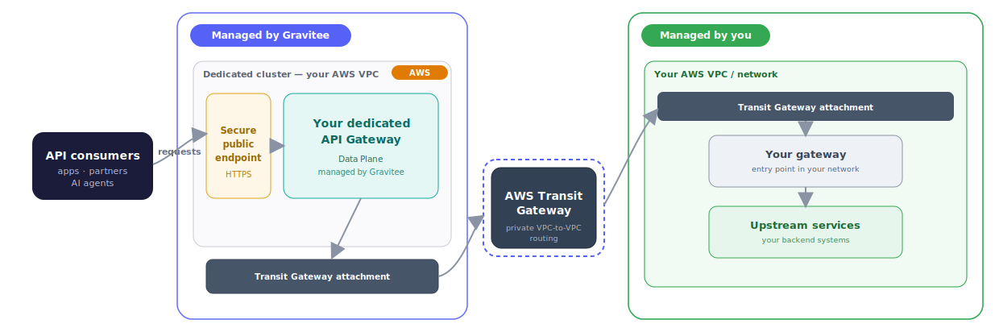

# Establish private networks with AWS

## Overview

A private network creates a secure connection between your Gravitee-hosted, software-as-a-service (SaaS) API Gateways and your own infrastructure. API traffic reaches your backend services without crossing the public internet.

On AWS, Gravitee establishes this connection using an **[AWS Transit Gateway](https://docs.aws.amazon.com/vpc/latest/tgw/what-is-transit-gateway.html)**—a network transit hub that interconnects Virtual Private Clouds (VPCs) and routes traffic between them. It links the dedicated cluster where Gravitee runs your API Gateways to a gateway in your own AWS environment.


This capability is available on **AWS only** and is established **on demand**: it is configured manually for your account rather than self-service. To enable it, [contact Gravitee](/gravitee-cloud/community-and-support/enterprise-support).


## How it works

<figure><figcaption>
Gravitee runs your API Gateways in a dedicated AWS cluster that connects to your own network over an AWS Transit Gateway. Internal traffic stays private and never crosses the public internet.
</figcaption></figure>

The following describes the connection at a high level:

* Gravitee provisions and manages your API Gateways in a dedicated, isolated cluster inside AWS. These API Gateways are the **Data Plane**.
* That cluster attaches to an **AWS Transit Gateway**, which provides private, VPC-to-VPC routing.
* Through the Transit Gateway, the cluster reaches a gateway in your own AWS infrastructure, which fronts your upstream backend services.
* Consumers keep calling your APIs through your Gateway's public HTTPS endpoint; from there, requests travel to your backend privately over the Transit Gateway.

## Establish a private network on AWS

Setup requires manual configuration on both Gravitee's side and within your AWS environment. To begin, [contact Gravitee](/gravitee-cloud/community-and-support/enterprise-support)—the team aligns with you on your requirements, such as region and network details, and completes the setup.

## Next steps

The following resources provide additional context:

<table data-view="cards"><thead><tr><th></th><th data-hidden data-card-target data-type="content-ref"></th></tr></thead><tbody><tr><td>Establish private networks with GCP</td><td><a href="/gravitee-cloud/guides/establish-private-networks-with-gcp">/gravitee-cloud/guides/establish-private-networks-with-gcp</a></td></tr><tr><td>Gravitee Cloud Geography and Provider Support</td><td><a href="/gravitee-cloud/reference/geography-and-provider-support">/gravitee-cloud/reference/geography-and-provider-support</a></td></tr></tbody></table>
