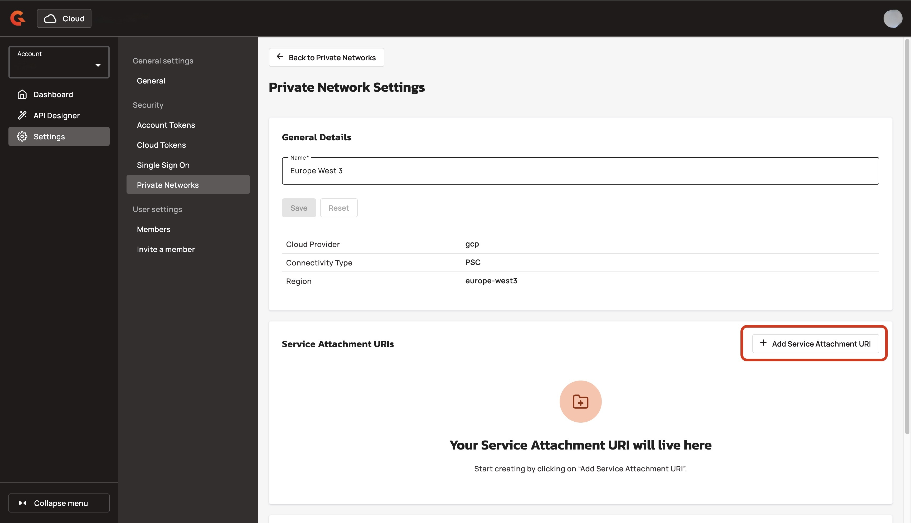
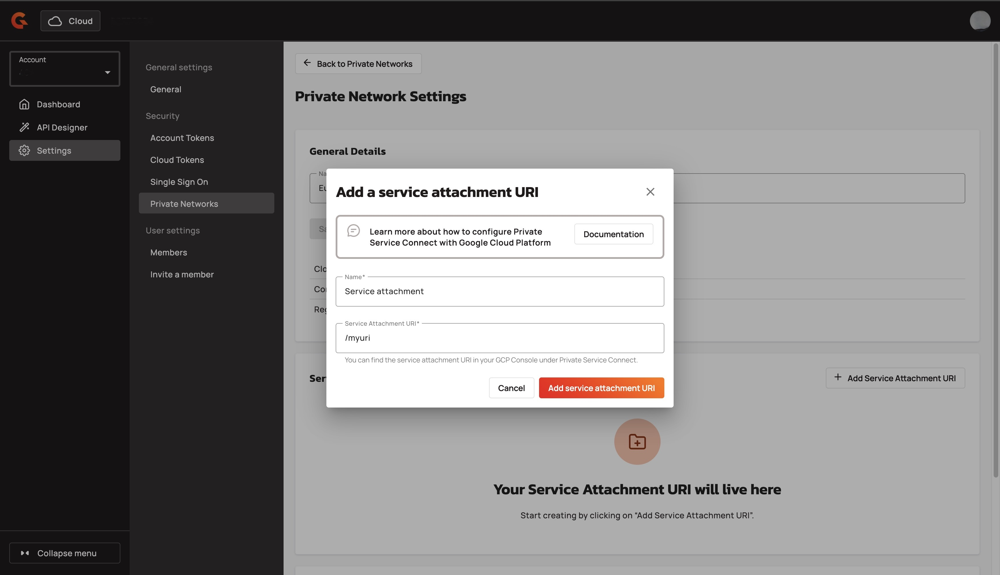

# Add a service attachment to your private network

## Overview&#x20;

You add a service attachment to your private network with Gravitee Cloud. A Service Attachment is a resource that exposes a service that runs in a producer VPC to consumers with Private Service Connect (PSC). The Service Attachment URI acts as the unique identifier that consumers use to target and establish a private connection to that service.

## Prerequisites&#x20;

* Enable the private network feature. To enable the private network feature, contact your Gravitee representative. For example, your Technical Account Manager.&#x20;
* Create a private network. For more information about creating a private network, see [create-a-private-network.md](create-a-private-network.md "mention").

## Add a service attachment&#x20;

1.  From the **Dashboard**, click **Settings**.  

    <figure><figcaption></figcaption></figure>
2.  In the settings menu, click **Private Networks**. 

    <figure><figcaption></figcaption></figure>
3.  From the list of private networks, click **the name of the private network** that you want to add a service attachment to.  

    <figure><figcaption></figcaption></figure>
4.  Navigate to **Service Attachments**, and then click **Add Service Attachment URI**.  

    <figure><figcaption></figcaption></figure>
5. In the **Add a service attachment URI** pop-up window, complete the following sub-steps:
   1. In the **Name** field, add the name of the service attachment. For example, service attachment.&#x20;
   2. In the **Service Attachment URI** field, add the service attachment URI.
   3.  Click **Add service attachment URI**. Wait a few minutes for Gravitee Cloud to generate the external IP. 

       <figure><figcaption></figcaption></figure>

## Verification&#x20;

The service attachment appears in the **Service Attachment URIs** section of your private network's details page.

<figure><figcaption></figcaption></figure>

## Next steps&#x20;

* [connect-a-gateway-to-your-private-network.md](connect-a-gateway-to-your-private-network.md "mention").
