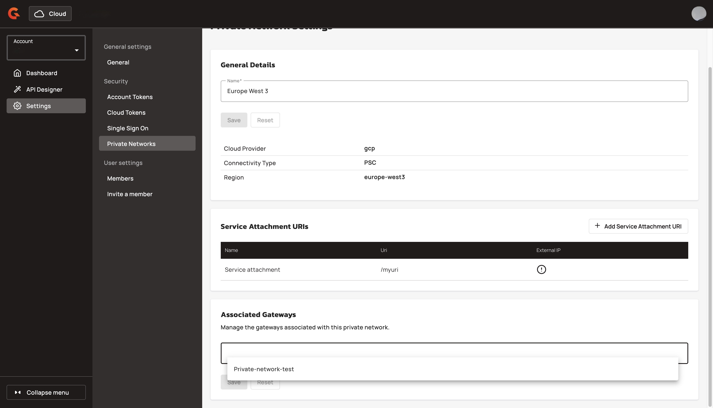
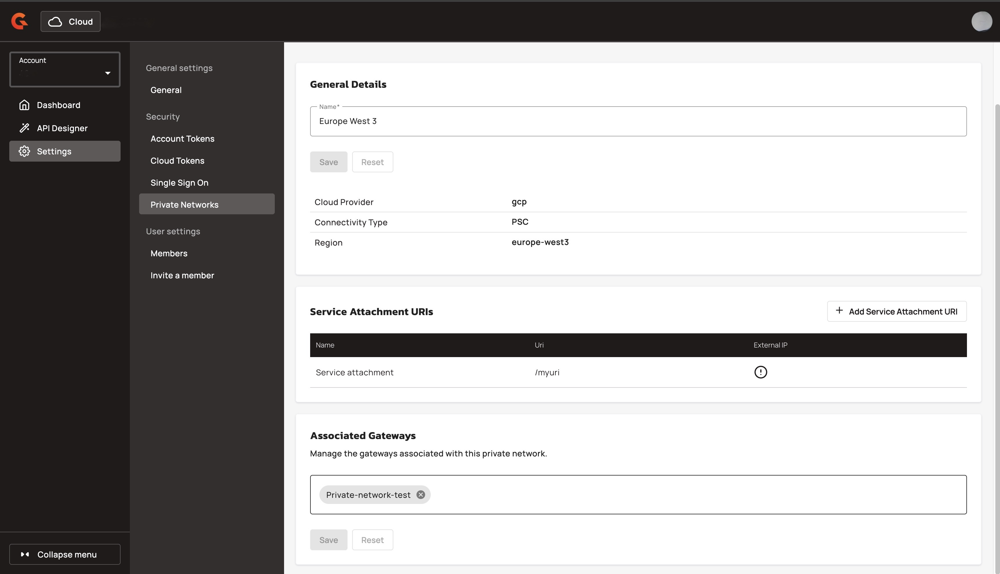
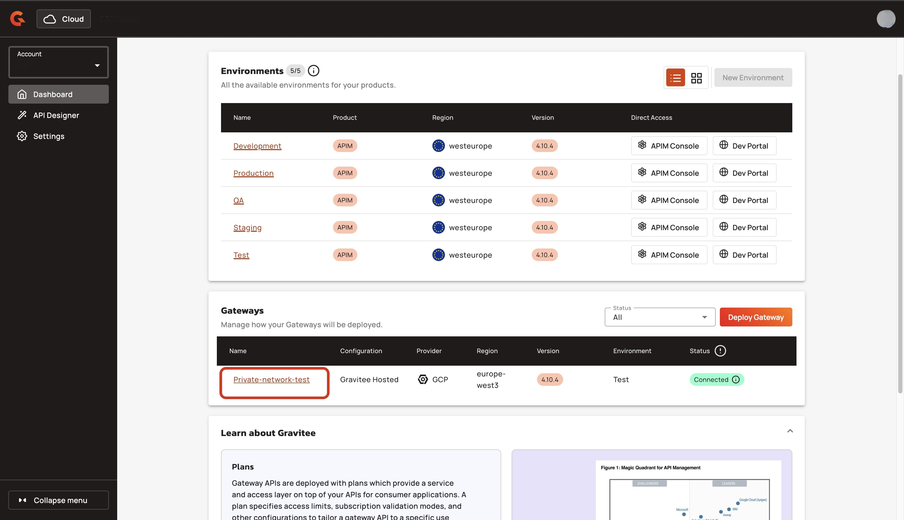
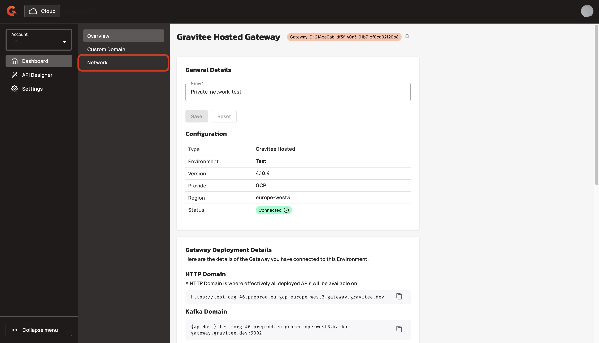
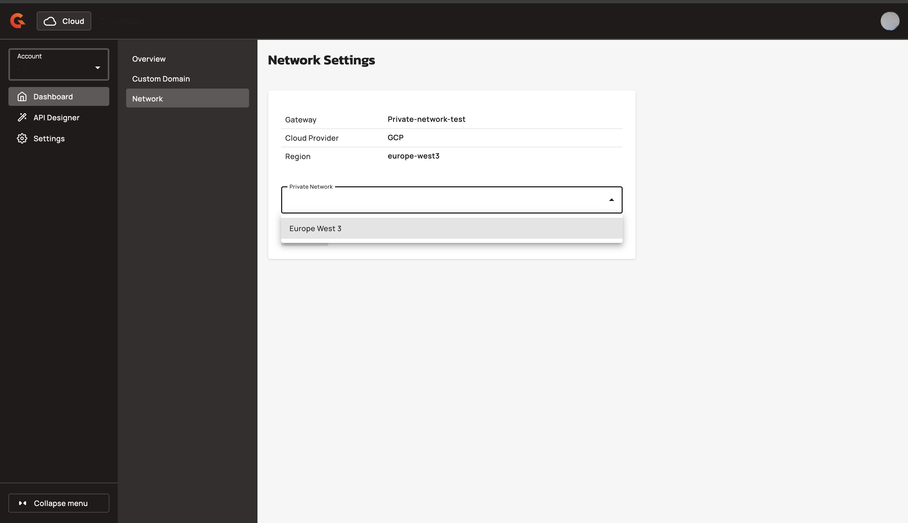
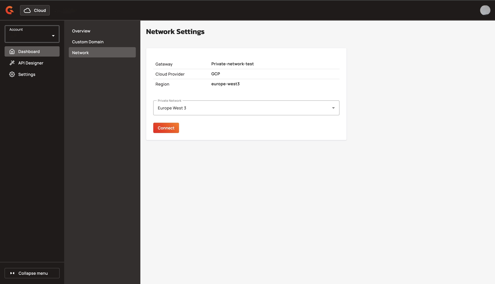
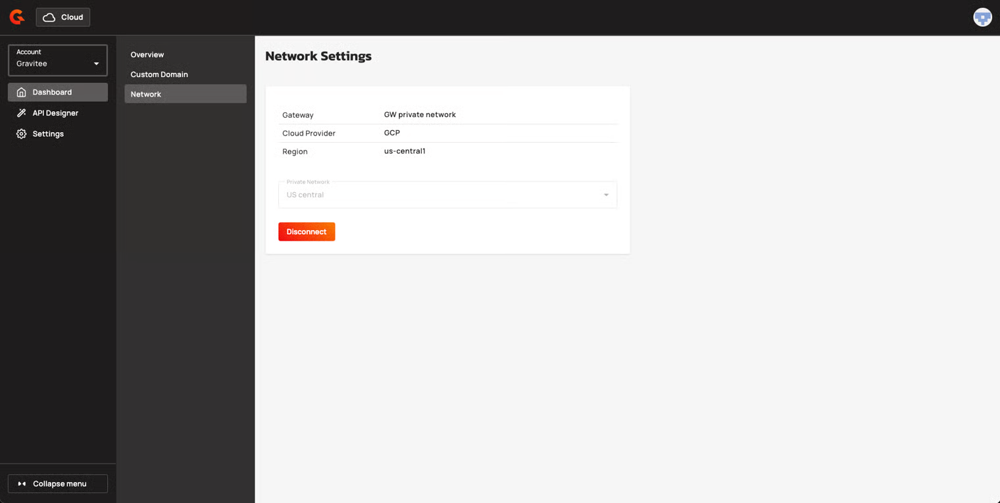

# Connect a Gateway to your private network

## Overview

You can disconnect your Gateway from your private network with Gravitee Cloud.

## Prerequisites

* Enable the private network feature. To enable the private network feature, contact your Gravitee representative. For example, your Technical Account Manager.
* Create a private network. For more information about creating a private network, see [create-a-private-network.md](create-a-private-network.md "mention").
* Deploy a Gateway with the GCP provider and in the same region as your private network. For more information about deploying a Gateway see [gravitee-hosted-gateways](../gravitee-hosted-gateways/ "mention").

## Connect a Gateway

You can connect a Gateway to your private network with either of the following methods:

* [#connect-a-gateway-from-the-network-details-page](connect-a-gateway-to-your-private-network.md#connect-a-gateway-from-the-network-details-page "mention")
* [#connect-a-gateway-from-the-private-network-detail-page](connect-a-gateway-to-your-private-network.md#connect-a-gateway-from-the-private-network-detail-page "mention")

### Connect a Gateway from the network details page

1.  From the **Dashboard**, click **Settings**. 

    <figure><figcaption></figcaption></figure>
2.  From the **Settings** menu, click **Private Networks**. 

    <figure><figcaption></figcaption></figure>
3.  Click the **name of the private network** that you want to add a Gateway to. 

    <figure><figcaption></figcaption></figure>
4. Navigate to the **Associated Gateways** section.
5.  Type the name of the Gateway, and then click the name of the Gateway from the list. 

    <figure><figcaption></figcaption></figure>
6.  Click **Save**. Wait a few minutes for Gravitee to establish the connection. 

    <figure><figcaption></figcaption></figure>

#### Verification

The Gateway appears in the list of the Associated Gateways. 

<figure><figcaption></figcaption></figure>

### Connect a Gateway from the private network detail page

1.  From the **Dashboard**, click the Gateway that you want to add to the private network. 

    <figure><figcaption></figcaption></figure>
2.  From the Gateway's menu, click **Network**. 

    <figure><figcaption></figcaption></figure>
3.  From the **Private Network** drop-down menu, select the private network that you want to add the Gateway to. 

    <figure><figcaption></figcaption></figure>
4.  Click **Connect**. 

    <figure><figcaption></figcaption></figure>

#### Verification

The **Connect** button changes to a **Disconnect** button.

<figure><figcaption></figcaption></figure>

## Next steps

* (Optional) [disconnect-a-gateway-from-your-private-network.md](disconnect-a-gateway-from-your-private-network.md "mention").
