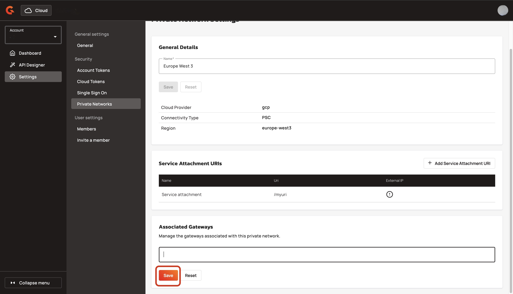
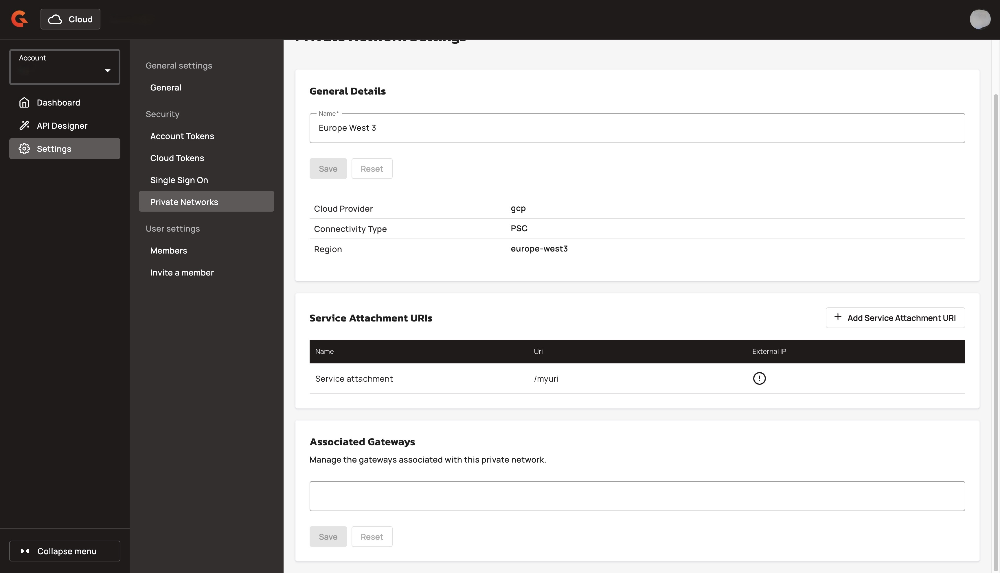
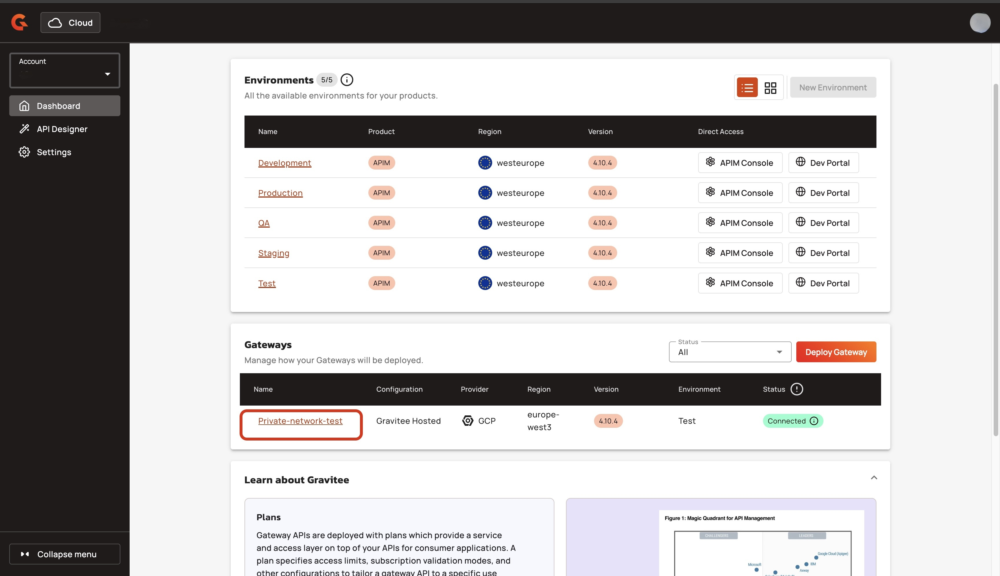
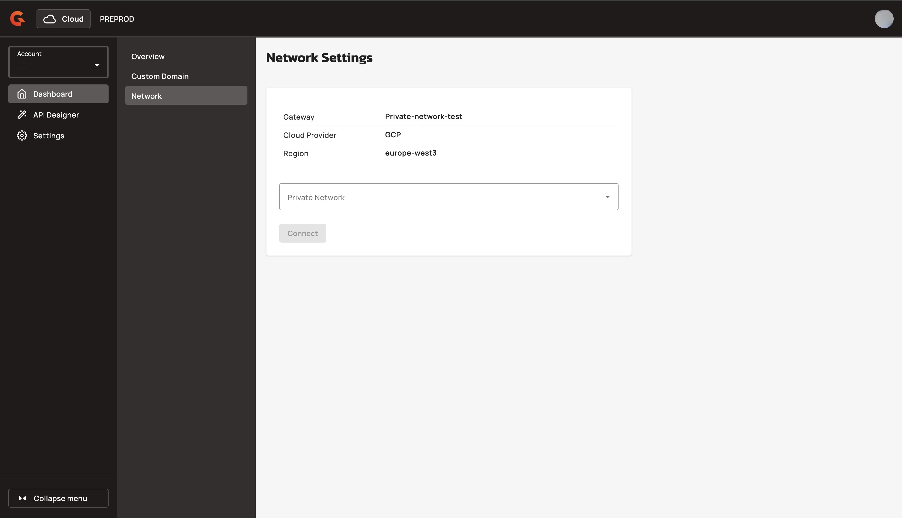

# Disconnect a Gateway from your private network

## Overview&#x20;

You can disconnect your Gateway from your private network with Gravitee Cloud.

## Prerequisites&#x20;

* Enable the private network feature. To enable the private network feature, contact your Gravitee representative. For example, your Technical Account Manager.&#x20;
* Create a private network. For more information about creating a private network, see [create-a-private-network.md](create-a-private-network.md "mention").
* Deploy a Gateway with the GCP provider and in the same region as your Private Network.

## Disconnect a Gateway&#x20;

You can disconnect a Gateway from your private network with either of the following methods:&#x20;

* [#disconnect-a-gateway-from-the-network-details-page](disconnect-a-gateway-from-your-private-network.md#disconnect-a-gateway-from-the-network-details-page "mention")
* [#disconnect-the-gateway-from-the-private-network-details-page](disconnect-a-gateway-from-your-private-network.md#disconnect-the-gateway-from-the-private-network-details-page "mention")

### Disconnect a Gateway from the network details page

1.  From the **Dashboard**, click **Settings**.  

    <figure><figcaption></figcaption></figure>
2.  From the **Settings** menu, click **Private Networks**. 

    <figure><figcaption></figcaption></figure>
3. Navigate to the **Associated Gateways** section.
4.  Click the **X** associated with the Gateway that you want to disconnect from the private network. 

    <figure><figcaption></figcaption></figure>
5.  Click **Save**. Wait a few minutes for Gravitee to disconnect the Gateway.  

    <figure><figcaption></figcaption></figure>

#### Verification

The Gateway does not appear in the list of the Associated Gateways. 

<figure><figcaption></figcaption></figure>

### Disconnect the Gateway from the private network details page

1.  From the **Dashboard**, click the Gateway that you want to disconnect from the private Network. 

    <figure><figcaption></figcaption></figure>
2.  From the Gateway's menu, click **Network**.&#x20;

    <figure><figcaption></figcaption></figure>
3.  Click **Disconnect**. Wait a few minutes for the disconnection to complete.

    <figure><figcaption></figcaption></figure>

#### Verification&#x20;

The Gateway is removed from the **Private Network Settings** scree&#x6E;**.**

<figure><figcaption></figcaption></figure>
