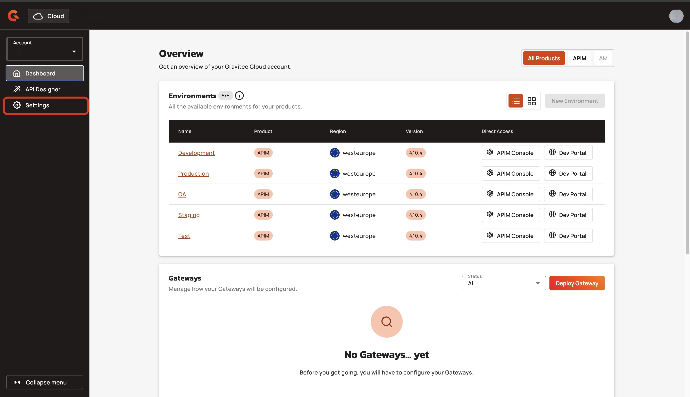
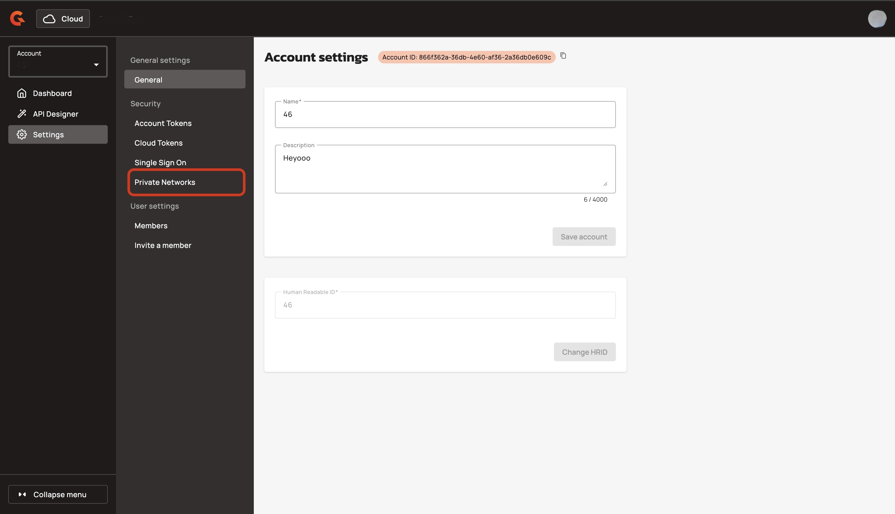
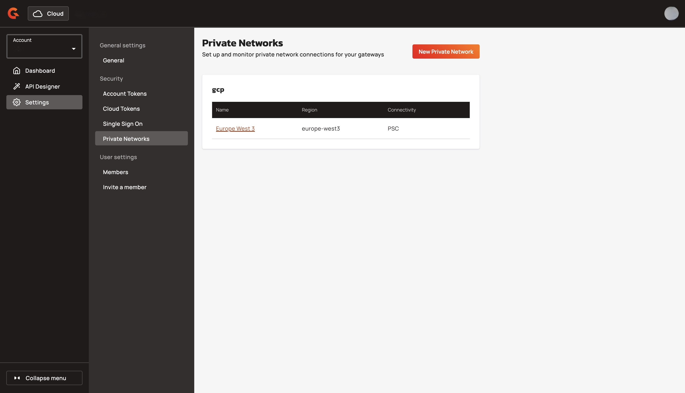
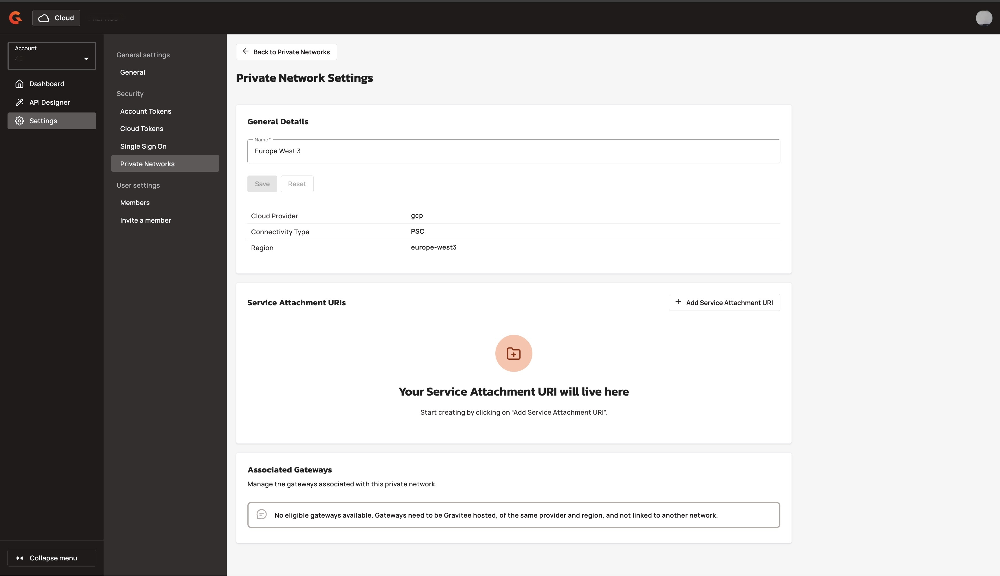

# View your private network's details

## Overview

You can view the details of your private network with Gravitee Cloud. You can view the following information within your private network's details screen:

The **Private Network Settings** screen displays the following information:&#x20;

* The name of your private network.&#x20;
* The Cloud provider. For example, GCP.
* The connectivity type. For example, psc.
* The region. For example, `asia-aoutheast1`.
* The Service Attachment URIs. For more information about Service attachment URIs, see  [add-a-service-attachment-to-your-private-network.md](add-a-service-attachment-to-your-private-network.md "mention").
* The Associated Gateways. For more information about connecting and disconnecting Gateways, see [connect-a-gateway-to-your-private-network.md](connect-a-gateway-to-your-private-network.md "mention") and [disconnect-a-gateway-from-your-private-network.md](disconnect-a-gateway-from-your-private-network.md "mention").

## Prerequisites&#x20;

* Enable the private network feature. To enable the private network feature, contact your Gravitee representative. For example, your Technical Account Manager.&#x20;
* Create a private network. For more information about creating a private network, see [create-a-private-network.md](create-a-private-network.md "mention").

## View your private network's details.&#x20;

1.  From the **Dashboard**, click **Settings**. 

    <figure><figcaption></figcaption></figure>
2.  In the settings menu, click **Private Networks**.  

    <figure><figcaption></figcaption></figure>

Your private networks are displayed in a list.&#x20;

<figure><figcaption></figcaption></figure>

3.  Click **the name of your private network**. The **Private Networks Settings** screen displays the information about your private network.  

    <figure><figcaption></figcaption></figure>

## Next Steps

* [add-a-service-attachment-to-your-private-network.md](add-a-service-attachment-to-your-private-network.md "mention")
* [connect-a-gateway-to-your-private-network.md](connect-a-gateway-to-your-private-network.md "mention")
