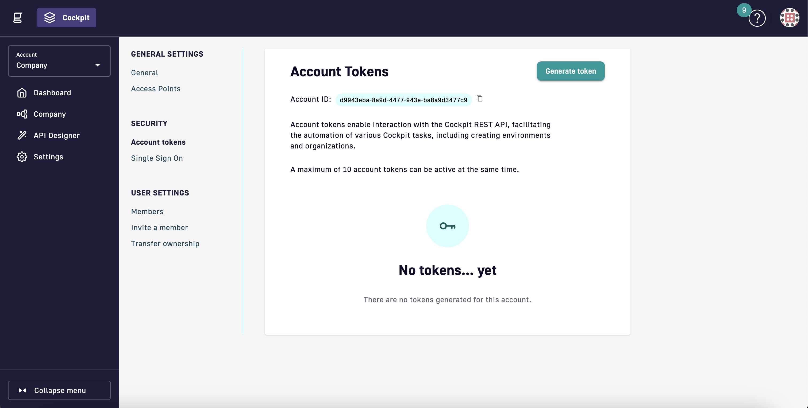

# Cloud Hosted Gateways

## Introduction

A full SaaS set up of Gravitee is a convenient way of running Gravitee. Gravitee manages operations related to your environments for both the Control Plane and all gateways. Deploying Cloud hosted gateways has the following benefits:

* **Automatic Configuration & Scaling**: Gravitee automatically configures and scales gateways in high availability setups, delivering the compute power and resources needed based on your subscription tier.
* **Managed Upgrades**: Gravitee provides automatic patch upgrades, with self-serve feature upgrades available for enhanced control.
* **Dedicated Environments**: Each Cloud hosted gateway is dedicated to an API Management environment of your choice (e.g., Production, Test, Development), ensuring isolation and security across environments.

## Deploying a Cloud hosted gateway

This section shows you how to connect a Cloud hosted gateway to your Gravitee Cloud API Management control plane environments.

You may deploy one Cloud hosted gateway for each environment. Dont worry about scaling and high availability, Gravitee will take of that.


You do not have to scale your gateways. Gravitee scales your gateways and manages high-availability.


1. Navigate to your Gravitee Cloud Dashboard, and then in the Gateways section, select **Deploy Gateway** .

<figure><figcaption>
Gravitee Cloud Dashboard with no gateways deployed yet.
</figcaption></figure>

2. In the **Choose Gateway Deployment Method** pop-up window, Select **Gravitee Hosted Gateway**.

<figure><figcaption>
Gateway deployment screen with Cloud hosted gateways or Hybrid gateways as option.
</figcaption></figure>

3. Select the environments that you want Cloud hosted gateways to, and then click **Deploy**.&#x20;


* Environment dedicated Cloud hosted gateways are deployed even if you select more than one environment. Cloud hosted gateways are never shared between your environments.
* Deploying a Cloud hosted gateway will take around 5 minutes.


<figure><figcaption>
Gateway deployment screen where you select environments that you want Cloud hosted gateways for.
</figcaption></figure>

After you deploy a gateway, you are taken to your Gravitee Cloud Dashboard, where you see that your Cloud hosted gateways are being deployed.

<figure><figcaption>
Gravitee Cloud Dashboard with a Cloud hosted gateway being deployed.
</figcaption></figure>

## Verification

Once the gateways are deployed, you will see them as an entry in the Gateways section.

<figure><figcaption>
Gravitee Cloud Dashboard with a Cloud hosted gateway deployed.
</figcaption></figure>

## Viewing the details of a gateway

* To the view the details of a gateway, click the gateway name to see the gateway details. For example, the Gateway URL and host that has been set up for your gateways.

<figure><figcaption>
Cloud hosted gateway settings screen.
</figcaption></figure>

## Deploying APIs

Once you deploy the gateways, navigate to the API Management Console UI to create, deploy and start consuming APIs.

<figure><figcaption>
API Management Developer Portal with an API deployed on a Cloud hosted Gateway. Notice the dedicated access URL for your API.
</figcaption></figure>
