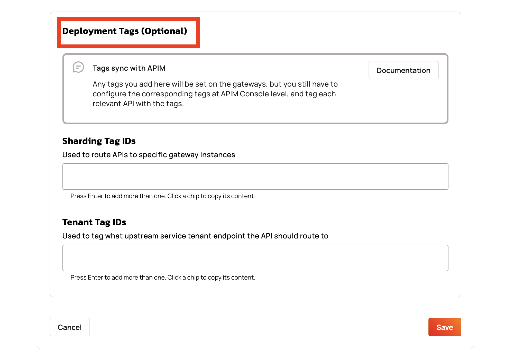

# Deploy a Gravitee Hosted Gateway

## Overview

A full SaaS set up of Gravitee is a convenient way to run Gravitee. Gravitee manages operations related to your environments for both the Control Plane and all Gateways. Deploying Cloud-hosted Gateways has the following benefits:

* **Automatic Configuration & Scaling**: Gravitee automatically configures and scales Gateways in high availability setups, which delivers the compute power and resources needed based on your subscription tier.
* **Managed Upgrades**: Gravitee provides automatic patch upgrades, with self-serve feature upgrades available for enhanced control.
* **Dedicated Environments**: Each Cloud-hosted Gateway is dedicated to an API Management environment of your choice, which ensures isolation and security across environments.

## Deploy a Gravitee hosted Gateway


You do not have to scale your Gateways. Gravitee scales your Gateways and manages high availability.


### Add Gateway details

1.  From the **Dashboard**, click **Deploy Gateway**.

    <figure><figcaption></figcaption></figure>
2.  In the **Choose Gateway Deployment Method** pop-up window, Select **Gravitee Hosted Gateway**, and then click **Next**.

    <figure><figcaption></figcaption></figure>
3. In the **Deploy Gateway** screen, complete the following-sub-steps:
   1. Enter the name of your Gateway. For example, Deploy Gateway 2.
   2. Choose the environment for your Gateway.&#x20;
   3. Choose the provider for your Gateway.
   4.  Choose the region for your Gateway

       <figure><figcaption></figcaption></figure>

### (Optional) Add Development tags

When deploying a new Gateway, you can optionally set sharding tags. To add sharding tags, complete the following steps:

1.  Navigate to the **Deployment Tags** section.\

    <figure><figcaption></figcaption></figure>
2.  In the **Sharding Tags IDs** field, enter one or more tags that identify this Gateway's purpose. For example, "us-east", "production", "eu-west".

    <figure><figcaption></figcaption></figure>

3.  In the **Tenant Tags** field, input identifiers that represent the backend services or tenants the Gateway should route to. For example, "eu-west-1".\

    <figure><figcaption></figcaption></figure>
4. Click **Save**.&#x20;

### (Optional) Add another Gateway&#x20;

1. Click **+** **Add another Gateway**. Each unique combination of environment, service provider, and region creates a separate Gateway deployment.&#x20;

<figure><figcaption></figcaption></figure>

2. In the **Deploy Gateway** screen, complete the following-sub-steps:
   1. Enter the name of your Gateway. For example, Deploy Gateway 2.
   2. Choose the environment for your Gateway.&#x20;
   3. Choose the provider for your Gateway.
   4.  Choose the region for your Gateway

       <figure><figcaption></figcaption></figure>
3. (Optional) Add development tags. For morei nformation about adding development tags, see [#optional-add-development-tags](gravitee-hosted-gateways.md#optional-add-development-tags "mention").
4.  Click on **Save.**\

    <figure><figcaption></figcaption></figure>

You see both Gateway configurations in the **Gravitee Hosted Gateways** section, including your existing Gateways and the newly created Gateways. Each Gateway shows its unique configuration details, including the assigned domains and regional settings.

<figure><figcaption></figcaption></figure>

### Deploy the Gateways

* Click **Deploy Gateways**. The Gateway takes a few minutes to deploy.


- Environment dedicated Cloud hosted gateways are deployed even if you select more than one environment. Cloud hosted gateways are never shared between your environments.


## Verification

The Gateway or Gateways appear in the **Gateways** section of the **Dashboard**.\

<figure><figcaption></figcaption></figure>

## View the details of a Gateway

*   To the view the details of a Gateway, click the Gateway name to see the Gateway details. \

    <figure><figcaption></figcaption></figure>

### Gateway Domains

Each deployed Gateway receives unique HTTP and Kafka domains that include the service provider and region information in the URL structure. This ensures that each Gateway has a distinct endpoint while maintaining backward compatibility with existing Gateway domains.

To view the details of a Gateway:&#x20;

1.  Click the Gateway name to see the Gateway details.&#x20;

    <figure><figcaption></figcaption></figure>
2.  The Gateway deployment details appear in the dashboard overview section showing the HTTP domain and Kafka domain.&#x20;

    <figure><figcaption></figcaption></figure>


All existing Gateway domains remain fully functional to ensure continuity for current API consumers, custom domain configurations, and existing integrations.


## Manage Sharding tags and Tenant tags&#x20;

Sharding tags allow you to control which APIs are deployed to specific Gateways. With Sharding tags, you configure multiple Gateways in different regions and you deploy certain APIs to only specific locations.

Tenant tags help route API requests to upstream services based on the Gateway's location or characteristics. This ensures requests are sent to backend services in the same region or cloud provider as the Gateway.

To update Sharding tags or Tenant tags on an existing Gateway, complete the following steps:

1.  Navigate to your Gravitee Cloud Dashboard, and then click the Gateway name&#x65;**.** \

    <figure><figcaption></figcaption></figure>
2.  Click the Gateway name to access Gateway settings.\

    <figure><figcaption></figcaption></figure>
3.  In the **Tags Deployment Details** section, you can add new Sharding tag IDs, and Tenant tag IDs. The changes are applied without requiring Gateway restart. \

    <figure><figcaption></figcaption></figure>


Sharding tag changes are applied immediately without gateway downtime. However, API synchronization may take a few minutes to complete.

Tenant tags are useful for routing requests to backend services in the same cloud provider or region as the gateway, ensuring optimal performance and data residency compliance.


### Configure Sharding Tags and Tenant Tags in API Management

For Gravitee-hosted Gateways, the process differs from Self-hosted Gateways:

* **Gateway configuration**: Use the Cloud UI as shown in the [add development tags ](gravitee-hosted-gateways.md#optional-add-development-tags)section instead of configuring it in `gravitee.yml` or `values.yaml` files
* **APIM configuration**: Follow the standard APIM process below

#### Configure Sharding Tags in API Management

Gateway tagging is handled in the Cloud UI deployment process. For API configuration in APIM, follow these specific steps from the APIM documentation:

* [Create a tag in the APIM Console](https://documentation.gravitee.io/apim/configure-and-manage-the-platform/gravitee-gateway/sharding-tags#create-a-tag-in-the-apim-console)
* [Add sharding tags to your APIs](https://documentation.gravitee.io/apim/configure-and-manage-the-platform/gravitee-gateway/sharding-tags#add-sharding-tags-to-your-apis)


**Note:** Skip any steps involving `gravitee.yml`, `values.yaml`, or environment variables. These are not applicable to Gravitee-hosted gateways.


#### Configure Tenant Tags in API Management

Gateway tenant configuration is handled in the Cloud UI deployment process. For API endpoint configuration in APIM:

* [Configure tenants and API endpoints](https://documentation.gravitee.io/apim/configure-and-manage-the-platform/gravitee-gateway/tenants)


**Note:** Skip any steps involving `gravitee.yml` configuration. Tenant tags are set through the Cloud UI for Gravitee-hosted gateways.

