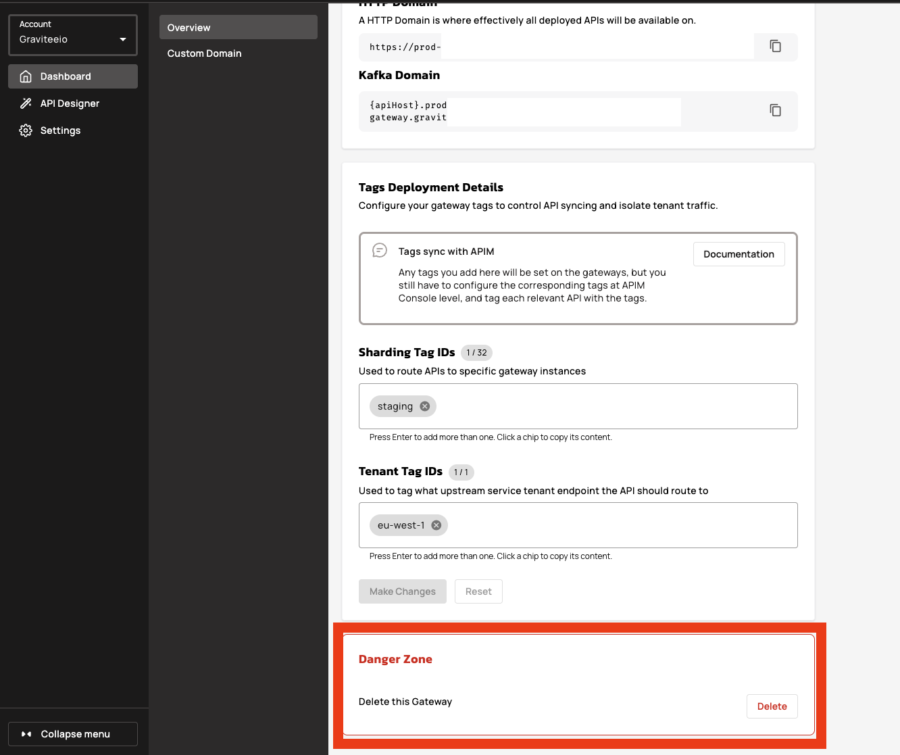
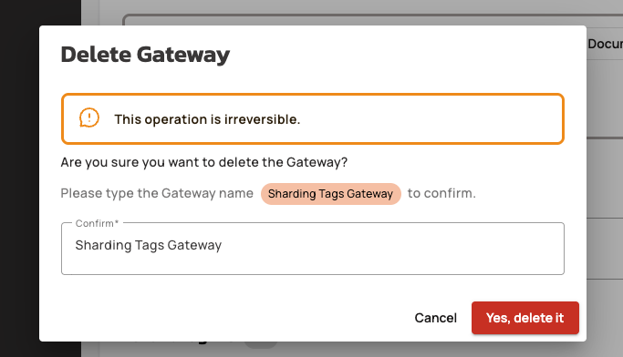

# Delete a Gravitee Hosted Gateway


This operation is irreversible. When you delete the Gateway, all its configurations will be permanently removed.


Deleting a Hosted Gateway is a way to maintain an efficient and secure cloud environment. By removing Gateways that are no longer needed, you optimize your resource allocation and strengthen your overall security posture by eliminating unused access points.

To delete a Hosted Gateway, complete the following steps:

1.  Navigate to your Gravitee Cloud Dashboard, and then click the Gateway name you want to delete.

    <figure><figcaption></figcaption></figure>
2.  Navigate to the **Danger Zone** section.

    <figure><figcaption></figcaption></figure>
3. Click **Delete.**&#x20;
4.  In the Delete Gateway pop-up window, type the exact Gateway name in the confirm field. The Gateway name is displayed for reference.

    <figure><figcaption></figcaption></figure>
5. Click **Yes, delete it** to delete the Gateway permanently.

## Verification

Upon successful deletion, a green confirmation pop-up window will display, indicating that the Gateway was successfully deleted.

<figure><figcaption></figcaption></figure>

The Gateway is immediately removed from your environment and will no longer appear in the Gateways section of your Dashboard.
