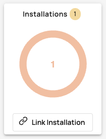
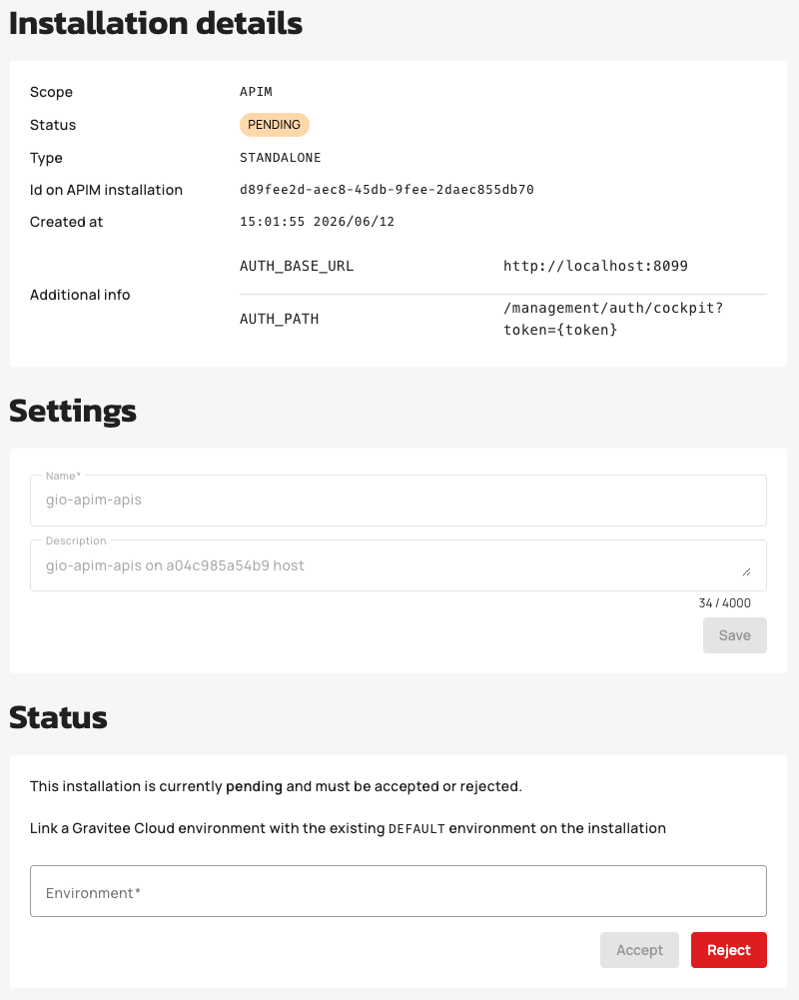
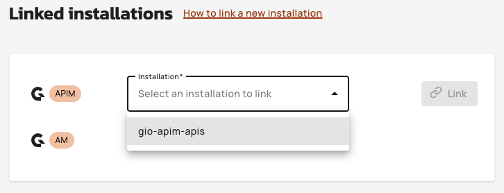
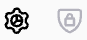
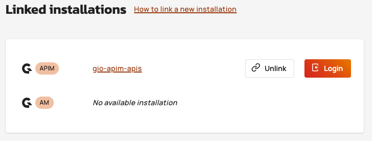

# Register installations

## Introduction

Existing self-hosted installations of Gravitee API Management (APIM) and Access Management (AM) can be registered in Gravitee Cloud (GC). This allows users to create and propagate new organizations and environments to these existing installations.

A registered installation communicates with GC via a WebSocket connection, secured with TLS.

When you register a new installation, its REST API and Gateway nodes are automatically linked to GC, including any nodes you add to your APIM and AM installations later on.

### Register a new installation

To register new APIM or AM installations with GC, you need to:

* Have a GC connector in your installation plugins.
* Download the certificate to allow secure connection via the GC UI.
* Install the certificate, and restart your installation.

These steps are explained in detail when you register the installation.



**Connecting through an HTTP proxy**

If your self-hosted installation cannot reach Gravitee Cloud directly and must route outbound traffic through a corporate HTTP proxy, configure the Gravitee Cloud connector to use that proxy in your installation's `gravitee.yaml`:

```yaml
cloud:
  enabled: true
  connector:
    ws:
      proxy:
        enabled: true
        host: <proxy-host>
        port: <proxy-port>
        type: HTTP
        username: <proxy-username>   # optional, if the proxy requires authentication
        password: <proxy-password>   # optional, if the proxy requires authentication
```

The `username` and `password` fields are only required when the proxy enforces authentication. The WebSocket connection to Gravitee Cloud remains secured with TLS when routed through the proxy.



Register the installation using the detailed instructions in the **How to register a new installation** link, below **Installations** in the dashboard. After registration, the installation is displayed as a pending installation in GC:



### Add the installation to GC

1. Accept the installation:
   1. Click the pending installation.
   2. Select the environment to which to link the installation.
   3.  Click **ACCEPT**.

       

       The installation is added to the hierarchy map with a link to the environment.
2.  Link the accepted installation to other environments in GC as needed, from the environment settings page.

    

### Log in to an installation

There are two ways to log in to an installation in GC:

* Click the login icon  on the environment in the hierarchy map
* Click **Login** on the environment settings page of the linked environment:



You are redirected to the Console login page of the APIM or AM instance.

If multiple APIM or AM installations are linked, the Console login page of the first installation linked to the environment opens.
