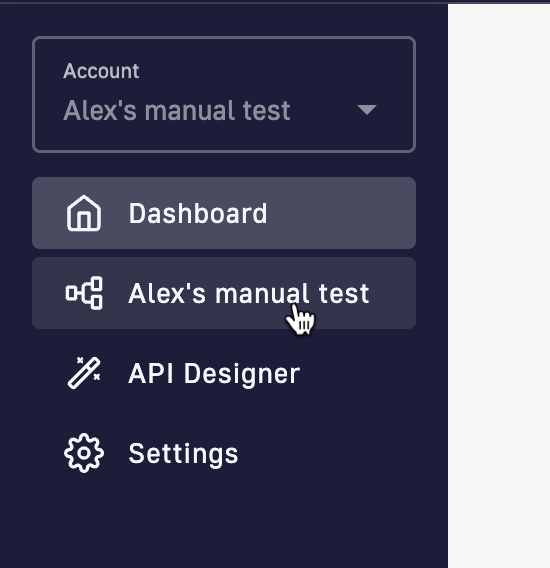

# Set up your Gravitee Cloud Hierarchy

## Introduction

Gravitee Cloud (GC) enables you to set up and edit Gravitee hierarchies.

## Set up your hierarchy

You create your hierarchy from the GC dashboard, select your organization in the left-hand nav.

<figure><figcaption></figcaption></figure>

Here, you'll see your various Gravitee APIM and/or AM entities/environments.

### Update entity settings

You can update the settings of any entity within your hierarchy from the hierarchy map, accessed by clicking your organization name in the left-hand menu.

You can update the general details of entities, delete entities, and manage users. You can also update specific settings such as API Designer settings for organizations.

To update settings for an entity in your organization:

1. Click the organization name in the left-hand menu.
2. Click the settings icon  of the entity

When you're done, just make sure that you **Save**.
