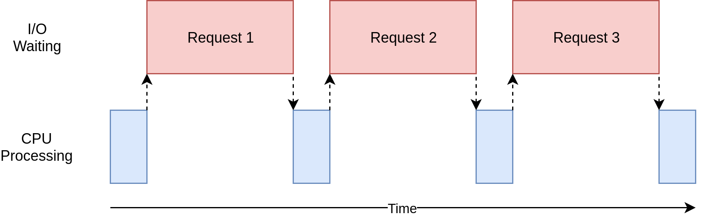
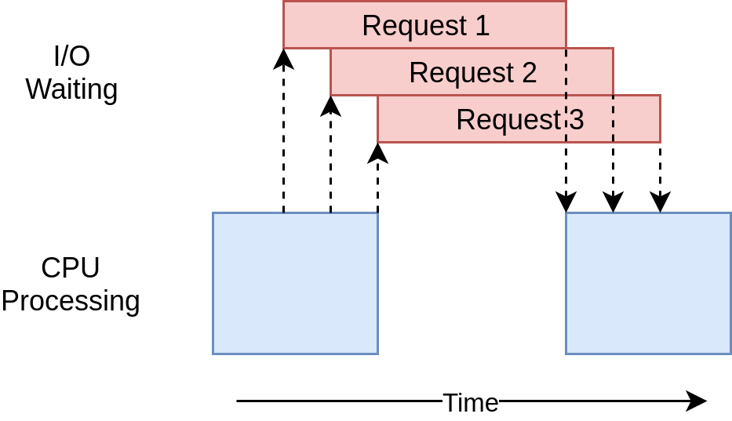

# Categorizing Web APIs

Web APIs are generally categorized as synchronous or asynchronous and stateless or stateful. These concepts are often subject to cross-pollination (e.g. all stateless APIs are synchronous) when, in actuality, they are entirely independent. Their respective details and relationships are further explored below in [synchronous vs asynchronous](categorizing-web-apis.md#synchronous-vs-asynchronous-9) and [stateful vs stateless web APIs](categorizing-web-apis.md#stateful-vs-stateless-web-apis-13).

## Synchronous vs asynchronous <a href="#synchronous-vs-asynchronous-9" id="synchronous-vs-asynchronous-9"></a>

Synchronous (sync) vs asynchronous (async) constitutes a fundamental demarcation within web APIs and represents a paradigm shift in how APIs communicate. The following sections broadly introduce synchronous and asynchronous patterns before applying these concepts to web APIs.

### **Sync vs async programming**

Synchronous programming is the linear, sequential execution of tasks, where each task must be completed before the next task is executed (e.g., first complete task A, then task B, then task C). Asynchronous programming is the concurrent execution of tasks, where tasks can be performed partially or totally out of order (e.g., start task A, complete task B, complete task C, return to finish task A).

To frame a relatable analogy, consider that humans cannot multitask when performing high-level functions, i.e., a person can sustain only a single train of thought. This is conducive to a person preparing for the synchronous execution of tasks, where task A must be completed before moving on to task B. For example, someone may intend to get a quote from an insurance provider, then write a report.

However, when executing tasks, humans often function asynchronously (e.g., begin task A, switch to task B, then return to task A, etc.). Returning to the previous example, if the insurance provider is experiencing a high call volume, the caller can work on their report while they're on hold, then switch back to the phone conversation once an agent joins.

A human's single train of thought is equivalent to a single-threaded process running on a computer. In each case, the involvement of a third party allows a set of tasks to be executed concurrently and independently, as opposed to the completion of one task gating the execution of another. In the real-world asynchronous example, this third party is the insurance provider. With respect to asynchronous programming, the third party is generally a web API called by the main execution thread.

The following functions demonstrate sync vs async programming at the expense of implementation logic. By design, Javascript inhibits synchronous, blocking code, because it is the [single-threaded language](https://medium.com/swlh/what-does-it-mean-by-javascript-is-single-threaded-language-f4130645d8a9) that powers the web. For these examples, focus on what the functions represent.


```javascript
const simulateSyncWork = function (work, ms) {
  const end = new Date().getTime() + ms;
  while (new Date().getTime() < end) {
    /* do nothing */
  }
  return console.log(`${work} Complete`);
};

console.time("Sync time");

simulateSyncWork("Web API Work", 3000);

simulateSyncWork("Local Work 1", 1000);
simulateSyncWork("Local Work 2", 2000);
simulateSyncWork("Local Work 3", 1000);

setTimeout(() => console.timeEnd("Sync time"), 1);
```


This simple example sets synchronous function calls that block execution of the main thread for specified durations. The `work` parameter specifies the type of work being simulated: either a web API call or actions executed locally. For this synchronous programming example, the difference is negligible. The script executes exactly as you would anticipate, and at the end, returns a total run time of approximately 7 seconds.

```
// Console Output:

// Web API Work Complete
// Local Work 1 Complete
// Local Work 2 Complete
// Local Work 3 Complete
// Sync time: 7001.510986328125 ms
```

The synchronous call to the web API requires the main thread to wait for a return value from a remote party. The following code modifies the same program to implement an asynchronous call to the same, simulated web API.

```javascript
const simulateAsyncWork = function (work, ms) {
  return setTimeout(() => console.log(`${work} Complete`), ms);
};
const simulateSyncWork = function (work, ms) {
  const end = new Date().getTime() + ms;
  while (new Date().getTime() < end) {
    /* do nothing */
  }
  return console.log(`${work} Complete`);
};

console.time("Async time");

simulateAsyncWork("Web API Work", 3000);

simulateSyncWork("Local Work 1", 1000);
simulateSyncWork("Local Work 2", 2000);
simulateSyncWork("Local Work 3", 1000);

setTimeout(() => console.timeEnd("Async time"), 1);
```

Changing the synchronous web API call to an asynchronous API call reduces the total run time to approximately 4 seconds.

```
// Console Output:

// Local Work 1 Complete
// Local Work 2 Complete
// Local Work 3 Complete
// Web API Work Complete
// Async time: 4002.68212890625 ms
```

The asynchronous implementation of the simulated API call allows the main thread to defer execution and continue with subsequent tasks. Once the web API has completed its work, it is added to a task queue for the main thread to return to once the call stack is empty. This is why the asynchronous call to the web API is the last function to return a value, and the overall program completes in approximately 4 seconds instead of 7.


Core to Javascript, [event loop](https://www.youtube.com/watch?v=8aGhZQkoFbQ) functionality enables asynchronous programming.


Though contrived, the above example effectively illustrates the power of asynchronous programming. Both `simulateSyncWork("Web API Work", 3000)` and `simulateAsyncWork("Web API Work", 3000)` represent calls to the same web API, but asynchronous programming enabled a change in response as further clarified by the following graphics.

<figure><figcaption><p>Diagram of synchronous calls to a web API from <a href="https://realpython.com/python-concurrency/">blog</a></p></figcaption></figure>

<figure><figcaption><p>Diagram of asynchronous calls to a web API from <a href="https://realpython.com/python-concurrency/">blog</a></p></figcaption></figure>

### **Sync vs async web APIs**

The concepts of sync vs async programming and sync vs async web APIs are related. Just like asynchronous programming breaks up the linear, sequential execution flow of a program, an asynchronous web API breaks up the linear, sequential communication between information producers and consumers. This is achieved via the event streaming network communication model.

Asynchronous API clients do not initiate communication beyond expressing initial interest in a data stream. Instead, communication is triggered by events, which are changes in state. In async communication, a client subscribes to a particular data stream, a change of state occurs, a broker delivers this change of state to all subscribed clients, and each client processes the data for a particular end use. Entire systems built around this flow employ what is broadly termed event-driven architecture (EDA). EDA is an architectural style that exists at the system level instead of the API level.

To demonstrate the benefits of EDA, consider an example use case where an IoT device tracks real-time temperature changes. Assuming an application must be alerted immediately if the temperature falls below 32F/0C degrees, an HTTP API adhering to the request-response model would need to continuously poll the server hosting the temperature data. Alternatively, an event-driven architecture built around asynchronous APIs following the pub/sub architectural style would allow a subscription to the broker’s temperature topic. For each temperature change, the broker would instantly push data to the topic, allowing subscribers to develop business logic around the data stream and react to threshold crossings. The publisher of the temperature data would not need to be aware of how or when the data is processed.

For use cases that focus on real-time applications, event-driven architecture and asynchronous APIs enable communication that is significantly more efficient. EDA is a novel way to structure an application and can lead to both internal and external integration challenges. The decision to use async communication is context-dependent and a single system often leverages both synchronous and asynchronous APIs.


Generally, the HTTP application protocol is conceptualized and discussed as a synchronous protocol. However, there are different versions of HTTP such as HTTP/1.1 (currently the most widely used version), HTTP/2.0, and HTTP/3.0. HTTP/2.0 functionality like multiplexing begins to break down the strict request/response model because multiple requests can be bundled together and returned in any order. The evolution of HTTP serves to caution against oversimplifying protocol classifications.


## **Reactive programming**

To implement EDA at the component or service level, programmers typically employ a technique known as [reactive programming](https://gist.github.com/staltz/868e7e9bc2a7b8c1f754), where events are the main orchestrators of application flow and program logic is built around asynchronous communication to manipulate and operate on data streams.

Reactive programming enables stream processing, which works with distributed streaming systems like [Kafka](https://www.confluent.io/what-is-apache-kafka/) that store ordered sequences of events, referred to as topics, in a data structure known as a log. Unlike traditional messaging queues, which apply simple computations to individual messages or batches of messages, topics allow historical event data to be pulled, unlocking the potential for a slew of input streams to be joined, aggregated, filtered, etc. This is stream processing, which is less about real-time data than complex processing applied across an array of input streams.

## Stateful vs stateless web APIs <a href="#stateful-vs-stateless-web-apis-13" id="stateful-vs-stateless-web-apis-13"></a>

The terms "synchronous API" and "stateless API" are often used interchangeably, as are "asynchronous API" and "stateful API." While this is often accurate, a label of stateless vs stateful hinges on the perspective of the server or broker.

A stateless API means the server does not store any information about the client making the request. In other words, the session is stored on the client, where the session is an encapsulation of a particular client-server interaction. Each client request is self-contained and provides all the information that the server requires to respond, including authentication tokens. The independent nature of each request is core to a stateless API. However, statelessness is not required for synchronous communication, as evidenced by the explicit citation of statelessness as a REST architectural constraint.

Many early web applications were built on stateful, synchronous APIs, as they are generally easier to build and therefore less expensive. This remains a reasonable approach to small-scale application development. However, problems arise when a single server can no longer handle the load. Every client request must be routed to the server that is currently storing that client’s session data, or there needs to be a mechanism for sharing session data between multiple servers. This limitation on the horizontal scaling of an application’s server-side infrastructure is a major driver of the popularity of REST and REST-like APIs.

When considering asynchronous APIs following the pub/sub pattern, the broker is responsible for pushing data to subscribers and must therefore maintain the session data, which explains why asynchronous APIs are almost always referred to as stateful. However, brokers are not inherently stateful. For example, the messaging platform [Pulsar](https://pulsar.apache.org/docs/2.10.x/concepts-overview/) implements a two-layer architecture consisting of a [stateless layer of brokers](https://pulsar.apache.org/docs/2.10.x/concepts-architecture-overview/#brokers) and a stateful persistence layer.
