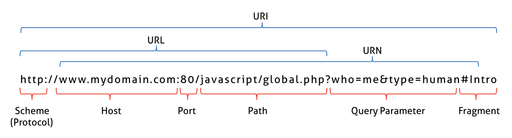

# Web APIs

To further clarify web API structure and functionality, this section addresses:

* [The internet vs the world wide web](web-apis.md#internet-vs-world-wide-web)
* [The shift to microservices](web-apis.md#shift-to-microservices)
* [API protocols](web-apis.md#protocols-4)
* [API architectures/patterns](web-apis.md#architectural-stylespatterns-5)
* [API specifications](web-apis.md#specifications-6)
* [Data-interchange formats](web-apis.md#data-interchange-formats-7)

## Internet vs world wide web

A web API is an API that is accessible over a network. Although the type of network is irrelevant, common usage of web API presumes an API that operates over the internet.

The internet is the physical infrastructure that connects the global network of computers along which information travels. Much of this information is in the form of hypermedia (e.g., web pages) and organized in a construct known as the world wide web, which is essentially an application running on the internet infrastructure. However, the world wide web, or web, is only one way to access or manage information on the internet. For example, Voice over Internet Protocol (VoIP) enables calls over the internet without interacting with the web.

<figure><figcaption><p>Photo of the underwater cables connecting the internet from this <a href="https://www.weforum.org/agenda/2015/11/how-can-we-protect-the-internets-undersea-cables/">blog</a></p></figcaption></figure>


For a quick history lesson and a bit more detail about the relationship between the internet and the world wide web, [watch this excellent video](https://www.youtube.com/watch?v=eHp1l73ztB8\&t=189s).


## Shift to microservices

The popularity of web APIs is largely due to the [shift from monolithic applications to microservices](https://www.gravitee.io/blog/what-are-microservices-how-do-they-enhance-web-applications). While [not always a superior architecture](https://www.primevideotech.com/video-streaming/scaling-up-the-prime-video-audio-video-monitoring-service-and-reducing-costs-by-90), microservices replaced many monolithic applications because not all aspects of a project scale in parallel. Microservices enable cloud-native applications through the functional separation and independent scaling of each runtime, and web APIs provide distributed architectures a means of reliable communication via standardized contracts for network interfacing.

The underlying framework powering web APIs is quite complicated. Web APIs rely on communication protocols to deliver information to intended recipients, and network data must be serialized into data-interchange format for transport. In addition, API design and documentation should adhere to both an architecture and a specification.

Protocols, data-interchange formats, API architectures, and API specifications are often insufficiently defined and differentiated. For example, the REST architectural style is inaccurately used as a proxy for the HTTP application layer protocol. The following sections offer high-level clarifications.

## Protocols <a href="#protocols-4" id="protocols-4"></a>

APIs are often categorized by their architectural style or the application layer protocol they use to communicate over the network (e.g., an HTTP API). Protocol terminology is based on the layered networking model, which conceptualizes communication within and between computers at different levels of abstraction and with respect to different functionality. The transport layer and the application layer contain the protocols most relevant to APIs.

### Transport layer

The two most widely used transport layer protocols are the user datagram protocol (UDP) and the transmission control protocol (TCP) which both support packet-based messaging. The main differentiator is that UDP is more lightweight at the expense of error checking and does not guarantee packet integrity, delivery, or order of delivery. UDP is suitable if data loss results in minor artifacts (e.g., real-time video calls) but not for use cases that demand high accuracy (e.g., routing banking information).

The need for accurate and reliable data factors heavily into why many application layer protocols are built on top of TCP. TCP provides robust error checking to ensure packets are not lost, corrupted, duplicated, or delivered out of order.

### Application layer

The application layer is the top layer of the layered network model and contains many recognizable protocols, such as those shown in the table [below](web-apis.md#types). Protocol network communication is either synchronous or asynchronous and can differ between versions of the same protocol.

Application layer protocols define how independent programs and services communicate over networks and share information. While the other protocol layers focus on delivering data to a destination, the application layer protocols are responsible for establishing communication standards that dictate how that data is accessed and consumed. Specifically, the application layer provides the programs at each end of a communication link with interface methods to ensure that the request and response are understood and managed correctly. The role the application layer plays in defining interface conventions explains why an API type and its protocol are often synonymous.

#### Types of application layer protocols

<table><thead><tr><th width="347">Name</th><th width="135">Abbreviation</th><th>Communication Type</th></tr></thead><tbody><tr><td>Hypertext Transfer Protocol</td><td>HTTP</td><td>Sync/Async</td></tr><tr><td>Hypertext Transfer Protocol Secure</td><td>HTTPS</td><td>Sync/Async</td></tr><tr><td>Websocket</td><td>N/a</td><td>Async</td></tr><tr><td>Server Sent Events</td><td>SSE</td><td>Async</td></tr><tr><td>File Transfer Protocol</td><td>FTP</td><td>Sync</td></tr><tr><td>Message Queuing Telemetry Transport</td><td>MQTT</td><td>Async</td></tr><tr><td>Advanced Message Queuing Transport</td><td>AMQP</td><td>Async</td></tr><tr><td>Kafka’s Custom Binary Protocol</td><td>N/a</td><td>Async</td></tr><tr><td>Google Remote Procedure Call</td><td>gRPC</td><td>Sync/Async</td></tr><tr><td>Simple Object Access Protocol</td><td>SOAP</td><td>Sync/Async</td></tr><tr><td>Simple Mail Transfer Protocol</td><td>SMTP</td><td>Sync</td></tr><tr><td>Domain Name Service</td><td>DNS</td><td>Sync/Async</td></tr><tr><td>Extensible Messaging and Presence Protocol</td><td>XMPP</td><td>Async</td></tr></tbody></table>

Despite sitting at the same layer of the networking model, application layer protocols can be dependent on one another, and many depend on HTTP/HTTPS. For example, SOAP effectively tunnels over HTTP, which is a strategy employed by many protocols, including modern asynchronous protocols like WebSocket.


To clarify, the WebSocket protocol [handshake](https://www.baeldung.com/cs/handshakes) uses HTTP, but HTTP is not involved past that point. Learn more about this distinction [here](https://stackoverflow.com/a/47085864).


Although SOAP can be designed to function over raw TCP, HTTP leverages the existing web ecosystem and offers advantages. HTTP is fundamental to web communication and there has been substantial, global investment in server and client-side infrastructure (i.e., web browsers) designed around HTTP/HTTPS. In addition, security provisions such as firewalls tend to admit network traffic targeted for ports 80/443, meaning that applications built on HTTP are much more likely to work out of the box.

Networks, including the internet, support many application layer protocols that are in no way tied to HTTP. Most of the other application layer protocols relevant to this guide are built on top of raw TCP. For example, [Kafka implements a custom binary application protocol over TCP](https://kafka.apache.org/protocol.html) due to performance concerns when using HTTP to deliver massive amounts of real-time data.

To summarize, APIs depend on many protocols. The ideal protocol stack, just like the ideal application stack, is completely context-dependent and subject to considerations such as application environment, security concerns, payload, network quality, etc.


"Webhook API" is a misnomer. Webhooks are not APIs. [Webhooks are essentially functionality that can be added to existing APIs](https://www.redhat.com/en/topics/automation/what-is-a-webhook). Compounding this misconception, APIs are often categorized by the application layer protocol they employ, but Webhook is not an application layer protocol itself. Webhooks communicate over the HTTP application layer protocol.


### Example

Modern web browsers are applications that communicate over the HTTP/HTTPS protocol (HTTPS is HTTP with encryption and verification) but often truncate the visible website address to omit the protocol and subdomain. This is evidenced by visiting a site such as [Google](https://google.com/) and double-clicking the URL.

<div>

<figure><figcaption><p>Shortened URL</p></figcaption></figure>

 

<figure><figcaption><p>Expanded URL</p></figcaption></figure>

</div>

The graphic below clarifies the structure and individual components of a web address, which concatenate to form the broader uniform resource locator (URL), uniform resource identifier (URI), and uniform resource name (URN).

<figure><figcaption><p>URI vs URL vs URN</p></figcaption></figure>

A communication link between two applications requires that each endpoint is defined by a network socket, which is a combination of transport layer protocol, domain (which resolves to an IP address), and port number that uniquely and completely resolves the web address of a client request to a web server.


Web browsers communicate over HTTP, which is built on top of TCP, so the transport layer protocol is assumed. However, this will be changing with HTTP/3, which is built on top of UDP.


When `google.com` is typed in a web browser, it is expanded to `https://www.google.com:443`, where `www.google.com` is the fully qualified domain name that is resolved into an IP address through [domain name system (DNS) resolution](https://serverfault.com/questions/643506/how-does-the-http-get-method-work-in-relation-to-dns-protocol/643511#643511) and 443 is the port reserved for HTTPS on every network (port 80 is reserved for HTTP). The browser’s request is directed to Google’s web server using the HTTPS application layer protocol, in particular the GET [HTTP method](https://developer.mozilla.org/en-US/docs/Web/HTTP/Methods), and Google’s web server interprets the request and responds with the Google homepage.

HTTP includes standard status codes to qualify the state of every network communication. For example, if the requested [resource](https://restful-api-design.readthedocs.io/en/latest/resources.html) does not exist, Google’s web server will respond with a 404.

<figure><figcaption><p>HTTPS error response example</p></figcaption></figure>

## Endpoints

The route portion of a URL combined with an HTTP method constitutes an HTTP API endpoint. Every resource can be accessed by the user of the API at a unique endpoint. For example, `GET http://foo.com/api/user/1` and `GET http://foo.com/api/user/2` contain different routes and correspond to distinct resources. `GET http://foo.com/api/user/1` and `POST http://foo.com/api/user/1` are also considered unique endpoints due to the change in HTTP method.

In this example, all resources, and therefore, all endpoints tied to this API, exist under a single API entry point of `http://foo.com/api`. The entry point can be viewed as a special type of endpoint: as the Gateway to the API, it’s a resource that exists outside of any other collection and contains all other collections of resources.

#### Path parameters

Path parameters allow variable values to be passed along the URL path of a request. In a typical API route, the path is divided into segments separated by forward slashes `/`. Path parameters are denoted by a placeholder or variable name within curly braces `{}`. When a request is made, the actual value for the parameter is substituted in place of the placeholder. The above example could represent an endpoint as `GET http://foo.com/api/user/{id}` where `{id}` is the path parameter.

## Architectural styles/patterns <a href="#architectural-stylespatterns-5" id="architectural-stylespatterns-5"></a>

Web API architectural styles are the frameworks that support the design and development of various API implementations. They are completely separate from the underlying protocols that power APIs. The architectures focus on guiding API design, to which both developers and business logic stakeholders actively contribute.


Design-first methodology, which is [an API development technique with purported benefits](https://www.gravitee.io/api-first), attempts to satisfy both technical criteria and business interests and is [recommended by the OpenAPI initiative](https://learn.openapis.org/best-practices.html#use-a-design-first-approach).


### REST

Although popular usage of "REST API" might imply that REST is an application layer protocol, it is actually an architectural style that stands for “representational state transfer." REST APIs employ the HTTP application protocol (a practical implementation rather than an explicit REST requirement) and must adhere to six [design principles](https://www.ibm.com/topics/rest-apis): uniform interface, client-server decoupling, statelessness, cacheability, layered system architecture, and (optional) code on demand.


Many APIs that claim to be REST APIs, or RESTful, are not fully compliant with REST architecture and are more accurately referred to as REST-like.


REST APIs and their associated architectural constraints originated with Roy Fielding's iconic Ph.D. dissertation “Architectural Styles and the Design of Network-based Software Architectures.” Their explosion in popularity is due to many factors, such as statelessness enabling scalability and fault tolerance. The request of each completely independent request-response cycle can be handled by an arbitrary server instance and unlocks essentially limitless horizontal scaling.

The structure of REST APIs forms the basis of their uniform interface by requiring that each resource is identified by a single URL and that the actions on that resource are managed by HTTP verbs (GET, POST, etc.), request headers, and the request body. For each client request, the server modifies the resource, if requested, then transfers a representation of the state of the resource back to the client, hence the designation "representational state transfer." Statelessness ensures that each request contains all of the information necessary for it to be processed without relying on a session state stored by the server.

### RPC

Another major architectural style that predates REST is the remote procedure call, or RPC. RPC-based APIs utilize several different application layer protocols such as HTTP, SOAP, and gRPC. The main differentiator between REST and RPC is that REST URLs are resource-centric (`http://foo/user/1`) while RPC URLs are action-centric (`http://foo/getUser`). A remote procedure call essentially calls a function the chosen programming language remotely, or over a network.

Unlike REST, RPC architecture does not clearly designate a set of constraints. Both REST and RPC are architectural styles and real-world implementations don’t often fully align with either. This has led to implementations such as GraphQL (an architectural style, an API query language, and a runtime for fulfilling those queries) which proponents describe as essentially RPC, but borrowing heavily from the REST community.


[REST vs RPC](https://www.smashingmagazine.com/2016/09/understanding-rest-and-rpc-for-http-apis/) can be examined in-depth via implementation examples that highlight the strengths and weaknesses of both styles.


### Network communication models

In general, an API implemented with a REST, RPC, or a GraphQL architectural style executes synchronous network communication via the request-response model, where the client computer makes a request directly to the server computer and the server responds by returning data or executing a procedure. While the client and server applications are decoupled and function independently, synchronous communication is inherently tightly coupled.

The request-response model was instrumental in the development of the modern web and has dominated network communication until recently, when an asynchronous network communication model known as event streaming, or message streaming, rose to prominence. In this context, an event is any change in the state of a resource. In the event streaming model, clients publish messages to or subscribe to receive messages from a server computer known as the event broker.


Both network communication models rely on **API transactions**. Each API transaction is a single interaction between a client application and a server through an API.

In a typical synchronous API transaction, a client request is sent to a server via an API endpoint and the server response is returned to the client. An asynchronous API transaction refers to a single transmission of a message payload between a client and a message broker.


One popular architectural style that implements event streaming is the publish/subscribe (pub/sub) pattern. Similar to RPC, it is fairly generalized without many rigid architectural constraints. The core tenet of the pub/sub pattern is that communication between information producers, or publishers, must be decoupled from information consumers, or subscribers, through the event broker. Consequently, publishers and subscribers are not aware of one another. This loose coupling greatly simplifies communication (i.e., the publisher has a single target, the broker) which enables the design of more scalable and flexible event-driven systems. APIs following the pub/sub pattern utilize many different application layer protocols such as MQTT, AMQP, and the Kafka custom binary protocol.


Although often used synonymously, there is a distinction between an event and a message. This guide adopts the high-level disambiguation that a message is the directed carrier of an event while the event is the actual change in observable state, but there is a [deeper technical distinction](https://developer.lightbend.com/docs/akka-guide/concepts/message-driven-event-driven.html).


## Specifications <a href="#specifications-6" id="specifications-6"></a>

The architectural styles that govern the client-server interactions do not dictate API usage such as available endpoints, permissible actions, authentication options, parameters to pass, etc. Documentation of this information must be clear, intuitive, comprehensive, and updated with bug fixes or future iterations. API specifications such as [OpenAPI](https://spec.openapis.org/oas/latest.html) alleviate the overhead associated with documentation by providing a template and expand API design to include documentation generation, code generation, validation and linting, mock servers, etc. The API description file acts as a single source of truth to limit the potential for repetition or inconsistency.

Specifications that focus either exclusively or primarily on synchronous APIs include OpenAPI, OData, RAML, GraphQL (a query language with its own specification), WSDL, etc. The role of some specifications is unique, such as WSDL serving SOAP APIs or the GraphQL specification serving GraphQL APIs, while other specifications target the same type of API, such as RAML and OpenAPI both serving HTTP APIs.

The [AsyncAPI](https://www.asyncapi.com/) specification serves asynchronous APIs and is widely regarded as OpenAPI's counterpart. The CloudEvents specification also applies to asynchronous APIs, but an [in-depth comparison](https://www.asyncapi.com/blog/asyncapi-cloud-events) reveals that CloudEvents and AsyncAPI belong to different categories of specification. While AsyncAPI addresses the overall application and its communication channels, CloudEvents defines an envelope for the application’s data.

## Data-interchange formats <a href="#data-interchange-formats-7" id="data-interchange-formats-7"></a>

The API payload is the data being transported by the API. For example, consider the Javascript object below, where "sampleObject" is the API payload.

```javascript
const sampleObject = {
  numberOneGateway: "gravitee",
  numberTwoGateway: "kong",
};
```

To ensure any API client can parse the transmitted data, the payload must be encoded into a universal format prior to delivery. It must also arrive in a self-contained stream or chunk, but abstractions inherent to high-level programming languages such as JavaScript generally inhibit the use of a single, contiguous block of memory to store an object. Instead, the object contains references to data stored in different blocks of memory, which spreads an object's properties over the memory of a running process.

Serialization satisfies these requirements by converting an object in memory to a stream of bytes for storage or transport. Serialized data can be easily transferred over a network, then deserialized (the inverse operation) upon reaching its destination. Data-interchange format and serialization format are synonymous terms.

Universal formats are either text-based or binary and facilitate deserialization by any client. The JavaScript Object Notation format (JSON) is the dominant universal format for web communication due to its universality, lightweight format, and human-readable text, though [other formats](https://blog.mbedded.ninja/programming/serialization-formats/a-comparison-of-serialization-formats/) are also common. Javascript has first-class support for JSON, which can be applied to "sampleObject" as follows:

```javascript
const serializedData = JSON.stringify(sampleObject);
console.log(serializedData);
typeof serializedData;
// Console Output:
// {"numberOneGateway":"gravitee","numberTwoGateway":"kong"}
// 'string'

const deserializedData = JSON.parse(serializedData);
console.log(deserializedData);
console.log(typeof deserializedData);
// Console Output:
// {numberOneGateway: 'gravitee', numberTwoGateway: 'kong'}
// 'object'
```

The serialized JSON object looks similar to the original Javascript object because the JSON format is based on Javascript’s object literal notation. However, the data did change as the object keys were converted into strings and the object itself was converted into a primitive string where all of the original object's data exists in a self-contained chunk.

The following code uses local APIs built into the JavaScript and Python programming languages to serialize the object to JSON, save it to local storage, read from storage, and deserialize the JSON string into a Python dictionary.


```javascript
import fs from "fs";

const sampleObject = {
  numberOneGateway: "gravitee",
  numberTwoGateway: "kong",
};
const serializedObject = JSON.stringify(sampleObject);

fs.writeFileSync("./serialized_data.json", serializedObject);
```



```python
import json

with open("./serialized_data.json", "r") as file:
    deserialized_data = json.loads(file.read())

print(deserialized_data)
print(type(deserialized_data))

# Console Output:
# {'numberOneGateway': 'gravitee', 'numberTwoGateway': 'kong'}
# <class 'dict'>
```


With respect to web APIs, serialization format is often dependent on the particular application layer protocol employed. For example, while SOAP APIs require XML, HTTP APIs are encoding-agnostic and support HTML, JSON, XML, CSV, binary formats, custom serialization formats, etc.

Binary formats are preferable to JSON for high-volume data transfers subject to strict performance criteria. For example, [Apache Avro is recommended for Kafka](https://www.confluent.io/blog/avro-kafka-data/) despite Kafka supports for JSON. JSON is also schema-less by default and does not enforce [type safety](https://levelup.gitconnected.com/what-is-type-safety-705b1813e0bb), instead prioritizing flexibility over validation and error-checking. Binary formats such as [protocol buffers](https://developers.google.com/protocol-buffers) have surged in popularity by addressing performance and validation concerns with JSON.


[JSON Schema](https://json-schema.org/understanding-json-schema/about.html) is essentially a tool to allow users to opt-in to JSON structure validation.

