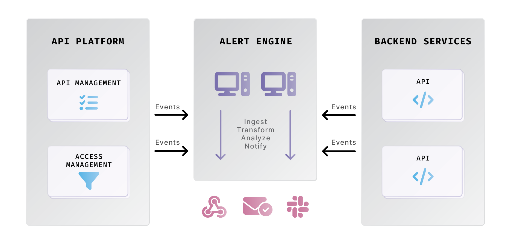

# Gravitee Core Concepts

The API lifecycle includes API design, development, testing, deployment, troubleshooting, monitoring, and security. The critical need to manage the complete API lifecycle has driven the development of comprehensive API management solutions, of which Gravitee is best-in-class.

## Overview 

Gravitee was founded in 2015 when 4 freelance developers with a passion for API strategy and implementation decided to create an API lifecycle toolset. One of Gravitee’s core differentiators is that, as an event-native API solution, built on event-driven architecture implemented with reactive programming to handle asynchronous, event-driven APIs, it still fully supports synchronous APIs following the request/response model, and can even mediate between sync and async application layer protocols.&#x20;

## Key concepts 

This section decodes key Gravitee concepts and terminology to provide a robust frame of reference for more detailed product documentation.

### Gravitee global architecture 

The architecture diagrams below offer a high-level conceptualization of the Gravitee landscape. The first diagram shows the interaction between the API Management (APIM) and Access Management (AM) ecosystems and their respective components. The second diagram highlights the function of the Alert Engine (AE).&#x20;

<figure><figcaption>
APIM and AM architecture overview
</figcaption></figure>

<figure><figcaption>
AE architecture overview
</figcaption></figure>

Key takeaways from the architecture diagrams:

* API publishers make requests to the Management API from either programmatically or from the Management Console.&#x20;
* The Management API focuses on creating and deploying APIs to the Gateway, which determines how requests are proxied from end users to backend APIs, and exposing backend APIs in a developer portal for access by API consumers.
* A single Gravitee APIM instance is composed of several core Gravitee components.
* An AM instance is deployed separately from APIM. AM and APIM can be linked together or used as standalone products.
* Each APIM and AM instance is attached to a Gravitee Cloud environment.
* Gravitee Cloud observes a hierarchy of three entity types. At the top level is an account (typically a company, not an individual user), next is an organization (typically a logical part of the company in a particular context, such as a region or business unit), and at the lowest level is an environment (typically an environment in an IT infrastructure, such as development or production).

<figure><figcaption>
Sample Gravitee Cloud hierarchy
</figcaption></figure>

### API Gateway: policies and plugins 

API Management encompasses API design, API security and access management, API reliability, API delivery, and API productization. At the core of APIM, the API Gateway is a reverse proxy that sits in front of your APIs. It routes requests to the appropriate backend services while performing various tasks such as rate-limiting, authentication, and request or response transformations. Policies are typically used to enforce security, reliability, and proper data transfer.

Policies are rules or logic that can be executed by the API gateway during the request or the response of an API call. By default, the Gravitee comes with a [large number of policies available for use](https://docs.gravitee.io/apim/3.x/apim\_policies\_overview.html) to control how an API is consumed. This control can manifest in a variety of ways, and policies can be used for all sorts of reasons and objectives, ranging from making APIs more secure to making them reliable to making them profit drivers in the case of API Monetization. Here is a list of common kinds of API policies that you might execute at the gateway level:

* Traffic shaping policies: use a Gateway to strip, shape, or otherwise alter network traffic so as to make consumption of APIs and the movement of data more secure, reliable, performant, or efficient
  * For example, you could strip certain information as data is brokered and sent to the client application to keep sensitive data from the client application and/or make a message leaner given a client application that might not need that specific set of stripped information
* Authentication/authorization policies: use a gateway to enforce certain authentication/authorization methods to ensure that an API consumer is allowed to request information from your backend
  * For example, you could use an API key policy to limit API consumption to a set of client applications that can pass a specific, unique API key with each request
* Rate limiting policies: policies that limit and/or throttle the number of requests over a set time period
  * For example, you could use a rate-limiting policy to limit your API to a maximum of 100 calls/min/consumer
* Dynamic routing policies: policies that are used to dispatch inbound calls to different targets/endpoints or to rewrite URIs
  * For example, you could use a dynamic routing policy to redirect requests from `http://gateway/apis/store/12/info` to `http://backend_store12/info`

Another Gravitee term you’ll often hear mentioned is **plugins**. [Plugins](https://docs.gravitee.io/apim/3.x/apim\_devguide\_plugins.html) are components that additional functionality by _plugging into_ the Gravitee ecosystem. Policies are simply a type of plugin. In other words, policies are a feature or function that is enabled through the functionality known as plugins. Check out the [plugin marketplace](https://www.gravitee.io/plugins) to see what plugins are currently available from both Gravitee and the community.&#x20;


**Custom plugins**

Looking to build your own plugin? Check out this guide to learn how.


### API Developer Portals & API Productization 

One of the other critical components of API management is the ability to expose APIs to your various consumers. These consumers can take many forms, as outlined in the following table:

| Consumer                       | Use case and/or strategic initiative                                                                                                                                                                                                                                                                                                 |
| ------------------------------ | ------------------------------------------------------------------------------------------------------------------------------------------------------------------------------------------------------------------------------------------------------------------------------------------------------------------------------------ |
| Internal Developer             | Organizations that are using APIs as internal tools to build products and services might be using APIs to connect systems, data sources, etc. The typical consumer of an API here would be the internal developer at your organization that needs to access and use that API to build the application that they are responsible for. |
| External Developer as Customer | This use case is very similar to the internal developer use case. However, instead of a developer at your company using your API as an internal tool, your API can be exposed to developers at other companies that could use your API in their product instead of building that functionality on their own.                         |
| Partner                        | Organizations that have technical partnerships that require integrations between certain products and/or feature sets might expose sets of APIs to those partners.                                                                                                                                                                   |

The best way to expose these APIs to your consumers is through an **API developer portal**. An API developer portal is a centralized catalog where internal API consumers and/or external API consumers can discover, find, subscribe, and manage subscriptions to APIs that are developed, managed, and deployed by API publishers.

For example, a developer at a FinTech company could create a “stock price fetcher” API that could be used to present real-time stock prices. This API could be published to a portal for other developers at that FinTech company to use when creating various banking applications that rely on visualizing stock prices in a UI. The developer portal ensures all other developers at the company have awareness of, and secure access to, that API so they don’t have to build that functionality themselves.

Another important facet of exposing APIs to fellow developers is API documentation. To borrow Stoplight’s definition, “API docs, or API description documents, are the collection of references, tutorials, and examples that help developers use your API. Your API’s documentation is the primary resource for explaining what is possible with your API and how to get started.”

It is crucial to include high-quality, up-to-date documentation with your APIs in your developer portal so that developers and other consumers have an easy time knowing how to consume your APIs. Otherwise, your teams will have spent valuable time and effort developing APIs only so that they go unused, or at the very least, don’t reach their consumption potential.

Finally, a growing use case for API developer portals is API monetization. API monetization allows you to turn APIs into self-serve, revenue-generating products with plans that govern how consumers can pay to access/consume your APIs. For example, you could charge delivery companies a set amount per message for a “track packages in real-time" API.

### API Access Management 

Access management can exist outside of the realm of API management, but API-security-forward organizations are beginning to implement API access management as a part of their larger API security and/or API management strategies.

**API access management** is essentially what it sounds like: applying typical access management practices to the API level. For example, you could use API access management to implement step-up authentication, an authentication method that is defined by adding extra factors of authentication in front of certain APIs or features in your application that might contain/move sensitive data. Let’s take an example of a banking application. In this example, instead of just enforcing multi-factor authentication (MFA) at the log-in level, maybe you’d choose to enforce an extra factor of authentication (such as facial recognition or fingerprint) when a client app or consumer tries to call a “payments API” that is responsible for brokering bank and routing numbers so that you can make or receive in-app payments.

Implementing access management at the API level is important for security-forward organizations because APIs are the ultimate brokers of data, both sensitive and non-sensitive. API-level access management allows for more fine-tuned access control in areas of applications where sensitive data exists. This allows you to further secure your applications and/or APIs by verifying that the consumer is who they claim to be while also fine-tuning the customer experience by only adding the friction of access control where sensitive data might exist.

### API Design-First 

Not always considered a part of every organization’s API management strategy, API design is the stage where you plan and make intentional architectural decisions around how and why your API interacts with client and backend (or, in east/west use cases, service and service).

API design is becoming increasingly important for organizations that are implementing API design-first methodology. **API design-first** is defined as organizations choosing to approach development decisions and planning by first starting with an API design or data model and then generating the API specification. This makes it easier for teams to include less technical, business users and build APIs that are more “fit for purpose” as they pertain to business value.

### Gravitee API Definitions 

In the [API Fundamentals](api-fundamentals/) documentation, we covered API specifications in-depth. In the world of Gravitee, there is a similar-sounding term known as a **Gravitee** **API definition**. An API definition is very similar to an API specification except it is a specification _for your Gravitee gateway._ It’s a JSON representation of everything that the Gravitee gateway needs to know for it to proxy, apply policies to, create plans for, etc. your APIs and their traffic.

Each [Gravitee API definition brings with it certain capabilities](https://www.gravitee.io/blog/gravitee-api-definitions) which you can read about further in the linked article. The key thing you need to note is that the **latest API definition is v4.** The v4 definition allows for advanced protocol mediation (i.e. fronting Kafka with a Webhook, Websocket, HTTP API, etc.) and the ability to apply Gravitee policies (i.e. authentication, traffic shaping, etc.) to asynchronous API traffic–at the message level. This is done by decoupling what is known as the gateway **entrypoints** and **endpoints**.

To keep things simple:

* Gateway Entrypoint: how the consumer “calls” or “subscribes” to the gateway. This essentially defines how a consumer will end up consuming data from a producer/provider
* Gateway Endpoint: the data source from/to which the gateway will fetch/post data for/from the consumer that calls or subscribes to the gateway

So, for example, if you wanted to make it possible for an API consumer to consume events from a Kafka topic over a WebSocket connection, you would choose a “Websocket” entrypoint and a “Kafka” endpoint when creating your API in Gravitee. If you wanted to make it possible for an API consumer to POST data onto a Kafka topic via an HTTP API, you would use the Gravitee HTTP POST entrypoint and Kafka endpoint.

### Gravitee API Deployment Options 

When it comes to Gravitee, there are two major categories of deployment: the APIs themselves and the Gravitee infrastructure, which includes the API gateway and management console among other components. While each product has detailed documentation on the deployment and installation of its respective infrastructure, we want to provide a quick overview of the different ways you can deploy APIs with Gravitee.

For Gravitee to be able to support [infrastructure as code (IaC)](https://www.redhat.com/en/topics/automation/what-is-infrastructure-as-code-iac) use cases, deployment needs to be able to be handled “as code,” and APIs need to be able to be pushed to/deployed to the API Gateway, tested, and then promoted across environments (test, dev, prod, etc.) without ever having to step a digital foot into a UI.

Many of our enterprise customers are already implementing an IaC practice using Gravitee. Some enterprise customers start off this way (i.e. customers who are already mature when it comes to GitOps, Kubernetes, etc.), but at least ⅓-½ of our enterprise customers gradually work their way into an IaC-compatible approach. We describe this process through the lens of API “deployment maturity.”

> **Note**: the term “maturity” here is not morally valenced or judgemental. We simply use the term to describe the sequential process that we see _most_ of our enterprise customers move through. There are many reasons for and benefits associated with each of the deployment styles mentioned below.

Traditionally, Gravitee customers progress through three levels of API “deployment maturity”:

#### **Gravitee Console/UI**

Gravitee comes with an easy-to-use, self-serve UI that is often used for development (we estimate that ⅓-½ of our enterprise customers use this UI for development).

#### **Gravitee Management API**

Every action in the Gravitee UI is tied to a REST API that makes up the Gravitee management API. The management API exposes a complete set of endpoints and is [documented using the OpenAPI spec](https://docs.gravitee.io/apim/3.x/apim\_installguide\_rest\_apis\_documentation.html#apim\_console\_api\_reference). As a result, everything you can do in the UI can be done via REST API calls for developers wanting to script some part of APIM administration. Typically, as enterprise customers start to move into a GitOps world and moving things across higher environments, they use things like GitLab, Jenkins, Bitbucket, GitHub Actions, etc. to manage everything in a data serialization format like JSON or YAML.

#### **Kubernetes-native using the Gravitee Kubernetes Operator**

This approach moves beyond relying on the console/UI and the underlying management API. If you deploy APIs in a Kubernetes cluster, you can describe your API as an API extension of Kubernetes using CRDs (custom resource definitions). Essentially, this means that when you deploy something natively to your K8s cluster, there’s an operator there that can deploy that API to the Gravitee gateway without relying on a proprietary UI or REST API. This is powered by the Kubernetes API and the Gravitee Kubernetes Operator. This is the preferred method of deployment if your organization is set on using Kubernetes.


**Kubernetes source of truth**

When you deploy the Kubernetes YAML file and everything deployed to the Gravitee Gateway and is up and running, you can still see the API and API definition in the Gravitee console and complete actions like deploying that API to the developer portal. However, as an administrator, there are some components of the API that you cannot change, as the source of truth is the Kubernetes YAML file. While this may seem like a restriction, this is a feature, not a bug. When implementing IaC, a key principle is to never change something in the “live form,” and instead change it in the code and observe the changes as they manifest in the front end.

