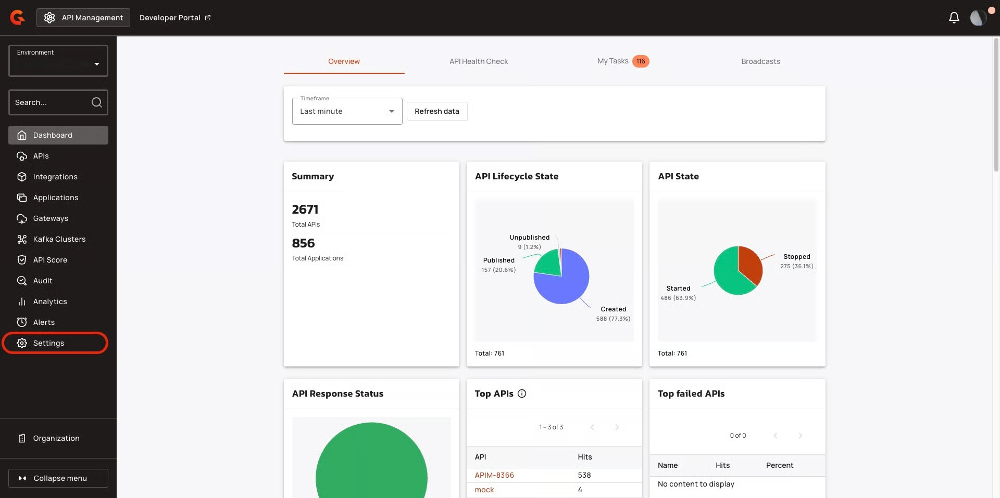

# Enforce user authentication

## Overview&#x20;

You can enforce user authentication to access your New Developer Portal. This limits access to your New Developer Portal to authenticated users only.

## Prerequisites&#x20;

* Install Self-Hosted Installation of Gravitee APIM or a Hybrid Installation of Gravitee APIM. For more information about installing Gravitee APIM, see [Broken link](/broken/pages/l3VTaBMjUvFd4jXfkLQh "mention") or [Broken link](/broken/pages/KmYIfcneJBExnYks77zr "mention").&#x20;
* Ensure that your installation of Gravitee APIM  is version 4.10 or later. For more information about upgrading Gravitee APIM, see [Broken link](/broken/pages/7anra8jO4R0or1MnFTlp "mention").
* Complete the steps in [Broken link](/broken/pages/5RELNfUmXNFFWCOkXm6g "mention").
* Complete the steps in [Broken link](/broken/pages/QIVgjPDwDCknL3JThS0H "mention")or [Broken link](/broken/pages/KOiAYXXzc0qOegMbiyLg "mention").

## Configure enforcing user authentication&#x20;

To configure enforcing user authentication, complete the following steps:&#x20;

* [#configure-enforcing-user-authentication-in-your-configuration-file](enforce-user-authentication.md#configure-enforcing-user-authentication-in-your-configuration-file "mention")
* [#configure-enforcing-user-authentication-in-the-apim-console](enforce-user-authentication.md#configure-enforcing-user-authentication-in-the-apim-console "mention")

### Configure enforcing user authentication in your configuration file&#x20;



1.  In your `gravitee.yaml` file, navigate to the `portal` section, and then add the following configuration:<br>

    ```yaml
    portal:
      authentication:
        forceLogin:
          enabled: true
    ```
2.  Deploy your installation with your new configuration using the following command:<br>

    ```bash
    docker compose up -d 
    ```



1.  In your `values.yaml` file, navigate to the `api` section, and then add the following configuration:<br>

    ```yaml
    api:
      env:
        - name: gravitee_portal_authentication_forcelogin_enabled
          value: "true"
    ```
2.  Deploy our installation with your new configuration using the following command: <br>

    ```bash
    helm upgrade gravitee-apim gravitee/apim \
      --namespace gravitee-apim \
      -f ./values.yaml \
      --set 'portal.ingress.annotations.nginx\.ingress\.kubernetes\.io/rewrite-target=null' \
      --wait \
      --timeout 5m
    ```



### Configure enforcing user authentication in the APIM Console&#x20;

1.  From the **Dashboard**, click **Settings**.<br>

    <figure><figcaption></figcaption></figure>
2.  In the **Settings** menu, navigate to the **Portal** section, and then. click **Authentication**. <br>

    <figure><figcaption></figcaption></figure>
3.  Turn on the **Force authentication to access portal**.<br>

    <figure><figcaption></figcaption></figure>

## Verification&#x20;

*   Log out of you New Developer Portal, and then try to access a page on your New Developer Portal. You are redirected to the login screen. <br>

    <figure><figcaption></figcaption></figure>
