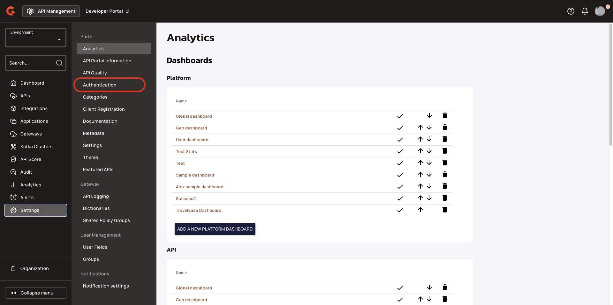

# Configure authentication with SSO: Reviewed

## Overview

This guide describes how to configure authentication with single sign-on (SSO) for the New Developer Portal.

## Prerequisites

* Install a self-hosted or hybrid Gravitee API Management (APIM) installation. For more information about installing Gravitee APIM, see [Broken link](/broken/pages/l3VTaBMjUvFd4jXfkLQh "mention") or [Broken link](/broken/pages/KmYIfcneJBExnYks77zr "mention").
* Ensure that your installation of Gravitee APIM is version 4.10 or later. For more information about upgrading Gravitee APIM, see [Broken link](/broken/pages/7anra8jO4R0or1MnFTlp "mention").
* Complete the steps in [Broken link](/broken/pages/5RELNfUmXNFFWCOkXm6g "mention").
* Configure one or more of the following identity providers:
  * [Broken link](/broken/pages/R3uvwQUXDXgfvEUeS7RJ "mention")
  * [Broken link](/broken/pages/J5VAAxGsY7INiOdPvoeo "mention")
  * [Broken link](/broken/pages/nje0QyKLNK99oeIcmZLz "mention")
  * [Broken link](/broken/pages/ge2IXPgfwdedGUXUkFE3 "mention")

## Configure authentication with SSO

To configure authentication with SSO, complete the following steps:

* [#activate-an-identity-provider-in-your-configuration-file](configure-authentication-with-sso.md#activate-an-identity-provider-in-your-configuration-file "mention")
* [#activate-an-identity-provider-in-the-apim-console](configure-authentication-with-sso.md#activate-an-identity-provider-in-the-apim-console "mention")

### Activate an identity provider in your configuration file

You can activate identity providers for specific environments so that they are available in your New Developer Portal. Follow the steps relevant to your installation method:



1. In your `gravitee.yaml` file, navigate to the `security` section, and then add the following configuration:

```yaml
security:
  providers:
    - type: google
      activations:
        - "<ORGANIZATION_ID>:<ENVIRONMENT_ID>"
```

* Replace `<ORGANIZATION_ID>` with the ID for your organization. The default value is `DEFAULT`.
* Replace `<ENVIRONMENT_ID>` with the ID for your environment. The default value is `DEFAULT`.

2. (Optional) Configure SSO-only login. To disable local login, navigate to the `portal` section, and then add the following configuration:

```yaml
portal:
  authentication:
    localLogin:
      enabled: false
```

3. Deploy your installation with the new configuration using the following commands:

```
docker compose down 
docker compose up 
```



1. In your `values.yaml` file, navigate to the `security` section, and then add the following configuration

```yaml
security:
  providers:
    - type: google
      activations:
        - "ORGANIZATION_ID:ENVIRONMENT_ID"
```

* Replace `<ORGANIZATION_ID>` with the ID for your organization. The default value is `DEFAULT`.
* Replace `<ENVIRONMENT_ID>` with the ID for your environment. The default value is `DEFAULT`.

2. (Optional) Configure SSO-only login. To disable local login, navigate to the `api` section, and then add the following configuration:

```yaml
api:
  env:
    - name: gravitee_portal_authentication_locallogin_enabled
      value: "true"
```

3. Deploy your installation with your new configuration using the following command:

```
helm upgrade gravitee-apim gravitee/apim \
  --namespace gravitee-apim \
  -f ./values.yaml \
  --set 'portal.ingress.annotations.nginx\.ingress\.kubernetes\.io/rewrite-target=null' \
  --wait \
  --timeout 5m
```



### Activate an identity provider in the APIM Console

1.  From the **Dashboard**, click **Settings**.

    <figure><figcaption></figcaption></figure>
2.  From the **Settings** menu, navigate to the **Portal** section, and then click **Authentication**.

    <figure><figcaption></figcaption></figure>
3.  Turn on the SSO toggle that you want to activate.

    <figure><figcaption></figcaption></figure>
4.  (Optional) For SSO-only login, turn off the **Show login form on Portal** toggle.

    <figure><figcaption></figcaption></figure>

### Verification

The login screen for your New Developer Portal shows only SSO login.

<figure><figcaption></figcaption></figure>

## Next steps

* [Broken link](/broken/pages/dEbr8DOikUsbYrvRS8Ec "mention")
